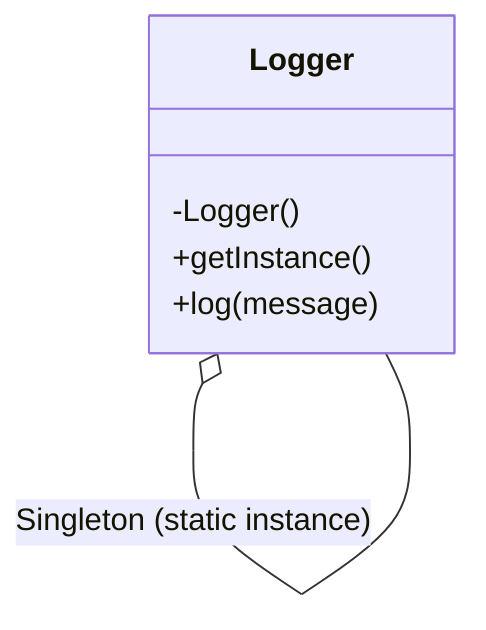
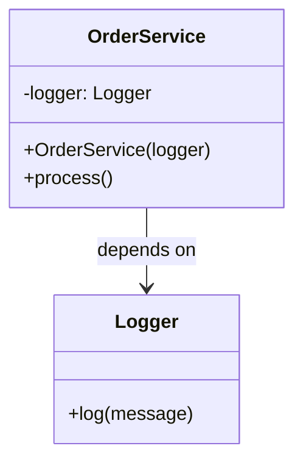

# 🔍 Singleton と DI の比較

## ✅ 比較の目的

どちらも「共通オブジェクトの再利用・共有」を目的とする場面で登場するが、設計思想や制御の主体に明確な違いがある。  
本節では、構造の類似性に惑わされず、それぞれの目的と役割を明確にし、使い分けの判断軸を整理する。

## ✅ 比較の観点

| 比較項目       | Singleton（シングルトン）                      | DI（依存性の注入）                         |
| -------------- | ---------------------------------------------- | ------------------------------------------ |
| 目的           | インスタンスの一意性とグローバルアクセスの確保 | 依存関係の明示と外部からの注入             |
| ライフサイクル | アプリケーション全体で 1 つだけ生成される      | 呼び出し元またはコンテナが制御             |
| 柔軟性         | 低め（インスタンスの差し替えが難しい）         | 高い（モックや代替実装の注入が容易）       |
| テスト容易性   | 低め（グローバル状態のためテストしにくい）     | 高い（依存の切り替えが容易）               |
| 隠蔽性         | 高い（内部で依存を隠してしまう）               | 低め（依存を明示する）                     |
| 利用スタイル   | `getInstance()` で取得し、内部で依存を生成     | コンストラクタやコンテナ経由で外部から注入 |

## ✅ 類似点

- どちらも「あるクラスのインスタンスを 1 つに限定し、アプリケーション全体で共有する」というユースケースに登場する
- グローバルな状態や構成情報、共通サービスなどに使われることが多い
- 過剰に使うと結合度が高まり、テスト性や保守性に影響を与えることがある

## ✅ 決定的な違い

| 観点             | Singleton                    | Dependency Injection（DI）           |
| ---------------- | ---------------------------- | ------------------------------------ |
| インスタンス制御 | クラス自身が責任を持つ       | 呼び出し元・外部コンテナが責任を持つ |
| 主導権           | クラス内部（self-managed）   | 外部（caller-managed）               |
| 柔軟性           | 低い（常に同一インスタンス） | 高い（Mock やスタブと差し替え可能）  |
| テスト性         | 低い（グローバル状態に依存） | 高い（依存注入により制御可能）       |
| 使用意図         | 制御不能な共有リソースの制限 | 可変な依存関係の柔軟な構成           |

## ✅ 選び分けの判断軸

- ✅ システム全体で唯一の状態・設定を保証したい → **Singleton**
- ✅ 外部から依存を差し替え可能にしたい（テスト・構成切替） → **DI**
- ✅ クラス自身に主導権を持たせたい → **Singleton**
- ✅ 呼び出し側で制御したい／可変性を持たせたい → **DI**

## ✅ UML クラス図

### Singleton パターン

### DI（依存性注入）

## ✅ 実務でのヒント

- ✅ `Singleton` は便利だが、**使いすぎるとテストが困難**になり、**結合度も高まる**
- ✅ `DI` を使えば、**テスト環境ではモックを注入**できるなど、柔軟な構成が可能になる
- ▶️ 例：アプリ設定やログ出力など、**本当に唯一性が必要な場面は Singleton**、それ以外は基本的に **DI による注入が推奨**

## ✅ まとめ

- `Singleton` は「**自分で自分を唯一にする**」自己管理型の設計
- `DI` は「**誰を使うかを外部に任せる**」依存関係の明示的な制御
- 両者は一見似ているが、**主導権の所在と柔軟性のレベル**が大きく異なる
- **将来的な変更・テスト・拡張を見据えるなら DI が有利**。Singleton は限定的に使うべき
