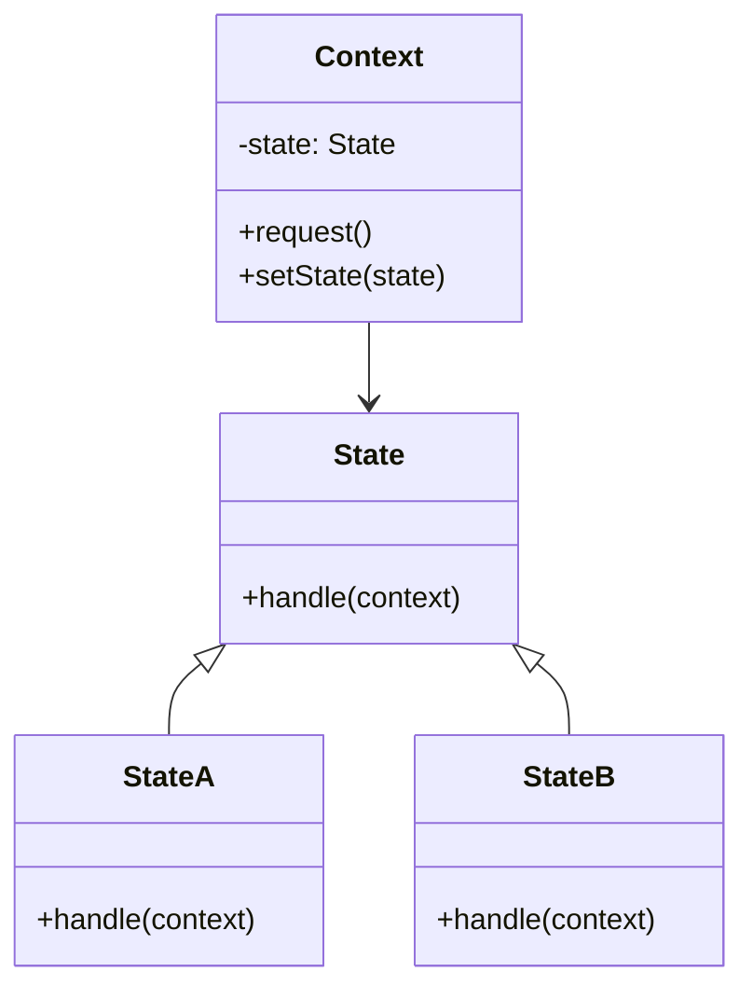
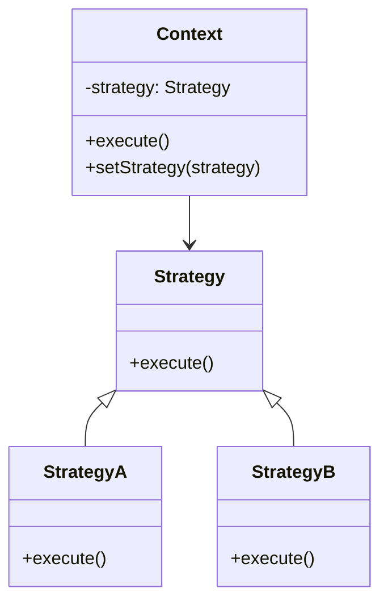

# 🔍 State と Strategy の比較

## ✅ 比較の目的

`State` パターンと `Strategy` パターンは、いずれも「ある動作を切り替える仕組み」を提供するが、目的と適用タイミングには明確な違いがある。本節では、両者の設計意図や使い分けの観点を整理し、適切な場面での選定に役立つ判断材料を提示する。

## ✅ 比較の観点

| 比較項目     | State（状態）                    | Strategy（戦略）                       |
| ------------ | -------------------------------- | -------------------------------------- |
| 主な目的     | 状態に応じて振る舞いを切り替える | 戦略（アルゴリズム）を柔軟に差し替える |
| 実装の形     | 状態ごとのクラスに処理を委譲     | 戦略ごとのクラスに処理を委譲           |
| トリガー     | オブジェクト内部の状態変化       | 外部からの注入や構成で切り替え         |
| 切り替え方法 | クラス内部で状態遷移を行う       | 呼び出し元が戦略を変更する             |
| 状態保持     | 現在の状態を保持し遷移する       | 状態を保持しない（単なるアルゴリズム） |

## ✅ 類似点

- いずれも「振る舞いの切り替え」を目的としている。
- 実行する処理を、**インターフェースを通じて外部のクラスに委譲**する。
- 条件分岐を排除し、**拡張性と保守性を向上**させる設計手法。

## ✅ 決定的な違い

| 観点               | State パターン                       | Strategy パターン                  |
| ------------------ | ------------------------------------ | ---------------------------------- |
| 主体               | オブジェクトの内部状態               | 実行時に注入される戦略（外部制御） |
| 動的切り替え       | オブジェクト自身が遷移ロジックを持つ | 呼び出し元が差し替える             |
| 状態遷移の概念     | 明確に状態を持ち、遷移がある         | 明示的な遷移はなく、都度指定       |
| クライアントの役割 | 状態管理を意識しない                 | 戦略を選定・注入する責務がある     |

## ✅ 選び分けの判断軸

- ✅ 内部状態の変化に応じた処理変更をしたい → **State**
- ✅ 外部構成やユーザー操作によって処理を差し替えたい → **Strategy**
- ✅ 処理の流れをオブジェクトに委ねたい → **State**
- ✅ 呼び出し元が戦略を選びたい → **Strategy**

## ✅ UML クラス図

### State パターン

### Strategy パターン

## ✅ 実務でのヒント

- ✅ **State は状態遷移を伴う業務ロジック**に適している（例：ログイン状態・注文ステータスなど）
- ✅ **Strategy は条件分岐の回避や、動的な構成切り替え**に適している（例：認証戦略、通知戦略など）
- ▶️ 両者が混同されやすいが、「変化の主体」と「切り替えのトリガー」が違う点を意識することが重要。

## ✅ まとめ

- `State` は、**内部状態の遷移によって振る舞いを変える**ための構造。
- `Strategy` は、**振る舞いを外部から差し替える**ための構造。
- 一見似ていても、「**制御の主導権**」と「**状態の持ち方**」が異なるため、使い分けが必要である。
