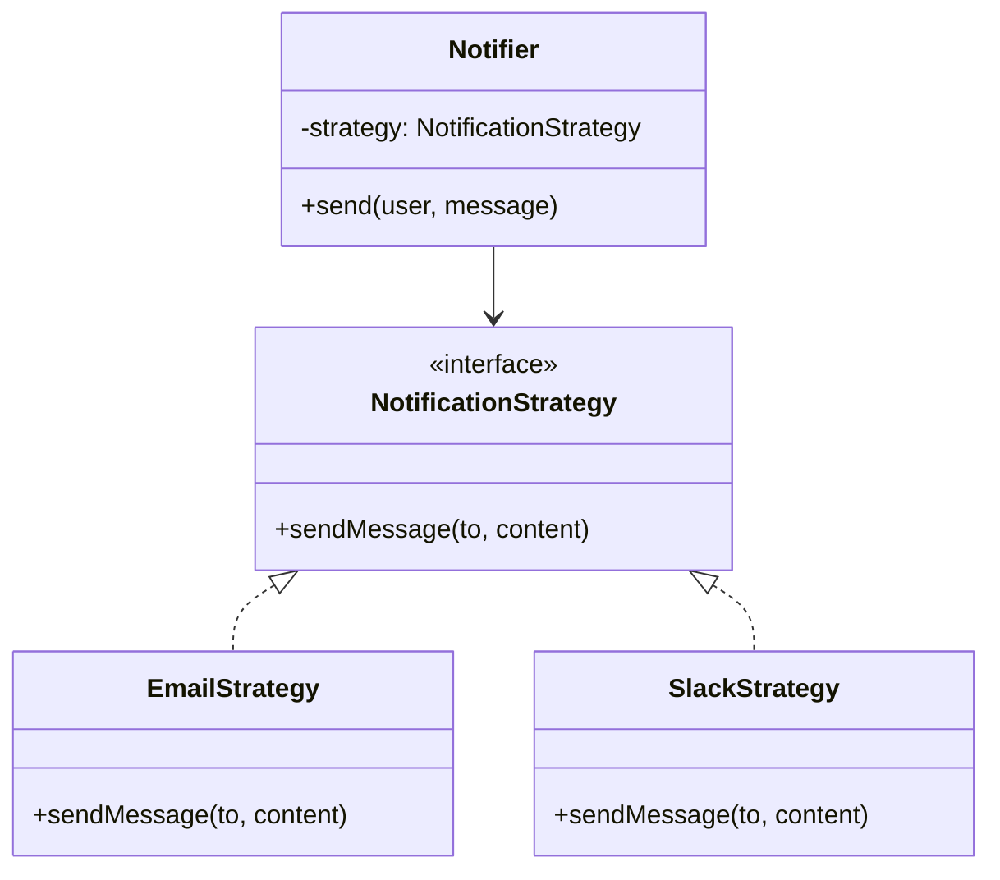
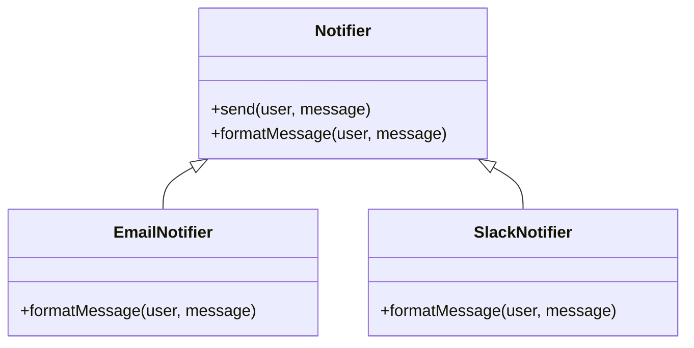

# 🔍 Strategy と Template Method の比較

## ✅ 比較の目的

`Strategy` パターンと `Template Method` パターンは、いずれも処理の一部を差し替えるための設計手法である。  
ただし、差し替えの単位やタイミング、コード上の主導権の持ち方が異なる。

本節では両者の違いを明確にし、目的や構造に応じた使い分けの判断軸を提示する。

## ✅ 比較の観点

| 比較項目     | Strategy                             | Template Method                            |
| ------------ | ------------------------------------ | ------------------------------------------ |
| 実装方法     | 委譲（インターフェースの実装を注入） | 継承（抽象クラスの実装を継承して差し替え） |
| 柔軟性       | 高い（実行時に切り替え可能）         | 中程度（クラス設計時に決定）               |
| 再利用性     | 高い（複数の文脈で再利用しやすい）   | 低め（継承階層に縛られる）                 |
| 構造の可視性 | 明確（DI により構成が明示される）    | やや不明瞭（オーバーライドで内部が変わる） |
| テスト容易性 | 高い（モック注入が可能）             | 中程度（メソッドの挙動が固定）             |

## ✅ 共通点

- どちらも「特定の処理だけを差し替えたい」目的で使われる。
- 実装の差異を **インターフェース／抽象メソッド** を通じて外部化している。
- 共通処理の枠組みの中に、可変な振る舞いを埋め込む設計スタイル。

## ✅ 決定的な違い

| 観点             | Strategy                | Template Method              |
| ---------------- | ----------------------- | ---------------------------- |
| 差し替え方式     | **注入（composition）** | **継承（inheritance）**      |
| 実行時変更       | ✅ 可能                 | ❌ 不可（クラス固定）        |
| クライアント構造 | Strategy を渡すだけ     | クラスを継承して作成する必要 |
| 主導権           | 呼び出し側にある        | 親クラスが全体の流れを支配   |

## ✅ 選び分けの判断軸

- ✅ 柔軟に戦略を切り替えたい → **Strategy**
- ✅ 一定の処理の流れは固定したい → **Template Method**
- ✅ ユーザーごとに処理内容を動的に変更したい → **Strategy**
- ✅ 差し込み箇所は少なく、全体の流れを統制したい → **Template Method**

## ✅ UML クラス図

### Strategy パターン

### Template Method パターン

## ✅ 実務での設計ヒント

- ✅ **Template Method だけで構成すると**：処理の流れを統一できるが、拡張がしにくく、継承が乱立する可能性がある。
- ✅ **Strategy だけで構成すると**：柔軟だが処理の統制が弱くなり、ログや前後処理が散逸しやすい。
- ▶️ **併用が効果的**：Template Method で「流れ」を、Strategy で「処理の中身（通知手段など）」を分離することで、統一感と柔軟性のバランスが取れる。

## ✅ まとめ

Strategy と Template Method は、いずれも柔軟な設計を支える基本パターンである。  
ただし、変更対象の単位や、差し替えのタイミング、構造の主導権といった観点で明確な違いが存在する。

- 動的に差し替えたい場合、または処理内容が外部依存する場合は **Strategy**
- 一連の処理の流れを固定した上で一部のみ差し替えたい場合は **Template Method**

今後の拡張方向や構成の透明性を踏まえ、目的に応じて適切に使い分けることが重要である。
