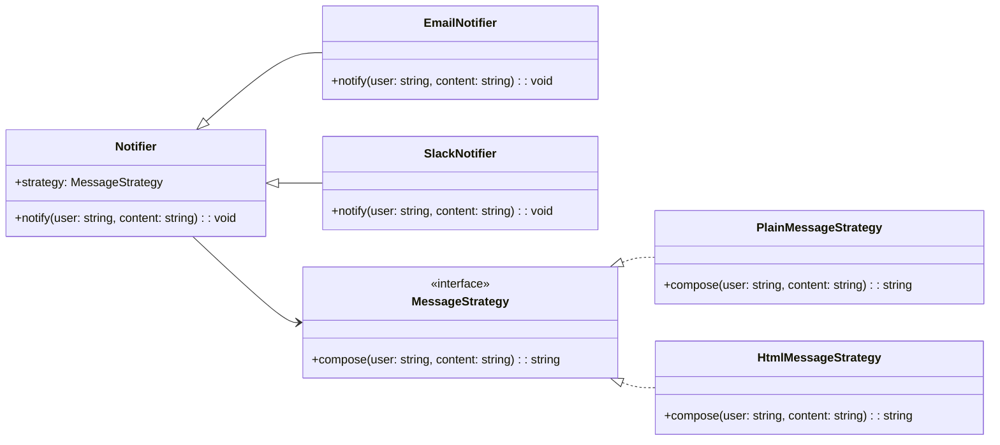

import Tabs from "@theme/Tabs";
import TabItem from "@theme/TabItem";
import CodeBlock from "@theme/CodeBlock";

import tsCode from "@site/src/codes/ref-synergy/ts/state-strategy.ts";
import phpCode from "@site/src/codes/ref-synergy/php/state-strategy.php";
import pyCode from "@site/src/codes/ref-synergy/py/state-strategy.py";

# 🧩 Bridge × Strategy

## ✅ 組み合わせの意図

- `Bridge` パターンによって「通知手段（メール / Slack など）」と「通知内容の表現（プレーン / HTML）」という**独立した 2 軸**を分離
- `Strategy` パターンで通知内容の組み立て方を外部化し、**通知方式 × 表現方法**の柔軟な組み合わせを可能にする

共通の通知処理を `Notifier` でまとめつつ、**出力方式（メール / Slack）とメッセージの構成ロジック（プレーン / HTML）を柔軟に組み合わせられる設計**を実現。

## ✅ よく使われるシーン

- 通知の**表現方式（テキスト / HTML / Markdown）と送信方式（メール / Slack など）を自由に組み合わせたい**とき
- 拡張の軸が複数あるが、それぞれを**独立して設計・拡張したい**とき
- **UI とテーマ**、**データと表示手段**など、**独立した 2 軸を持つ構成**で再利用性を高めたいとき

## ✅ UML クラス図

## ✅ コード例

<Tabs groupId="language">
  <TabItem value="ts" label="TypeScript">
    <CodeBlock language="ts">{tsCode}</CodeBlock>
  </TabItem>
  <TabItem value="php" label="PHP">
    <CodeBlock language="php">{phpCode}</CodeBlock>
  </TabItem>
  <TabItem value="python" label="Python">
    <CodeBlock language="python">{pyCode}</CodeBlock>
  </TabItem>
</Tabs>

## ✅ 解説

- `Notifier` は、通知手段の抽象クラス。内部に `MessageStrategy` を持ち、**メッセージの組み立て方を外部化**（`Strategy`）。
- `EmailNotifier`, `SlackNotifier` はそれぞれ異なる通知チャネルを提供（`Bridge` の実装側）。
- `MessageStrategy` はメッセージのフォーマット戦略で、`PlainMessageStrategy` や `HtmlMessageStrategy` によって差し替え可能。
- 通知方式とメッセージ構成方式が**独立して変更・拡張できる**構造になっている。

## ✅ まとめ

- `Bridge` により「通知方式の拡張」と「通知メッセージ構成」の関心を分離
- `Strategy` によりメッセージ内容の構築方法を切り替え可能
- 拡張の自由度が高く、「どの通知方式 × どの表現方式」という柔軟な組み合わせを可能にする

この構造は、**多軸での拡張が求められる実務**において非常に効果的で、設計の保守性・再利用性を大きく向上させる。
