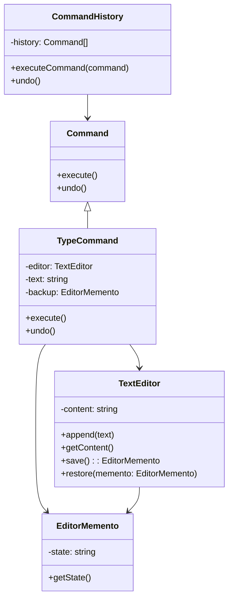

import Tabs from "@theme/Tabs";
import TabItem from "@theme/TabItem";
import CodeBlock from "@theme/CodeBlock";

import tsCode from "@site/src/codes/ref-synergy/ts/command-memento.ts";
import phpCode from "@site/src/codes/ref-synergy/php/command-memento.php";
import pyCode from "@site/src/codes/ref-synergy/py/command-memento.py";

# 🧩 Command × Memento

## ✅ 組み合わせの意図

- `Command` により、操作（入力）をオブジェクトとして扱い、履歴として記録可能にする
- `Memento` により、オブジェクトの状態を保存・復元できるようにする

この組み合わせにより、**「何をしたか」だけでなく「どの状態だったか」も含めて記録・取り消しできる構造**が実現する。

## ✅ よく使われるシーン

- テキストエディタや図形エディタなど、Undo/Redo 機能を提供する場面
- 履歴管理が必要なツール（設定変更・一括操作・バッチ処理など）
- UI 操作と内部状態を両方とも記録・巻き戻ししたいケース

## ✅ UML クラス図

## ✅ コード例

<Tabs groupId="language">
  <TabItem value="ts" label="TypeScript">
    <CodeBlock language="ts">{tsCode}</CodeBlock>
  </TabItem>
  <TabItem value="php" label="PHP">
    <CodeBlock language="php">{phpCode}</CodeBlock>
  </TabItem>
  <TabItem value="python" label="Python">
    <CodeBlock language="python">{pyCode}</CodeBlock>
  </TabItem>
</Tabs>

## ✅ 解説

- `TextEditor` は文字列状態を持つ「受信者（Receiver）」で、状態の保存・復元機能（`Memento`）も持つ
- `TypeCommand` はテキスト入力という操作を `Command` として表現し、実行前に `Memento` で状態を保存
- `CommandHistory` は操作の履歴を管理し、`undo()` で巻き戻し可能

この構成により、操作履歴（Command）と状態復元（Memento）を **分離かつ連携** させた堅牢な履歴管理機能が実現できる。

## ✅ まとめ

- `Command`：操作を履歴として記録・再実行できる
- `Memento`：状態をスナップショットとして保存・復元できる
- 組み合わせにより「操作の記録」と「状態の保存・復元」が両立できる
- Undo/Redo 機能を備えたアプリ設計の基盤として有効
