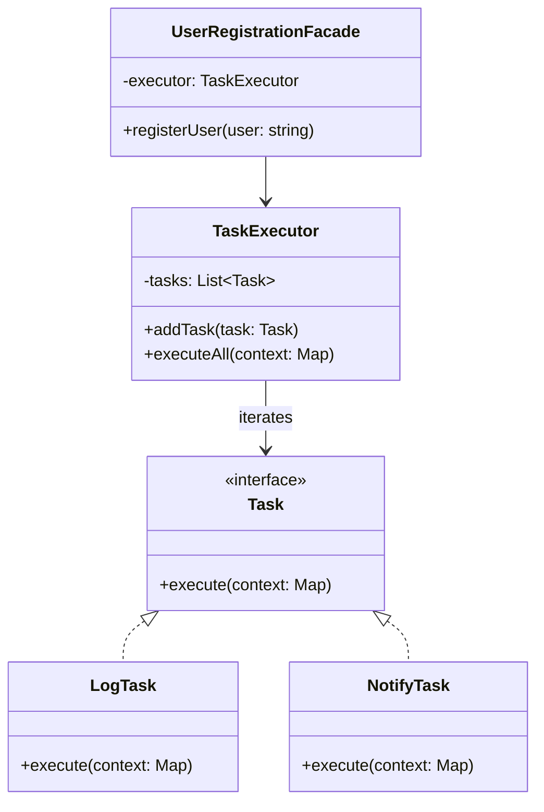

import Tabs from "@theme/Tabs";
import TabItem from "@theme/TabItem";
import CodeBlock from "@theme/CodeBlock";

import tsCode from "@site/src/codes/ref-synergy/ts/facade-iterator.ts";
import phpCode from "@site/src/codes/ref-synergy/php/facade-iterator.php";
import pyCode from "@site/src/codes/ref-synergy/py/facade-iterator.py";

# 🧩 Facade × Iterator

## ✅ 組み合わせの意図

- `Iterator` で一連の処理（タスク）を走査し、
- `Facade` によってそれらを簡潔な操作として外部に提供する

「複数のステップ処理」が必要な場合でも、`Facade` を使えば呼び出し側は `registerUser()` のような 1 行だけで済む。
内部では `Iterator` によって、各ステップ（ログ・通知など）を順番に処理している。

## ✅ よく使われるシーン

- 登録処理や初期化処理など、**一連のステップをまとめて実行したいとき**
- ステップの構造は保ちつつ、**利用者側のコードを簡素化したいとき**
- ログ、通知、バリデーションなど、**繰り返し処理を 1 つの流れで扱いたいとき**

## ✅ UML クラス図

## ✅ コード例

<Tabs groupId="language">
  <TabItem value="ts" label="TypeScript">
    <CodeBlock language="ts">{tsCode}</CodeBlock>
  </TabItem>
  <TabItem value="php" label="PHP">
    <CodeBlock language="php">{phpCode}</CodeBlock>
  </TabItem>
  <TabItem value="python" label="Python">
    <CodeBlock language="python">{pyCode}</CodeBlock>
  </TabItem>
</Tabs>

## ✅ 解説

- `Task` インターフェースは、各ステップ処理の共通化された契約
- `TaskExecutor` は `Iterator` の役割を果たし、タスクを順に実行
- `UserRegistrationFacade` はこれらをまとめ、呼び出し側がシンプルなインターフェースで使えるようにする

このように、**ステップごとの処理は疎結合で管理しつつ、利用者には簡単な窓口（Facade）を提供する**ことで、
柔軟性と使いやすさの両立が実現できる。

## ✅ まとめ

- **Facade** により、一連の処理を 1 メソッドで簡潔に実行可能
- **Iterator** により、複数の処理ステップを順番に実行できる構造を実現
- ステップの追加・削除がしやすく、処理全体の見通しも良くなる
