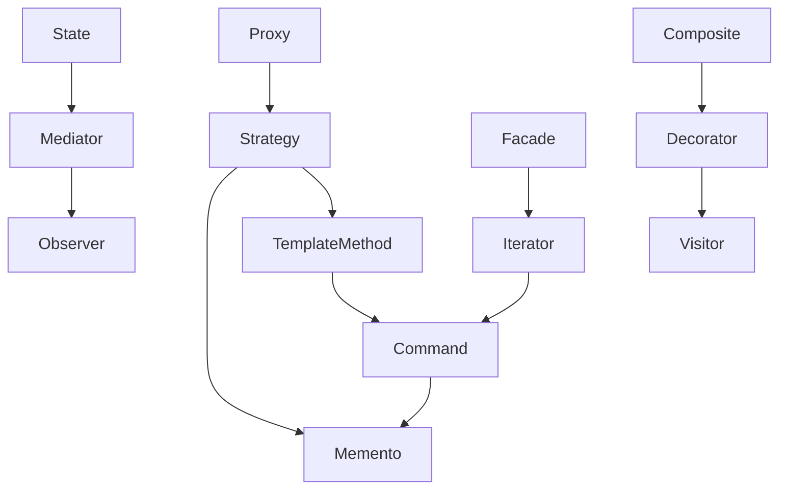

# 補足：3 つ以上のパターンによる拡張構成

本ドキュメントでは、基本的に **2 つのデザインパターンを組み合わせた構成**を中心に扱っているが、実際の設計においては、**複数のパターンが段階的に組み合わされていく構造**も見られる。

本章では、そうした **3 つ以上のパターンによる拡張的な構成**について、代表的な構成パターンとともに、その関係性を図解で整理する。

## ✅ 概要と目的

- **3 つ以上の組み合わせは、2 つの併用パターンの自然な発展形**として導かれることが多い
- それぞれのパターンは **独立した役割を持ちつつも、相補的な関係にある**
- 本章は、「複合利用パターン（2 パターン）」の**背後にある設計的発展構造を俯瞰的に把握する**ことを目的とする

## ✅ 拡張パターンの関係図

以下は、パターン同士の併用関係・発展的構成を示したものである。矢印（→）は「A の上に B を積み重ねることで自然な設計が構成される」ことを表す。

## ✅ 典型的な拡張構成の例

| 構成例                                           | 概要                                                                                                                                            |
| ------------------------------------------------ | ----------------------------------------------------------------------------------------------------------------------------------------------- |
| `Strategy → Template Method → Command → Memento` | 可変処理（Strategy）に共通フロー（Template Method）を重ね、さらにコマンド化（Command）と状態復元（Memento）を追加した履歴管理可能な実行パターン |
| `Proxy → Strategy → Memento`                     | アクセス制御（Proxy）に戦略的切り替え（Strategy）と状態復元機能（Memento）を組み合わせた柔軟なミドルレイヤ構成                                  |
| `State → Mediator → Observer`                    | 状態に応じた振る舞い切り替え（State）を、仲介役（Mediator）と通知機構（Observer）で統合したモジュール連携構成                                   |
| `Facade → Iterator → Command`                    | 複雑な手続き呼び出し（Facade）を、要素走査（Iterator）とコマンドパターン（Command）で統一管理                                                   |

## ✅ 位置づけと活用方法

- 本章の構成は、各複合パターンの「**背後にある構造的な接続関係**」を整理することを目的とした補足資料である
- 各複合パターン章においては **2 パターン構成の解説**に留め、3 つ以上のパターン構成は本章にて **全体像の補足**として提示する
- 実務上も、2 つのパターンを起点として設計を進めた結果、**自然な拡張として 3 つ目以降が導入される**ことが多い

## ✅ まとめ

- **3 つ以上のパターンは、2 パターン併用の発展形として捉えるのが有効**
- 本書では、**2 パターン構成を習得することで、拡張的構造にも対応できる土台**を提供している
- この補足図は、パターン同士の連携関係や拡張可能性を視覚的に捉える際の参考として活用できる
