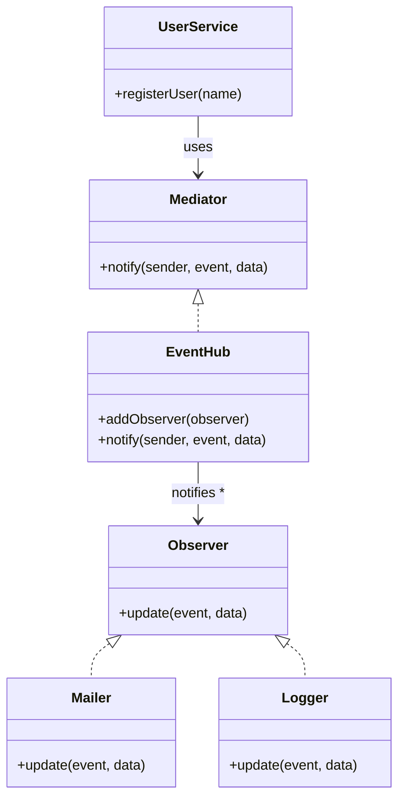

import Tabs from "@theme/Tabs";
import TabItem from "@theme/TabItem";
import CodeBlock from "@theme/CodeBlock";

import tsCode from "@site/src/codes/ref-synergy/ts/observer-mediator.ts";
import phpCode from "@site/src/codes/ref-synergy/php/observer-mediator.php";
import pyCode from "@site/src/codes/ref-synergy/py/observer-mediator.py";

# 🧩 Observer × Mediator

## ✅ 組み合わせの意図

- `Observer` により、イベント発生と処理の分離を実現
- `Mediator` により、通知先の登録・制御を集約

この組み合わせにより、「発信元は何も知らずにイベントを投げる」「通知の流れは中央で制御する」「通知先は必要に応じて後から追加できる」といった柔軟なイベント設計が可能になる。

## ✅ よく使われるシーン

- ユーザー登録やフォーム送信後に複数の後処理（メール送信、ログ記録、Slack 通知など）を行いたいとき
- 処理フローが将来増えたり変更される予定があるとき
- 発信元と通知先を疎結合に保ちたいとき（テスト容易性・拡張性が求められる場面）

## ✅ UML クラス図

## ✅ コード例

<Tabs groupId="language">
  <TabItem value="ts" label="TypeScript">
    <CodeBlock language="ts">{tsCode}</CodeBlock>
  </TabItem>
  <TabItem value="php" label="PHP">
    <CodeBlock language="php">{phpCode}</CodeBlock>
  </TabItem>
  <TabItem value="python" label="Python">
    <CodeBlock language="python">{pyCode}</CodeBlock>
  </TabItem>
</Tabs>

## ✅ 解説

- `Observer` により、通知先は `update()` メソッドで処理を行う
- `Mediator` が `notify()` で通知処理を集中管理
- `UserService` はイベント通知を `Mediator` に依頼するだけで、実際に何が起きるかを知らなくてよい
- `Mailer` や `Logger` は `Observer` として登録され、イベントに応じて個別に処理を実行

この設計により、**「通知先を外部から自由に追加・削除できる」** という柔軟性と、**「通知の流れを中央から制御できる」** という可視性・保守性が得られる。

## ✅ まとめ

- `Observer` で **イベントの通知対象を疎結合に**
- `Mediator` で **通知の流れを中央集約・制御**
- イベント駆動設計において **柔軟性・保守性・拡張性を両立する代表的な組み合わせ**
