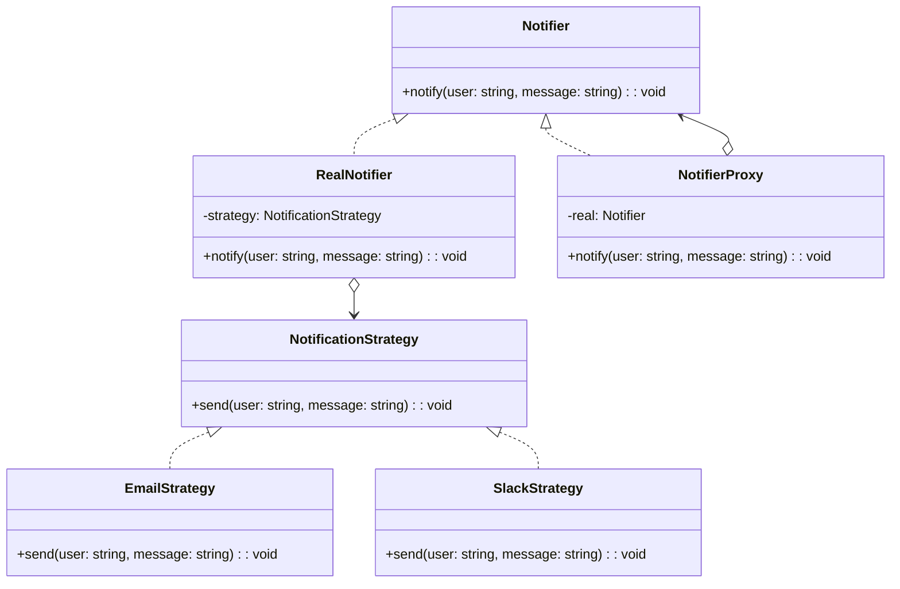

import Tabs from "@theme/Tabs";
import TabItem from "@theme/TabItem";
import CodeBlock from "@theme/CodeBlock";

import tsCode from "@site/src/codes/ref-synergy/ts/proxy-strategy.ts";
import phpCode from "@site/src/codes/ref-synergy/php/proxy-strategy.php";
import pyCode from "@site/src/codes/ref-synergy/py/proxy-strategy.py";

# 🧩 Proxy × Strategy

## ✅ 組み合わせの意図

- `Proxy` パターンで通知の **アクセス制御やログ出力** をラップし、
- 実際の送信処理は `Strategy` パターンで切り替え可能な通知手段として分離

この設計により、**通知の振る舞い（送信手段）を戦略として柔軟に差し替えつつ、外側では Proxy によって共通の制御（ログ、認証、検閲など）を適用**できる。

## ✅ よく使われるシーン

- 通知処理の共通フロー（ログやトレース）を Proxy でラップしつつ、通知内容は戦略的に差し替えたいとき
- 開発環境ではモック通知、本番ではメールや Slack などの通知方式を切り替えたいとき
- **外部 API の実行制御（頻度制限・認可など）** を Proxy に集約し、送信方式は柔軟に変更したい場合

## ✅ UML クラス図

## ✅ コード例

<Tabs groupId="language">
  <TabItem value="ts" label="TypeScript">
    <CodeBlock language="ts">{tsCode}</CodeBlock>
  </TabItem>
  <TabItem value="php" label="PHP">
    <CodeBlock language="php">{phpCode}</CodeBlock>
  </TabItem>
  <TabItem value="python" label="Python">
    <CodeBlock language="python">{pyCode}</CodeBlock>
  </TabItem>
</Tabs>

## ✅ 解説

- `NotificationStrategy` は通知戦略の共通インターフェース
- `EmailStrategy`, `SlackStrategy` は通知手段の具象戦略
- `RealNotifier` は実際の送信処理を担当し、`Strategy` を注入される
- `NotifierProxy` は通知の前後にログや制御処理を追加し、`RealNotifier` に処理を委譲（`Proxy`）

このように、**可変ロジック（戦略）と共通制御（Proxy）を分離することで、単一責任を維持しながら柔軟で保守性の高い通知処理が実現できる。**

## ✅ まとめ

- **Proxy** により、共通制御（ログ・認証・監査など）を一元化
- **Strategy** により、通知手段（メール・Slack・モックなど）を柔軟に切り替え
- 共通制御と振る舞いの切り替えを分離し、**拡張性・テスト性・再利用性が高い設計**
