import Tabs from "@theme/Tabs";
import TabItem from "@theme/TabItem";
import CodeBlock from "@theme/CodeBlock";

import tsCode from "@site/src/codes/ref-synergy/ts/state-strategy.ts";
import phpCode from "@site/src/codes/ref-synergy/php/state-strategy.php";
import pyCode from "@site/src/codes/ref-synergy/py/state-strategy.py";

# 🧩 State × Strategy

## ✅ 組み合わせの意図

- 状態によって処理の可否や振る舞いを切り替えるために `State` パターンを使用し、
- 実行する戦略（支払方法など）を柔軟に差し替えるために `Strategy` パターンを併用する

この組み合わせにより、状態遷移と処理内容の両方を分離・柔軟化できる。

## ✅ よく使われるシーン

- 状態に応じて振る舞いを変えつつ、具体的な処理手段（アルゴリズム）も切り替えたい場合
- 「現在は支払できる状態か？」「支払方法は何か？」という 2 つの軸があるようなシナリオ
- 例：決済処理、会員ステータスに応じた機能制御、予約可否と処理手段の分離など

## ✅ UML クラス図

```mermaid
classDiagram
    class PaymentStrategy {
        +pay(amount: number): void
    }

    class CreditCardPayment {
        +pay(amount: number): void
    }
    class PayPalPayment {
        +pay(amount: number): void
    }

    PaymentStrategy <|.. CreditCardPayment
    PaymentStrategy <|.. PayPalPayment

    class PaymentState {
        +handle(amount: number): void
        +setStrategy(strategy: PaymentStrategy): void
    }

    class ReadyState {
        -strategy: PaymentStrategy
        +handle(amount: number): void
        +setStrategy(strategy: PaymentStrategy): void
    }

    class DisabledState {
        +handle(amount: number): void
        +setStrategy(strategy: PaymentStrategy): void
    }

    PaymentState <|.. ReadyState
    PaymentState <|.. DisabledState

    class PaymentContext {
        -state: PaymentState
        +setState(state: PaymentState): void
        +setStrategy(strategy: PaymentStrategy): void
        +pay(amount: number): void
    }

    PaymentContext --> PaymentState
    ReadyState --> PaymentStrategy
```

## ✅ コード例

<Tabs groupId="language">
  <TabItem value="ts" label="TypeScript">
    <CodeBlock language="ts">{tsCode}</CodeBlock>
  </TabItem>
  <TabItem value="php" label="PHP">
    <CodeBlock language="php">{phpCode}</CodeBlock>
  </TabItem>
  <TabItem value="python" label="Python">
    <CodeBlock language="python">{pyCode}</CodeBlock>
  </TabItem>
</Tabs>

## ✅ 解説

- `PaymentContext` は現在の状態（`PaymentState`）を保持し、状態に応じた処理を委譲
- `ReadyState` と `DisabledState` は `State` としての役割を果たし、`handle` メソッドの振る舞いを状態ごとに変える
- `Strategy`（`CreditCardPayment`, `PayPalPayment`）は、支払方法の切り替えを担当
- 実行フロー：
  - `PaymentContext` が `ReadyState` なら支払戦略を用いた処理が可能
  - `DisabledState` なら拒否される

## ✅ まとめ

- **State パターン** により、処理の可否や状態遷移のロジックを明確に分離
- **Strategy パターン** により、可変な処理ロジック（支払方法など）を柔軟に切り替え可能
- 状態と戦略の 2 軸がそれぞれ独立して拡張可能な、保守性の高い構造となる
