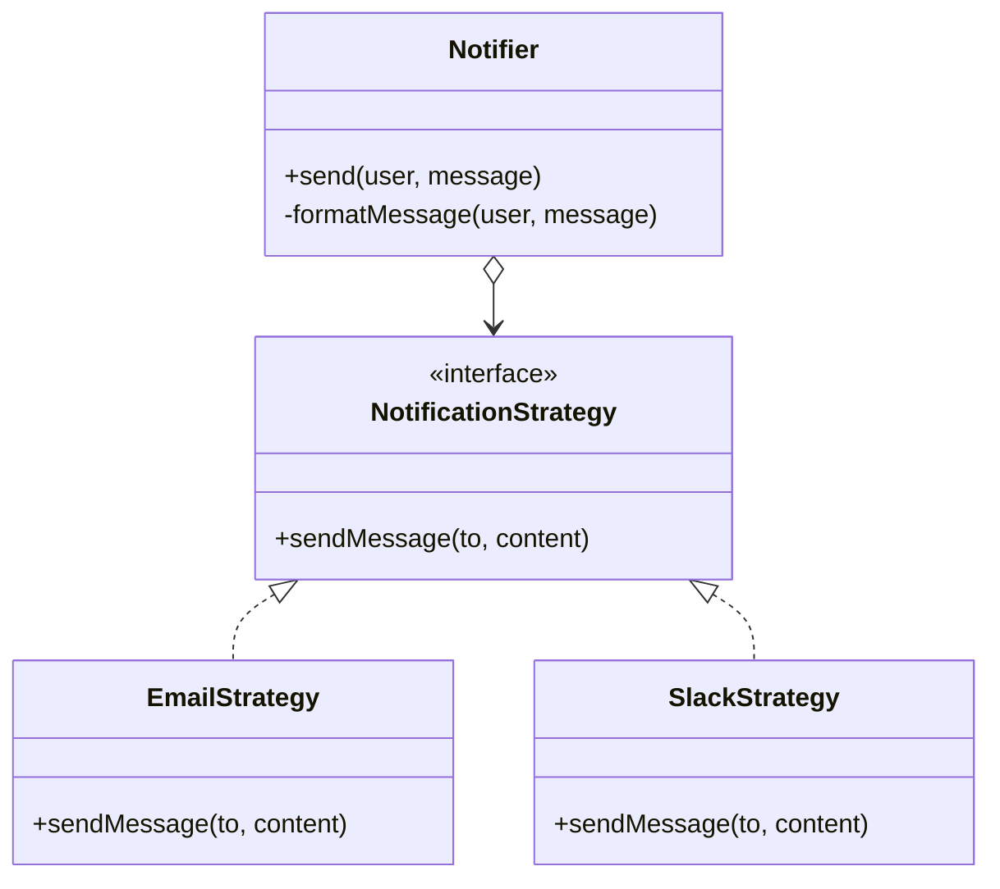

import Tabs from "@theme/Tabs";
import TabItem from "@theme/TabItem";
import CodeBlock from "@theme/CodeBlock";

import tsCode from "@site/src/codes/ref-synergy/ts/strategy-template.ts";
import phpCode from "@site/src/codes/ref-synergy/php/strategy-template.php";
import pyCode from "@site/src/codes/ref-synergy/py/strategy-template.py";

# 🧩 Strategy × Template Method

## ✅ 組み合わせの意図

- `Template Method` で通知の流れ（テンプレート）を固定し、
- 可変部分である通知手段を `Strategy` によって外部化する

共通の通知フロー（ログ出力・メッセージ整形・送信前後処理など）を一元化しながら、送信手段（メール、Slack など）だけを戦略的に差し替えられる設計。

## ✅ よく使われるシーン

- 処理手順は共通（ログや前処理など）だけど、送信方法や中身の戦略を柔軟に切り替えたいとき
- テスト環境では Mock 通知、本番ではメール通知など、通知先や形式を切り替えたいとき
- 通知テンプレートの整形や、送信ログの出力が共通化できるとき

## ✅ UML クラス図

## ✅ コード例

<Tabs groupId="language">
  <TabItem value="ts" label="TypeScript">
    <CodeBlock language="ts">{tsCode}</CodeBlock>
  </TabItem>
  <TabItem value="php" label="PHP">
    <CodeBlock language="php">{phpCode}</CodeBlock>
  </TabItem>
  <TabItem value="python" label="Python">
    <CodeBlock language="python">{pyCode}</CodeBlock>
  </TabItem>
</Tabs>

## ✅ 解説

- `Notifier` は共通のテンプレート処理を提供（ログ出力、整形、送信）
- `formatMessage` の実装はサブクラス（例: `AlertNotifier`）に任せる（`Template Method`）
- 送信戦略（`EmailStrategy`, `SlackStrategy`）は注入可能で切り替え可能（`Strategy`）

このように、**処理のテンプレート（流れ）を固定しつつ、可変処理だけ戦略として外部化する**ことで、
共通化と柔軟性のバランスが取れた設計になる。

## ✅ まとめ

- **Template Method** により、通知処理の一貫した流れを強制できる
- **Strategy** により、可変部分（送信手段）を自由に切り替えられる
- テスト・拡張・再利用・保守性に優れた設計
