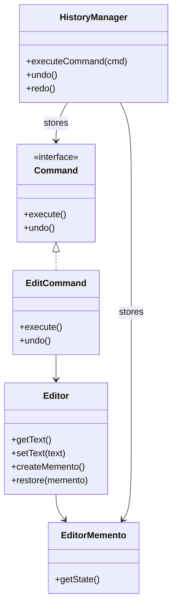

# 🧪️ Undo/Redo を実装したい

## ✅ 背景と課題

フォームやエディタ、GUI 操作などで「直前の状態に戻す（Undo）」「やり直す（Redo）」機能を求められることがある。  
このような機能を場当たり的に実装すると、状態の差分を手動で保存したり、処理の分岐が増えたりしてコードが煩雑になりがち。

特に次のような問題が起こる：

- 変更操作の履歴が記録されていない
- 「元に戻す」処理と「やり直す」処理が非対称でテストしづらい
- 状態と操作がバラバラに扱われており、拡張やデバッグが困難

## ✅ 解決の方向性と適用パターン

操作を `Command` パターンで「コマンドオブジェクト」として記録し、  
状態を `Memento` パターンで「スナップショット」として保存・復元できるようにする。

| 関心事                   | 使用パターン |
| ------------------------ | ------------ |
| 操作の履歴管理・取り消し | Command      |
| 状態の保存と復元         | Memento      |

これにより、「操作の記録」と「状態の復元」が役割分担され、  
Undo/Redo の処理が一貫した設計で実現できる。

## ✅ パターンの連携構成

| 要素                     | 実装例                            |
| ------------------------ | --------------------------------- |
| 実行・取り消し可能な操作 | `EditCommand`, `InsertCommand`    |
| 状態の保存               | `EditorMemento`                   |
| 状態管理者               | `Editor`（Memento の Originator） |
| 操作履歴の管理者         | `HistoryManager`（Invoker）       |

操作はコマンドとして抽象化され、各コマンドは実行時に `Memento` を保存することで、  
いつでも状態を巻き戻せる構造となる。

## ✅ UML クラス図

## ✅ 解説

この設計では、`EditCommand` などの各操作を `Command` として扱い、  
実行前に `Editor` の状態を `EditorMemento` として保存する。

`HistoryManager` はコマンドとスナップショットを履歴として管理し、  
Undo/Redo 操作に応じて適切に処理と状態を巻き戻す。

この構成により：

- 各コマンドが自律的に取り消しをサポートできる
- 状態と操作が明確に分離される
- 複雑な状態復元処理が簡潔に管理できる

## ✅ 実務での利点と適用例

- ✅ テキストエディタや画像編集ツールなどの Undo/Redo に対応
- ✅ 状態を保持したままロールバック可能なフォームやトランザクション制御
- ✅ 操作ログと状態履歴を分離できるため、テストしやすくデバッグもしやすい

## ✅ まとめ

- `Command` で操作の履歴をオブジェクトとして管理
- `Memento` で状態のスナップショット保存と復元を実現
- 両者を組み合わせることで、Undo/Redo を安全かつ柔軟に実装可能
- ユーザー操作の信頼性と UX 向上に寄与する設計構造となる

特に「一連の変更をやり直す」ような GUI 操作において、この構成は保守性・拡張性の高い実装手段となる。
