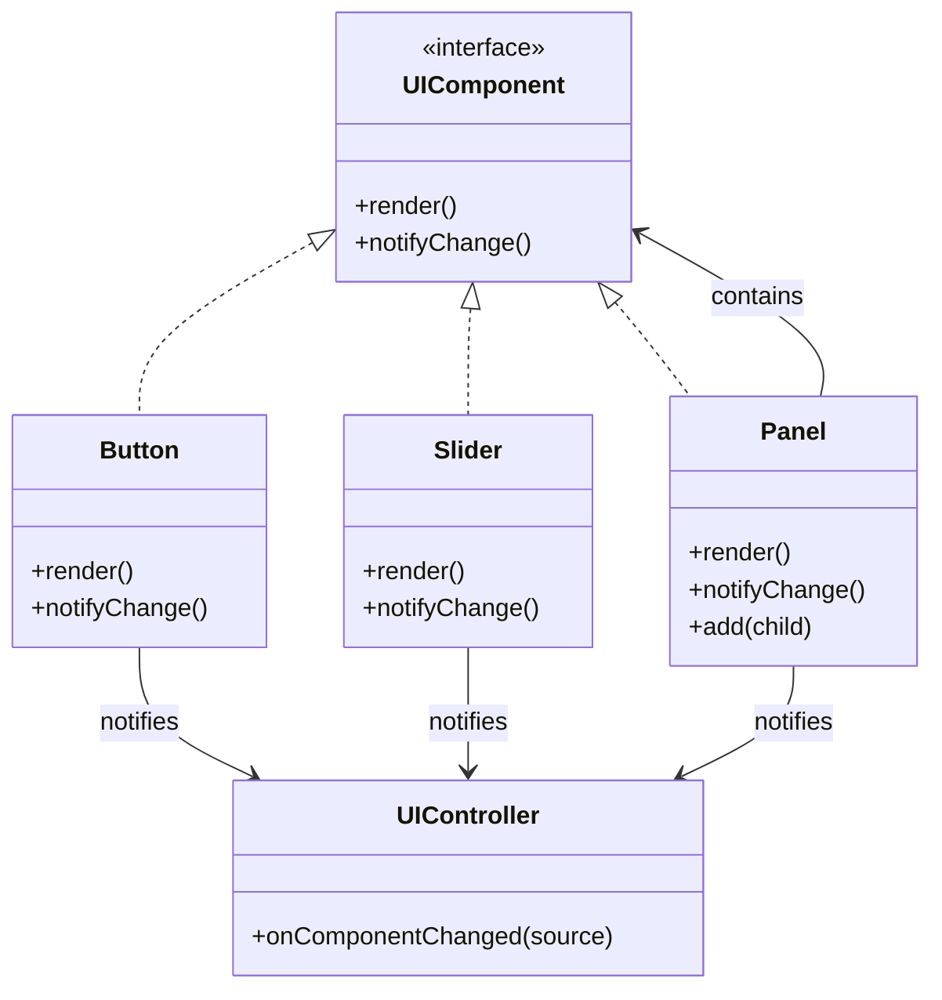

# 🧪️ UI の連携が煩雑

## ✅ 背景

ダッシュボードや設定画面などで、複数の UI コンポーネントが連動して動作するケースは多い。  
しかし、各コンポーネントが互いに直接通信していると、**依存関係が複雑化し、保守が困難になる**。

よくある課題：

- 子コンポーネント同士が相互に状態を変更し合っている
- 画面構成が増えるほど、制御ロジックも増大
- 全体を見渡す管理ロジックが存在せず、挙動のトレースが困難

## ✅ 解決の方向性

`Composite` パターンで UI コンポーネントを階層構造で扱い、  
全体の制御を `Mediator` パターンに集中させることで、**依存を中央に集約して制御を簡素化**する。

| 解決したい関心事         | 適用パターン |
| ------------------------ | ------------ |
| 階層的な構成の管理       | Composite    |
| 各コンポーネント間の調整 | Mediator     |

## ✅ パターンの併用構造

| 役割              | 実装例                           |
| ----------------- | -------------------------------- |
| UI 要素の共通基底 | `UIComponent`（interface）       |
| 単一要素          | `Button`, `Slider`（Leaf）       |
| 複合要素          | `Panel`, `GroupBox`（Composite） |
| 仲介者            | `UIController`（Mediator）       |

- 各 UI 要素は `UIComponent` を実装し、単体でも複合でも扱える（Composite）
- イベント発火や通知処理は `UIController` に集中（Mediator）

## ✅ UML クラス図

## ✅ 解説

この設計では以下のように責務を分離している：

- `UIComponent` を通じて共通インターフェースを定義（Composite）
- `Button`, `Slider`, `Panel` などが個別または複合 UI 要素として機能
- `UIController`（Mediator）が各 UI 要素の変更を受け取り、適切に連動処理を行う

結果として、**個々の要素は自律的に動作しつつ、中央制御で連携**が実現できる。

## ✅ 実務での利点と適用例

- ✅ ダッシュボードや設定画面など、複数要素が連携する UI の制御がシンプルに
- ✅ イベント伝播や通知処理の集中管理が可能になり、挙動がトレースしやすくなる
- ✅ 複雑な連動ロジックがあっても、Mediator に集約できるためコードの見通しが良くなる

例）

- 入力フォームに連動したエラーチェックやプレビュー
- 設定変更により他 UI を無効化する切り替え処理
- マルチパネル UI の一括切り替えや同期表示制御

## ✅ まとめ

- `Composite` で UI 構造をツリー状に構成し、柔軟なネストを実現
- `Mediator` でコンポーネント間の連携ロジックを中央集約
- UI の構造と制御ロジックを分離し、保守性と拡張性が向上
- 個々の要素は独立しつつも、全体として統一された振る舞いを実現

多数の UI 要素が複雑に関係し合う場合でも、この設計により**見通しの良い連携と制御の分離が可能**となる。
