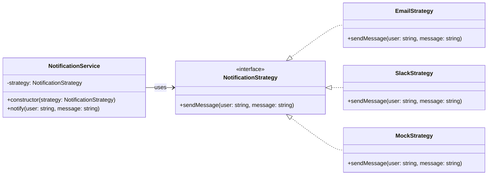

# 🧪 テストしづらい

## ✅ 問題の背景

通知などの副作用をビジネスロジック内に直接記述していると、テストが難しくなる。  
たとえば `OrderService` の中でメールや Slack を直接送っている場合、**その挙動を検証したり、抑制したりするのが困難**になる。

このような構造では、以下のような課題が発生する：

- テスト中でも通知が実際に送られてしまう
- 通知が「送られたかどうか」を検証できない
- 環境に応じて通知方法を切り替えるのが難しい

これは、**処理の可変性を直接埋め込んでしまったアンチパターン**の一例である。

## ✅ 解決の方向性

通知の手段を `Strategy` パターンによって外部化し、それを `DI（依存性の注入）` によって挿し込むことで解決する。

| 懸念点                 | 採用するパターン         |
| ---------------------- | ------------------------ |
| 通知手段を切り替えたい | Strategy（戦略パターン） |
| 具象の生成を分離したい | DI（依存性の注入）       |

この組み合わせにより、テスト時にはモック通知を、本番環境では実通知を使うといった **構成の切り替えが可能**になる。

## ✅ パターンの連携

| 役割             | 実装例                           |
| ---------------- | -------------------------------- |
| インターフェース | `NotificationStrategy`           |
| 実際の通知手段   | `EmailStrategy`, `SlackStrategy` |
| テスト用スタブ   | `MockStrategy`                   |
| 注入の仕組み     | コンストラクタ DI                |

この設計により、ビジネスロジック側は通知方法を意識せず、**処理の差し替えやテストが容易になる**。

## ✅ UML クラス図

## ✅ 解説

この設計では、通知処理を `NotificationStrategy` インターフェースとして定義し、  
その実装をコンストラクタ経由で `NotificationService` に注入する。

この構造によって：

- ビジネスロジックは通知の仕組みに依存しない
- テストではモックを挿し込んで挙動を制御できる
- 実行環境に応じて実装を切り替えられる

といった利点が得られる。

## ✅ 実務での利点と適用例

- ✅ 副作用（通知など）を抑制したテストが可能
- ✅ 本番・テストで通知手段を切り替えられる
- ✅ ログ出力や検証の挿し込みも柔軟に行える

通知処理以外にも、決済処理や外部サービス連携など、副作用のある処理全般に応用可能。

## ✅ まとめ

- `Strategy` により、通知手段を外部化・差し替え可能にする
- `DI` により、呼び出し元と具象の依存関係を分離できる
- テスト性と拡張性の両立が図れる構造となる

副作用を含む処理のテスト可能性を高めたい場合に、極めて有効なパターンの組み合わせである。
