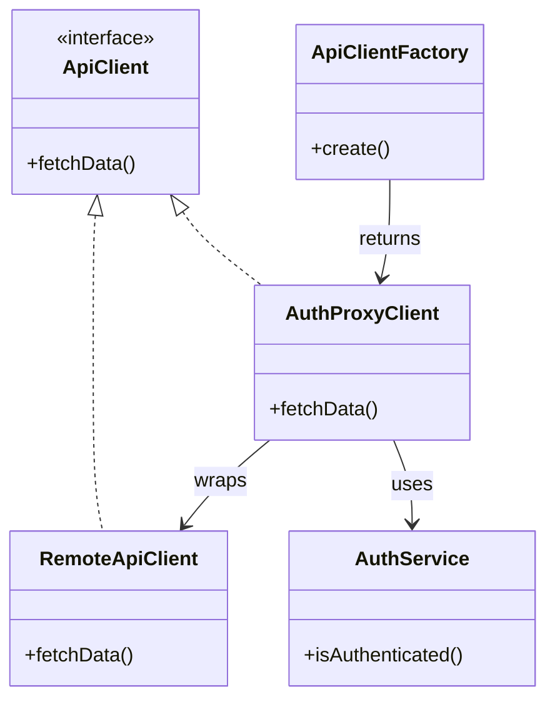

# 🧪️ 認証付きリソースを生成したい

## ✅ 背景

認証が必要な外部 API やリソースへのアクセスを行う場合、認証チェックやトークン管理、リソースの生成が複雑に絡み合いがちである。  
この処理が呼び出し元に分散して記述されると、再利用性が低くなり、保守性が著しく悪化する。

よくある課題：

- 各所で認証チェックを重複実装している
- リソース生成と認証処理が密結合になっている
- テストが困難で、認証回避のために条件分岐が増える

## ✅ 解決の方向性

`Factory` パターンでリソースの生成処理を一元化し、  
`Proxy` パターンでリソースアクセス時の認証チェックをラップすることで、責務分離と認可制御の簡素化を実現する。

| 解決したい関心事     | 適用パターン |
| -------------------- | ------------ |
| リソースの生成と構成 | Factory      |
| アクセスの認可制御   | Proxy        |

## ✅ パターンの併用構造

| 役割             | 実装例             |
| ---------------- | ------------------ |
| 実リソース       | `RemoteApiClient`  |
| 認証付きプロキシ | `AuthProxyClient`  |
| リソース生成工場 | `ApiClientFactory` |
| 認証チェック     | `AuthService`      |

- `Proxy` によってアクセス前に認可チェックを挿入
- `Factory` により、利用者はラップ済みリソースを簡単に生成可能

## ✅ UML クラス図

## ✅ 解説

この構成では以下のように責務を明確に分離：

- `RemoteApiClient` が実際の API 通信を担当
- `AuthProxyClient` が呼び出しに対する認証チェックを追加（Proxy）
- `ApiClientFactory` がすべてをまとめてクライアントに提供（Factory）
- `AuthService` が認証状態を判定

利用者は `Factory` を使って `Proxy` ラップ済みクライアントを受け取るだけで済み、認証処理を意識せずに安全に操作できる。

## ✅ 実務での利点と適用例

- ✅ API 呼び出しに必要な認可処理を共通化・一元化できる
- ✅ テスト環境では認証をモック化した Proxy に切り替えるだけでテスト可能
- ✅ Factory の切り替えにより開発用・本番用リソースを安全に使い分け可能

例：

- OAuth トークンが必要な API クライアント
- 社内用 API に対するアクセス制限付き UI 操作
- 外部リソースを安全に使うプラグイン設計

## ✅ まとめ

- `Factory` により、認証ロジックを含んだクライアント生成を一元管理
- `Proxy` により、アクセスごとに認証チェックを挿入
- セキュリティと拡張性の両立を図れる構造
- 認証付きリソースの生成・利用を安全かつ再利用可能に構築できる

この構成は、**セキュリティと構成の柔軟性が求められる外部連携設計において非常に有効なパターンの組み合わせ**である。
