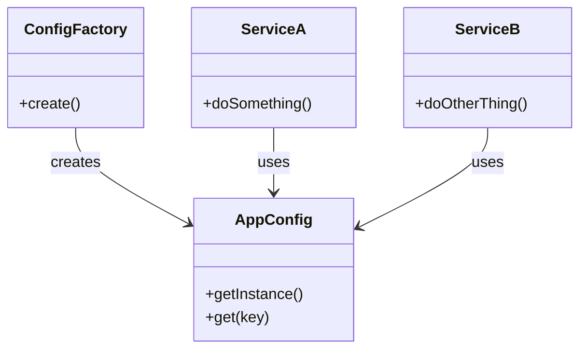

# 🧪️ 設定が散らかっている

## ✅ 背景

アプリケーションの初期化時に、複数の設定値や外部サービスへの依存関係を手動で組み立てていると、  
コードの再利用性が低下し、構成ミスや重複が発生しやすくなる。

よくある課題：

- 設定の初期化処理があちこちに散らばっていて把握しづらい
- 依存関係の構築順序や整合性の保証が難しい
- テストや本番で切り替えたい構成をうまく管理できない

## ✅ 解決の方向性

アプリケーションの構成情報を `Factory` パターンで集中管理し、  
そのインスタンスを `Singleton` パターンで共有・再利用する。

| 解決したい関心事         | 適用パターン |
| ------------------------ | ------------ |
| 構成・初期化の一元化     | Factory      |
| 共通インスタンスの再利用 | Singleton    |

## ✅ パターンの併用構造

| 役割             | 実装例                         |
| ---------------- | ------------------------------ |
| 設定情報の取得   | `ConfigFactory`（構成生成）    |
| 共通インスタンス | `AppConfig`（Singleton）       |
| 利用者           | `ServiceA`, `ServiceB`（依存） |

- `Factory` によって構成を一元的に定義・生成できる
- `Singleton` によって設定の再生成や不一致を防げる

## ✅ UML クラス図

## ✅ 解説

この構成では、設定や依存関係の初期化と共有を明確に分離：

- `ConfigFactory` が構成の初期化責任を持つ（Factory）
- `AppConfig` は `Singleton` として一度だけ生成され、全体で共有される
- 各サービスは `AppConfig` を参照することで設定情報にアクセス

これにより、**設定構成の一元化・再利用・テスト切り替え**が簡潔に実現できる。

## ✅ 実務での利点と適用例

- ✅ 環境別（開発/ステージング/本番）の設定切り替えがしやすい
- ✅ テストコードでの設定差し替えも容易になる
- ✅ コンフィグ以外にも DB 接続や認証などにも応用可能

例）

- `.env` から読み込んだ設定を `AppConfig` にまとめる
- テスト時に `ConfigFactory` をモック化して疑似設定を注入
- 複数サービスで共有される共通ライブラリ構成を統一管理

## ✅ まとめ

- `Factory` によって初期化・構成処理を集約し、柔軟な生成が可能に
- `Singleton` によって一貫性のある設定共有と再利用を実現
- 設定や依存の初期化に伴うミスを防ぎ、全体構成の見通しを良くする
- テスト環境・本番環境・動的切り替えへの対応がしやすいパターン

この設計は、**拡張可能で安定した初期化処理を支える土台となりうる構成**である。
