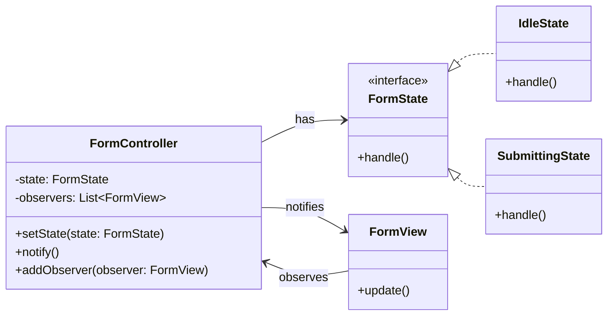

# 🧪️ UI の状態更新が複雑

## ✅ 問題の背景

状態によって表示や挙動が変わる UI では、状態管理がコードのあちこちに散らばりがちになる。  
「あるフラグが true ならボタンを表示する」「入力中はローディングを表示する」などの処理が増えてくると、**UI ロジックが煩雑になり、保守性が低下**する。

このような設計では以下のような問題が発生しやすい：

- 状態の分岐が UI コンポーネントに直接書かれ、再利用しづらい
- 状態の変更と表示の更新が結びついておらず、バグが発生しやすい
- 状態の変化に応じた他コンポーネントの更新が追いにくい

## ✅ 解決の方向性

状態を `State` パターンで明示的に表現し、  
状態の変更を `Observer` パターンで UI に通知する構成にする。

| 懸念点                           | 採用するパターン           |
| -------------------------------- | -------------------------- |
| 状態の変化に応じた挙動切替       | State（状態パターン）      |
| 状態変更を他コンポーネントに通知 | Observer（監視者パターン） |

状態と表示更新を明確に分離し、拡張性と見通しの良い UI を構築する。

## ✅ パターンの連携

| 役割            | 実装例                                               |
| --------------- | ---------------------------------------------------- |
| 状態管理        | `FormState`（State）                                 |
| 各状態の定義    | `IdleState`, `SubmittingState` など（ConcreteState） |
| UI 更新通知元   | `FormController`（Subject）                          |
| UI 表示の更新先 | `FormView`（Observer）                               |

`State` によって状態ごとの処理をまとめ、  
その変化を `Observer` 経由で UI に伝えることで、**UI 更新の一貫性とテスト性を高める**。

## ✅ UML クラス図

## ✅ 解説

この構造では、フォームの状態（未入力中、送信中など）を `FormState` によって抽象化し、  
その変更を `FormController` がトリガーとして UI に通知する。

この連携により：

- 状態による処理の分岐がクラス単位で分離される
- UI 側は状態変更を検知して自動で表示を切り替える
- 状態の追加・変更が UI 側の実装に影響しにくくなる

という保守性の高い UI 管理が実現する。

## ✅ 実務での利点と適用例

- ✅ 状態の追加や切り替えに対して拡張しやすくなる
- ✅ 画面側で複雑な条件分岐を持たずに済む
- ✅ ローディング中／完了／エラーなどの状態が明確に分けられる

フォーム UI、ダッシュボード、ステップ付きウィザード、モーダルなど、**状態によって UI 表示が変化する場面**に非常に有効。

## ✅ まとめ

- `State` によって状態ごとの処理をクラスで明確に分離できる
- `Observer` により UI への更新通知を効率的に実装できる
- 状態の増加や UI の複雑化にも耐えうる柔軟な構造となる

状態と UI を疎結合に保つことで、UI 更新の信頼性と見通しが格段に向上する。
