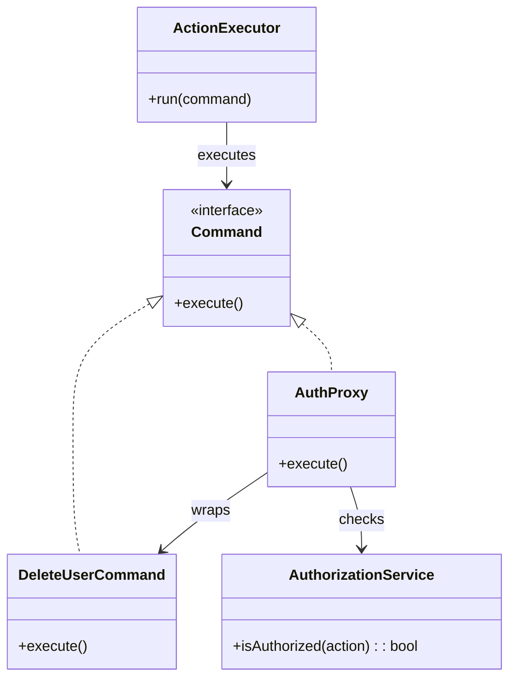

# 🧪️ 認可付きで操作させたい

## ✅ 背景

重要な処理（例: データ削除、外部 API 呼び出しなど）に対して、アクセス権や条件による実行制御が必要になることが多い。  
しかし、操作ロジックと認可ロジックが一体化していると、コードが複雑になり、再利用やテストが困難になる。

よくある課題：

- 実行前に認可チェックを挟みたいが、毎回 if 文を入れている
- 処理そのものと認可制御が混在し、責務分離ができていない
- 条件分岐が増えると、読みにくく拡張しづらい構造になる

## ✅ 解決の方向性

`Command` パターンで各操作をオブジェクト化し、  
`Proxy` パターンでその実行に対する前段制御（認可や検証）を追加する。

| 解決したい関心事     | 適用パターン |
| -------------------- | ------------ |
| 操作のオブジェクト化 | Command      |
| 認可や条件付き実行   | Proxy        |

## ✅ パターンの併用構造

| 役割            | 実装例                              |
| --------------- | ----------------------------------- |
| 操作本体        | `DeleteUserCommand`（Command）      |
| 実行ラッパー    | `AuthProxy`（Command を包む Proxy） |
| 実行者／Invoker | `ActionExecutor`（操作を実行）      |
| 認可サービス    | `AuthorizationService`（認可判断）  |

- `Command` により操作をオブジェクト化し、再利用・履歴管理を可能に
- `Proxy` により、認可条件に応じた実行制御を実現

## ✅ UML クラス図

## ✅ 解説

この構成では、操作の本体とその制御処理を責務ごとに分離：

- `DeleteUserCommand` などの処理は `Command` としてカプセル化
- `AuthProxy` が `Command` をラップし、実行前に認可をチェック（Proxy）
- `AuthorizationService` が権限を判定
- `ActionExecutor` は `Command` インターフェースに従って処理を実行

これにより、**ロジックの共通化・認可制御の分離・再利用性の向上**が実現される。

## ✅ 実務での利点と適用例

- ✅ 実行条件付きのコマンドを、認可の仕組みごと再利用できる
- ✅ 複数の認可戦略（管理者限定／本人のみ許可など）を Proxy 側で切り替え可能
- ✅ UI 側での制御（ボタン表示／非表示）やログ記録との連携も可能

例）

- 管理者権限が必要なデータ削除処理
- ロール別の実行許可を伴う操作（例：チーム編集）
- 外部連携 API への送信前に、検証や条件チェックが必要なケース

## ✅ まとめ

- `Command` により、処理をオブジェクト化し再利用・履歴管理が可能に
- `Proxy` により、前段で認可や検証処理を追加できる
- 実行条件付きの処理に柔軟に対応できる設計構成
- UI・認可・ログなど複数関心事を整理・統合できる

この構成は、**条件付きでの安全な処理実行**を求められる実務において、高い保守性とセキュリティを両立させる有効なアプローチである。
