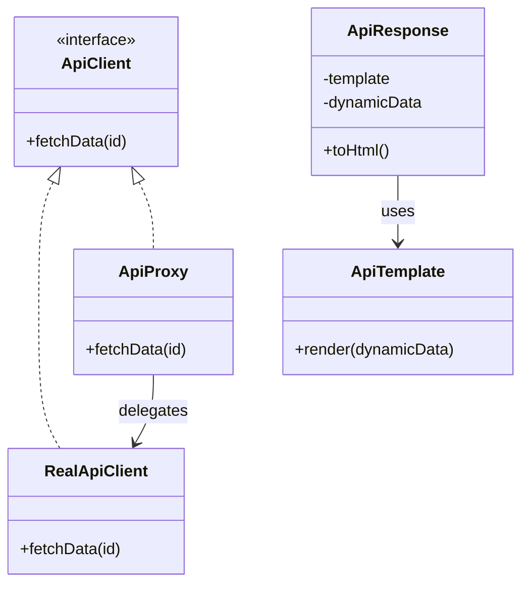

# 🧪️ API 呼び出しが重くて遅い

## ✅ 背景

外部 API との通信処理は、通信遅延やレスポンス待ちの影響で、システム全体のパフォーマンスを著しく低下させることがある。  
同じようなデータを何度も取得するケースでは、無駄な呼び出しが繰り返されていることも多い。

よくある課題：

- 毎回 API を呼び出していてパフォーマンスが悪い
- 一部のレスポンスデータが使い回しできるにもかかわらずキャッシュされていない
- 呼び出し元での制御が煩雑で、共通化できていない

## ✅ 解決の方向性

`Proxy`パターンで API 呼び出しの前段にキャッシュ付きの仲介層を設け、  
`Flyweight`パターンで共通部分（テンプレート、構造など）を共有してメモリ消費も抑える。

| 解決したい関心事       | 適用パターン |
| ---------------------- | ------------ |
| 遅延評価・アクセス制御 | Proxy        |
| データ構造の共有       | Flyweight    |

## ✅ パターンの併用構造

| 役割             | 実装例                              |
| ---------------- | ----------------------------------- |
| API アクセス対象 | `RealApiClient`（実体）             |
| 代理層           | `ApiProxy`（キャッシュ付き）        |
| 共有構造         | `ApiTemplate`（不変のテンプレート） |
| 可変データ       | `ApiResponse`（ユーザー毎に異なる） |

- Proxy によって呼び出し制御やキャッシュが可能に
- Flyweight によって、共通構造を共有しリソース効率を向上

## ✅ UML クラス図

## ✅ 解説

この設計では以下のように責務を分離している：

- `ApiProxy` がキャッシュと呼び出し制御を担当（Proxy）
- `RealApiClient` は実際の外部 API との通信を担当
- `ApiTemplate` は変化しない共通部分を保持（Flyweight）
- `ApiResponse` が可変データとテンプレートを合成

このように、**アクセス制御と構造共有をそれぞれのパターンに分担させる**ことで、  
柔軟かつ効率的な API 連携が可能となる。

## ✅ 実務での利点と適用例

- ✅ 同じ ID のデータを頻繁に取得するようなアプリでキャッシュ効果が大きい
- ✅ テンプレートやフォーマットが共通のレスポンス形式に最適
- ✅ API 呼び出し回数の削減だけでなく、UI 構築側の再利用性も高められる

例）

- プロフィール情報やカテゴリ情報などの読み取り専用 API
- ダッシュボードでの共通カードレイアウト表示
- コンテンツ配信システムなどでの共通テンプレート利用

## ✅ まとめ

- `Proxy`で呼び出し前にキャッシュや遅延評価を実現
- `Flyweight`で共通構造を共有し、軽量かつ効率的な設計に
- API 呼び出しが重くなりがちなシーンで有効な組み合わせ構成
- 通信の最適化と UI 側の再利用性向上を両立できる設計パターン構成

重い API アクセスを適切にラップし、共通構造を共有するこの設計は、**高負荷環境でも安定性と拡張性を両立させる有効なアプローチ**である。
