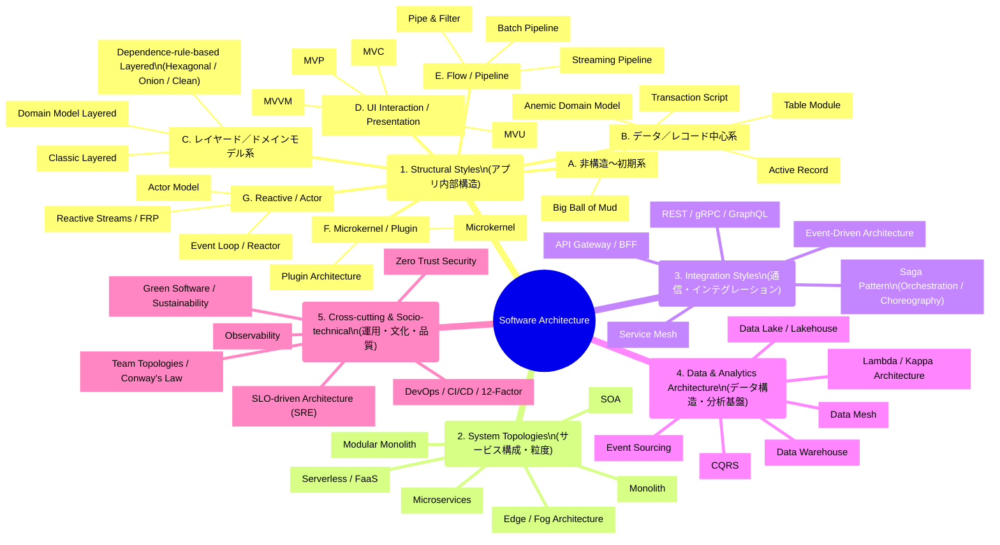
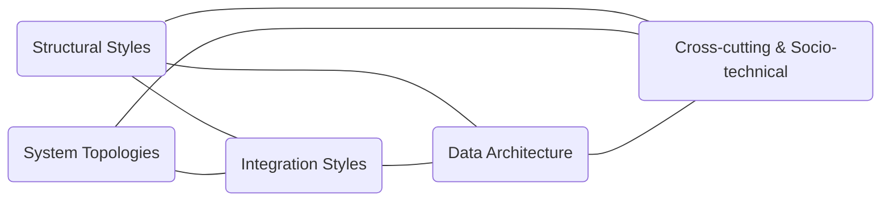

# ソフトウェアアーキテクチャの地図

このサイトは、ソフトウェアアーキテクチャを体系的に理解するための「地図」を提供することを目的とする。  
アーキテクチャは単一の概念ではなく、複数の設計レイヤーが重なり合う領域であり、全体像を掴むことが難しい。本サイトでは、それらを整理し、相互関係を理解しやすくするための指針を示す。

## ✅ なぜアーキテクチャは分かりにくいのか

アーキテクチャの議論が混乱しやすい理由は、異なる次元の設計が同じ文脈で語られがちだからである。  
以下は代表的なレイヤーであり、それぞれ独立した設計軸を持つ。

- アプリ内部構造（Layered, MVC, Hexagonal など）
- システム構成・粒度（Monolith, Microservices）
- 通信方式（REST, gRPC, Event-driven）
- データ構造・基盤（DWH, Data Lake, Event Sourcing）
- 運用・組織（DevOps, SRE, Team Topologies）

これらは「構造・配置・通信・データ・運用」というまったく別の設計レイヤーであり、ひとつの図や概念で統合的に説明することはできない。

## ✅ 本サイトの分類構成について

本サイトの分類は、近年のアーキテクチャ議論の歴史的トレンドを踏まえて設計している。

- Hexagonal / Onion / Clean Architecture のような  
  **依存方向ルール（Dependency Rule）を前提としたスタイル** が実務で強く定着したこと
- これらが 2000〜2010 年代にかけて  
  **アプリ内部構造の主要トピックとして深化したこと**
- 対して近年は、  
  **Topologies（モノリス〜マイクロサービス）、Integration、Data、Socio-technical**  
  といった “より外側のレイヤー” の進化が中心になっていること

こうした背景により、本サイトでは  
**Structural Styles（アプリ内部構造）を細かく分類し、外側のレイヤーを別カテゴリとして整理する構成**  
を採用している。

### 1. Structural Styles（アプリ内部構造）

近年の議論では、Hexagonal / Onion / Clean など **Dependency Rule** を中核としたスタイルが強く定着し、アプリ内部構造の中心的トピックとして扱われてきた。  
そのため Structural Styles は他カテゴリより細かく分類している。

なお、Vertical Slice / Feature-based などの実装手法は、既存スタイルの具体的な構成パターンとして補足的に位置づけている。

### 2. System Topologies（システム構成・粒度）

モノリスからマイクロサービス、さらにサーバレスやエッジに至るまで、アプリケーションの配置戦略を扱う領域。近年の進化が最も顕著なカテゴリである。

### 3. Integration Styles（通信・連携方式）

REST、gRPC、Event-driven、Service Mesh など、サービス間通信の方式と統合パターンを扱う。

### 4. Data & Analytics Architecture（データ構造・分析基盤）

従来の DWH や Data Lake から、CQRS・Event Sourcing による操作分離、Data Mesh による分散責務まで、データ設計の進化を整理している。

### 5. Cross-cutting & Socio-technical（運用・文化・品質）

DevOps、SRE、Observability、Zero Trust、Team Topologies など、技術基盤だけではなく組織・運用・文化が関わる領域を扱う。

## 🧩 ソフトウェアアーキテクチャ全体樹形図

## 🧩 カテゴリ間の関係図（横断エッジ）

## 🧩 アーキテクチャ全体を理解するためのガイド

アプリ内部構造・システム構成・通信方式・データ基盤といった個別カテゴリを読む前に、全体像を俯瞰するための補足ページを用意している。

### ● Architecture Principles（アーキテクチャ原則）

アーキテクチャに共通する基盤概念（依存方向・境界・結合度と凝集度・整合性モデル・同期／非同期など）を整理した。

### ● Architecture Decision Guide（アーキテクチャ選定ガイド）

外側の構造（Topologies / Integration / Data / Cross-cutting）を、要件・制約・組織構造からどのように選ぶかを体系化したガイド。

### ● Structural Styles Decision Guide（内部構造選定ガイド）

アプリ内部の構造（Layered / Clean / Hexagonal / MVC / MVVM / Transaction Script など）を、ドメイン複雑性・変更容易性・チーム構造などからどのように選ぶかを整理したガイド。

これらは各カテゴリの前提として読むことで、アーキテクチャ全体を俯瞰しながら、個々のスタイルを適切に位置づけるための助けとなる。

## 🧭 このあと読むべきページ

- [**Structural Styles（アプリ内部構造）**](./structural/index.md)
- [**System Topologies（サービス構成・粒度）**](./topologies/index.md)
- [**Integration Styles（通信・連携方式）**](./integration/index.md)
- [**Data Architecture（データ構造・分析基盤）**](./data/index.md)
- [**Cross-cutting & Socio-technical（運用・文化・品質）**](./cross-cutting/index.md)

各カテゴリでは、次の観点から説明する。

- 解決しようとした問題
- スタイルの思想・構造
- 適するアプリケーション領域
