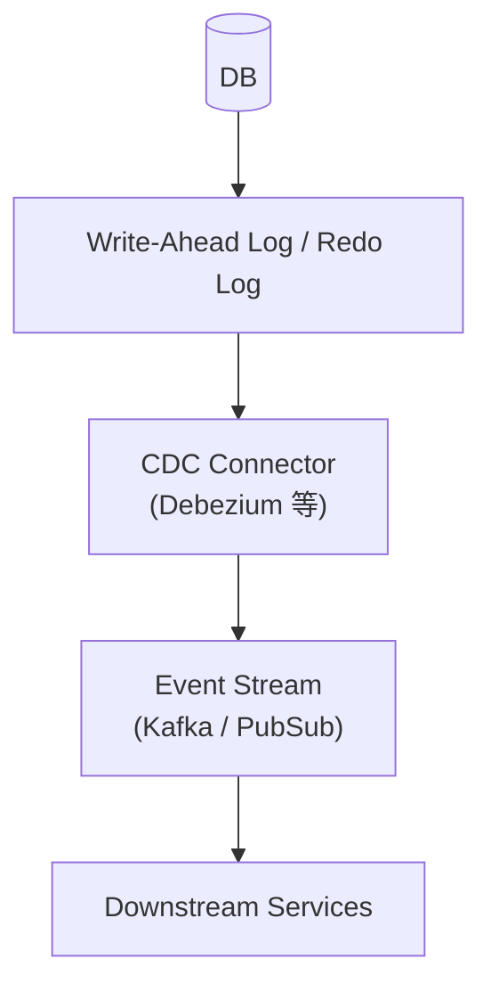

# 🧩 Change Data Capture（CDC）

CDC（Change Data Capture）は、**データベースの変更をリアルタイムに検知し、イベントとして外部へ配信する構造** を提供する仕組みである。

## ✅ このスタイルの概要

DB の変更（INSERT / UPDATE / DELETE）をログレベルで取得し、  
アプリケーションを経由せずにストリームへ反映する。

## ✅ 解決しようとした問題

- DB を変更したのに、アプリ側がイベントを発火し忘れる
- アプリが関与するフローが複雑化し、整合性が保てない
- 高スループットのイベント生成にアプリが耐えられない

CDC により、**アプリを介さず DB の変更が確実にイベント化される。**

## ✅ 基本思想・構造

- DB のログ（WAL・binlog）を読み取る
- 変更差分をイベントとして配信
- アプリへの変更は不要（DB が唯一の truth source）

## ✅ 得意なケース

- 大量データの非同期複製
- イベント生成をアプリに書きたくない
- データパイプライン／分析基盤への即時反映

## ❌ 不向きなケース

- DB のスキーマ変更が頻繁にあり不安定
- 強整合で同期処理すべてを制御したい場合

## ✅ 関連スタイル

- [Outbox Pattern](./outbox-pattern.md)（アプリ経由 vs DB 経由の違い）
- [Event Sourcing](../data/event-sourcing.md)（イベントをデータの真実とする思想）
- [EDA](../integration/event-driven.md)（Event-driven 全般）

## ✅ まとめ

CDC は **DB 主導のイベント生成** により、整合性とスケールを両立する仕組みである。  
アプリケーションが複雑になりがちなイベント生成を DB にオフロードできる点で、現代的データアーキテクチャの中心技法となっている。
