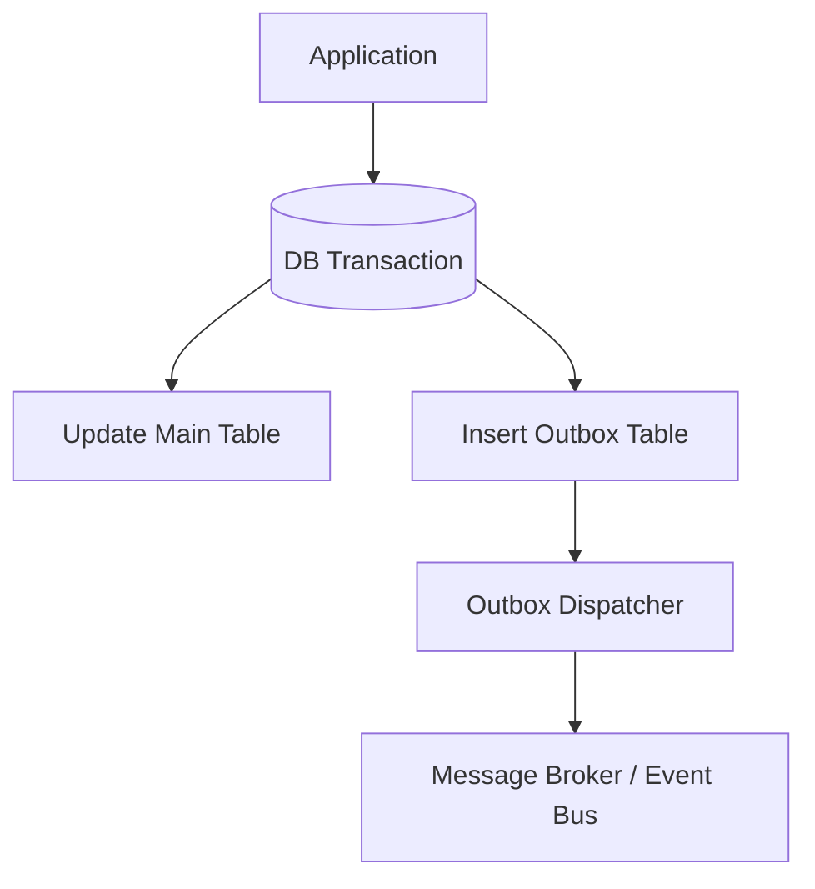

# 🧩 Outbox Pattern（Transactional Outbox）

Outbox Pattern は、サービス間連携における **データ整合性とイベント配送の不整合** を解消するための代表的な Integration パターンである。

## ✅ このスタイルの概要

アプリケーションのローカルトランザクション内で  
**（A）DB の更新 と （B）イベントの記録** を同時に行い、  
その後バッファ（Outbox テーブル）からイベントを外部に配送する構造を取る。

## ✅ 解決しようとした問題

- DB 更新は成功したがイベント送信が失敗する
- イベントは送られたが DB 更新がロールバックされた
- 分散トランザクション（2PC）を避けたい
- マイクロサービス間で強整合性を保てない

Outbox Pattern は **ローカル DB トランザクションにすべてを閉じ込める** ことでズレを防ぐ。

## ✅ 基本思想・構造

- Outbox テーブルは「未送信イベント」のバッファ
- Dispatcher が定期的に Outbox を読み、Kafka / SNS / etc に送信する
- 成功後に Outbox レコードを削除 or マーク済みにする

## ✅ 得意なアプリケーション

- マイクロサービス間のデータ整合性が重要
- CRUD + イベント連携が中心の業務系
- 監査・変更履歴を残したいケース

## ❌ 不向きなケース

- 超高頻度でイベントを大量生成する場合（Outbox がボトルネック化）
- 遅延が極めてシビアなワークロード

## ✅ 関連スタイル

- Change Data Capture（CDC）
- Event-driven Architecture（EDA）
- Saga Pattern（特に Orchestration）

## ✅ まとめ

Outbox Pattern は、マイクロサービス時代の **最も実務的な整合性担保パターン** であり、  
DB 更新とイベント配送のズレを避けるための標準的手法である。
