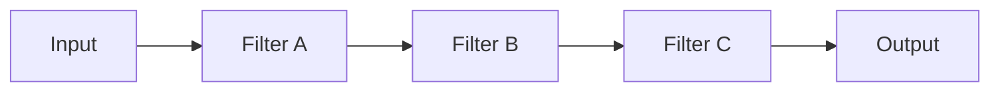

# 🧩 Pipe & Filter

## ✅ このスタイルの概要

**入力データが一連のフィルタ（処理ステージ）を通過しながら変換されていく構造スタイル。**  
Unix の `cmd1 | cmd2 | cmd3` のような発想をプログラム内に適用するイメージ。

## ✅ 解決しようとした問題

- 1 つの巨大な処理関数にすべてのロジックが詰め込まれている
- 特定ステップの差し替え・再利用・テストが難しい
- 入出力が複雑に絡み合っており、処理フローが読みづらい

Pipe & Filter は、

> 「処理を小さなフィルタに分割し、データをパイプでつなぐ」

ことで、処理フローを

- 見通し良く
- 差し替えやすく
- 並列化しやすく
  することを狙う。

## ✅ 基本思想・ルール

### ● Filter（フィルタ）

- 単一責務の処理ステージ
- 入力ストリームを受け取り、出力ストリームを返す
- 副作用は最小限（理想的には純粋関数に近い）

### ● Pipe（パイプ）

- フィルタ同士をつなぐデータの流れ
- メモリ内の関数呼び出し、キュー、メッセージングなど実装は様々

### ● 流れの例

```text
Input → FilterA → FilterB → FilterC → Output
```

- 途中で分岐・合流を行うこともできる

### 概念図（Conceptual Diagram）



## ✅ 得意なアプリケーション

- テキスト処理・ログ処理
- 画像・音声・動画などの逐次変換
- ETL 処理の一部（抽出 → 変換 → ロード）
- 小さなツール群を組み合わせるバッチ処理

特に、

> 「この処理フローは、この順番で A→B→C と通る」

と説明できる場面で威力を発揮する。

## ❌ 不向きなケース

- ステートフルな処理が強く絡むロジック（状態遷移中心のワークフローなど）
- 双方向通信や複雑なインタラクションが必要な UI
- 単純な CRUD アプリ（管をつなぐコストの方が高い）

## ✅ 歴史（系譜・親スタイル）

- Unix のパイプ機構にルーツを持つ
- 早期のソフトウェアアーキテクチャ文献でも「パイプ＆フィルタ」として紹介
- Data Pipeline / Streaming Pipeline など、後続のスタイルに影響を与えた

## ✅ 関連スタイル

- **[Batch Pipeline](./batch-pipeline.md)**：バッチ処理としてのパイプライン構造
- **[Streaming Pipeline](./streaming-pipeline.md)**：ストリーミング処理への発展
- **[Reactive / Actor 系](../reactive/index.md)**：イベントストリーム処理と組み合わさることが多い

## ✅ 代表的なフレームワーク

Pipe & Filter は軽量処理パイプラインとして、多くの環境で自然に登場する。

- **Unix / Linux CLI（`cmd1 | cmd2 | cmd3`）**  
  パイプ構造そのもの。原型と言える。

- **Node.js Streams**  
  `Readable → Transform → Writable` の構造がまさに Pipe & Filter。

- **Golang（io.Reader / io.Writer）**  
  インターフェースを通して単方向ストリームをつなぎやすい。

- **画像・動画処理ツール（FFmpeg など）**  
  小さな変換処理をパイプで連結して複雑な処理を構築できる。

## ✅ このスタイルを支えるデザインパターン

Pipe & Filter の内部構造は、複数のデザインパターンの組み合わせで成立している。

- **Chain of Responsibility**  
  フィルタを“処理チェーン”として順番に適用する。

- **Iterator**  
  ストリームデータを逐次処理する際に使われる。

- **Strategy**  
  各フィルタのアルゴリズムを差し替え可能な形で表現する。

- **Mediator**  
  ステージ間の調整が必要な場合に現れる（分岐／合流など）。

## ✅ まとめ

Pipe & Filter は、

- 処理を小さなステージに分割し
- ステージ間を明確なデータフローでつなぐ

というシンプルな発想で複雑さを扱うスタイルである。

「巨大な処理をどう分割するか？」に悩んだときの、  
**最初の候補** として検討する価値がある。
