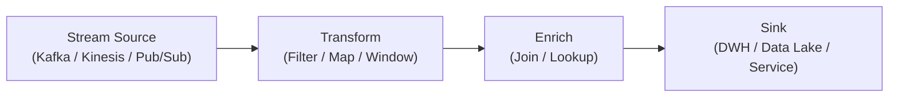

# 🧩 Streaming Pipeline

## ✅ このスタイルの概要

**連続して流れてくるデータ／イベントを、途切れさせずにパイプラインで処理し続けるスタイル。**

- 常にデータが「流れている」ことを前提としたパイプライン
- ほぼリアルタイムでの集計・検知・変換に強い
- バッチではなく **ストリーム（流れ）** を設計対象とする

## ✅ 解決しようとした問題

バッチ処理や単発の ETL では対応しきれない、次のような課題を解決したいときに Streaming Pipeline が登場する。

- イベント数が多く、**1 回ごとのバッチ処理が重くなりすぎる**
- 「1 時間ごとのバッチ」では遅く、**ほぼリアルタイムで検知・反応したい**
- 同じデータを複数チームや複数システムが **継続的に利用したい**
- ログ／センサー／トランザクションデータなどが **絶えず増え続ける**

> 「結果だけでなく、データが流れていくプロセス自体を、継続的に動くパイプラインとして設計したい」

というニーズに応えるスタイルである。

## ✅ 基本構造と考え方

Streaming Pipeline では、データは以下のようなステップで流れていく。

1. **Source（ソース）**
   - Kafka Topic / Kinesis Stream / Pub/Sub 等からイベントを受け取る
2. **Transform（変換）**
   - フィルタリング、マッピング、結合、ウィンドウ集計などを行う
3. **Enrich（補強）**
   - 他のストリームや参照データを使って情報を付加する
4. **Sink（シンク）**
   - ストレージ（[DWH](../../data/data-warehouse.md) / [Data Lake](../../data/data-lake-lakehouse.md)）や下流システム、ダッシュボードなどに出力する

特徴的な要素：

- **Immutable Event / Append-only**：過去のイベントを上書きせず、「流れた事実」として扱う
- **Windowing（時間窓）**：一定時間ごとの集計・検知（例：直近 5 分のエラー数）
- **Stateful Processing**：ストリーム処理の途中で状態を持ち、継続的に更新する
- **Backpressure / Rate Control**：大量の入力に対して、処理能力を超えないよう制御する

### 概念図（Conceptual Diagram）

## ✅ 得意なアプリケーション

Streaming Pipeline が特に威力を発揮するのは、次のような領域である。

- **ログ・メトリクス処理**  
  アクセスログ、アプリケーションログ、メトリクスのリアルタイム集計・アラート。

- **イベント駆動サービス**  
  ユーザー行動イベントをもとにしたレコメンド、パーソナライズ、フィード生成。

- **IoT / センサー系**  
  センサーデータやデバイスからのテレメトリの連続監視、異常検知。

- **決済・トランザクションモニタリング**  
  不正検知、リアルタイムのリスク評価など。

## ❌ 不向きなケース

Streaming Pipeline は「何でもストリーミングでやればよい」わけではない。

- **1 回きりの集計やマイグレーション**  
  単発の重い処理はバッチの方がシンプルなことが多い。

- **厳密な一括整合性が必要な処理**  
  すべてのデータが揃ってから一度に判断する方が安全なケース（例：期末バッチ決算）。

- **シンプルな CRUD 中心の業務システム**  
  そもそもストリームとして設計する必要がない場合も多い。

## ✅ 歴史（系譜・親スタイル）

Streaming Pipeline は、次の文脈から発展してきた。

- **[Pipe & Filter](./pipe-and-filter.md)** や **[Batch Pipeline](./batch-pipeline.md)** の考え方を、リアルタイム処理に拡張したもの
- **ログ集計基盤**（Hadoop 時代）から、Kafka などの分散ログ基盤 + ストリーム処理エンジンへと進化
- [Lambda / Kappa アーキテクチャ](../../data/lambda-kappa.md)における「スピードレイヤ」「ストリームレイヤ」として定式化

> 「バッチの限界を超え、データが到着するたびに処理し続ける」

という方向に振り切ったパイプラインスタイルである。

## ✅ 関連スタイルとの関係

- **[Pipe & Filter](./pipe-and-filter.md)**  
  モデルとしては同じくステージの連結だが、Streaming は「常に流れている」ことが前提。

- **[Batch Pipeline](./batch-pipeline.md)**  
  処理単位が「ジョブごと」「日次・時間ごと」か、「イベント単位／時間窓単位」かの違い。

- **[Event-driven Architecture / EDA](../../integration/event-driven.md)**  
  イベントの流れがシステム境界をまたぐ場合、その内部処理として Streaming Pipeline が登場する。

- **[Lambda / Kappa Architecture（Data 系）](../../data/lambda-kappa.md)**  
  ストリーム処理と [DWH](../../data/data-warehouse.md) / [Data Lake](../../data/data-lake-lakehouse.md) をどう組み合わせるかの文脈でよく登場する。

## ✅ 代表的なフレームワーク

Streaming Pipeline を実現する代表的な基盤・フレームワークには次のようなものがある。

- **Apache Kafka Streams / ksqlDB**  
  Kafka 上のストリーム処理専用ライブラリ。トピック間のストリーム変換・結合・集計を記述できる。

- **Apache Flink**  
  ストリーム処理に強い分散処理エンジン。複雑なウィンドウ処理・状態管理が可能。

- **Apache Beam（ストリーミングモード）**  
  Batch / Streaming を同一モデルで記述でき、Dataflow など複数ランタイムにポータブル。

- **Amazon Kinesis / Google Cloud Pub/Sub + Dataflow など**  
  マネージドサービスとしてストリーミングパイプラインを構築できる。

## ✅ このスタイルを支えるデザインパターン

Streaming Pipeline は、オブジェクト指向のデザインパターンで見ると次のような組み合わせになっている。

- **Iterator**  
  ストリームを「次の要素を順に取り出す」抽象として扱う。

- **Observer**  
  新しいイベントの到着を購読し、処理をトリガーする。

- **Chain of Responsibility**  
  複数の処理ステージをつなぎ、イベントを段階的に処理していく。

- **Mediator**  
  複数のストリームやステージが絡むとき、ルーティングや結合を一箇所に集約する。

- **Strategy**  
  ステージごとの処理ロジック（集計アルゴリズムやフィルタ条件）を差し替え可能にする。

## ✅ まとめ

Streaming Pipeline は、

- データが絶えず流れ続ける前提で
- ステージを組み合わせて
- ほぼリアルタイムに処理・集計・検知する

ためのパイプラインスタイルである。

[Pipe & Filter](./pipe-and-filter.md) / [Batch Pipeline](./batch-pipeline.md) と同じ系譜にありながら、

> **「データが来るたびに動き続ける処理フロー」**

を設計の主役にする点が最大の特徴である。

データ量・リアルタイム性・拡張性の要件が高いシステムでは、  
Streaming Pipeline を意識した設計が、アーキテクチャ上の重要な選択肢となる。
