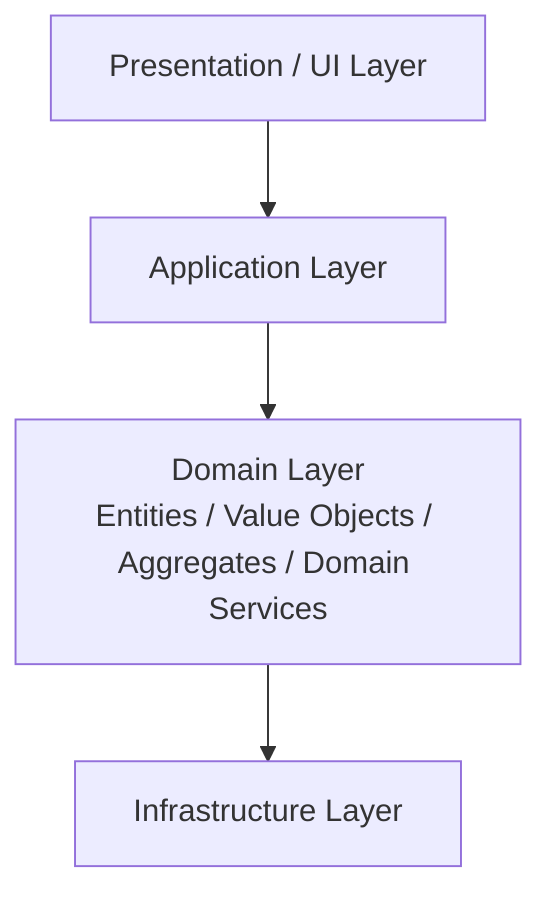

# 🧩 Domain Model Layered（ドメインモデルレイヤード）

## ✅ このスタイルの概要

Classic Layered をベースにしつつ、
**Domain 層にリッチなドメインモデル（集約・エンティティ・値オブジェクト）を中心に据えたスタイル。**
DDD の考え方と相性が良いレイヤードアーキテクチャ。

## ✅ 解決しようとした問題

Classic Layered では、次のような問題が起こりがちです：

- Domain 層が「DTO 置き場」や共通関数置き場になり、実質的に空洞化する
- ビジネスルールが Application / Service 層に散らばる
- ドメインの複雑さをコードから読み取りづらい

Domain Model Layered はこれに対して、

> 「ドメインの概念をコード上のクラス・メソッドとして表現し、
> ビジネスルールを Domain 層に集約する」

という考え方で応える。

## ✅ 基本思想・ルール

レイヤー構造そのものは Classic Layered に近いですが、
**Domain 層の扱いが決定的に異なります。**

- Domain 層に：
  - エンティティ
  - 値オブジェクト
  - ドメインサービス
  - 集約
    などのドメインオブジェクトを配置
- アプリケーション固有のユースケースの流れは Application 層
- インフラ依存（DB, 外部 API）は Infrastructure 層

依存関係としては：

- Application → Domain
- Infrastructure → Domain

のような形が理想とされる（実際には完全分離は難しいが、方向性として）。

現実の実装では、ORM（JPA / Hibernate など）のアノテーションをドメインモデルに直接付与するケースも多く、結果として Domain → Infrastructure の依存が残ることがある。この点が、依存方向をより厳密に分離しようとする Hexagonal / Clean Architecture などの“Dependency Rule 強化系”スタイルとの違いとなる。

### 概念図（Conceptual Diagram）

## ✅ 得意なアプリケーション

- 業務ルールが複雑な B2B SaaS / エンタープライズシステム
- 状態遷移・不変条件・計算ロジックが重要な領域（金融・在庫・料金計算など）
- ドメインエキスパートと「ドメイン言語」で会話しながら開発するプロジェクト

Domain Model Layered は、**ドメインの複雑さがビジネスのコア価値である** 場合に特に力を発揮する。

## ❌ 不向きなケース

- CRUD が中心でドメインルールが単純なアプリ
- DB スキーマ ≒ 画面項目、という構造で十分なシステム
- チームのオブジェクト指向・DDD への習熟度が低く、むしろ複雑になる場合

ドメインモデルを無理に導入すると、
「概念だけ複雑で実装が追いつかない」といった状態にもなり得る。

## ✅ 歴史（系譜・親スタイル）

- Classic Layered の発展形として登場
- Fowler の PoEAA や Evans の DDD に大きく影響を受けたスタイル
- のちに Hexagonal / Onion / Clean などの“依存ルール強化系”スタイルへとつながっていく

## ✅ 関連スタイル

- **Classic Layered**：ドメインを薄く扱う原型スタイル
- **Hexagonal / Onion / Clean**：ドメインをさらに強く保護しようとする発展系
- **DDD（戦術パターン）**：エンティティ、値オブジェクト、集約などの具体的なモデル表現

## ✅ 代表的なフレームワーク

Domain Model Layered はフレームワークに依存しないスタイルだが、次のような環境で採用されることが多い。

- **Spring Boot（Java）**  
  DDD + レイヤード構成のサンプルや書籍が非常に豊富で、Domain Model Layered の典型例として参照しやすい。

- **ASP.NET Core / .NET**  
  DDD と組み合わせたレイヤード構成（Application / Domain / Infrastructure）が多くのテンプレートで採用されている。

- **NestJS**  
  Module / Provider 構造と TypeScript の相性の良さから、ドメインモデル中心のレイヤード構成に寄せやすい。

## ✅ このスタイルを支えるデザインパターン

ドメインモデル（集約・エンティティ・値オブジェクト）を中心とした構造を支えるために、次のパターンがよく現れる。

- **Strategy**  
  ドメインオブジェクトの振る舞い（料金計算・割引・条件分岐など）を差し替え可能に表現する。

- **Composite**  
  階層構造を持つドメイン（ツリー状のカテゴリー、組織、構成品など）を一貫したインターフェースで扱う。

- **Mediator**  
  複数エンティティ間の複雑なやり取りを、一箇所に集約して調停する。

- **Template Method**  
  ドメインサービスや集約ルートが、似た処理の流れを持つ場合の共通化に使われる。

## ✅ まとめ

Domain Model Layered は、

- レイヤードアーキテクチャの理解しやすさと、
- DDD 的なドメインモデルの強さ

を両立しようとするスタイルである。

ドメインの複雑さが増し始めたときに、
**Classic Layered からの「次の一歩」として採用を検討する価値がある。**
