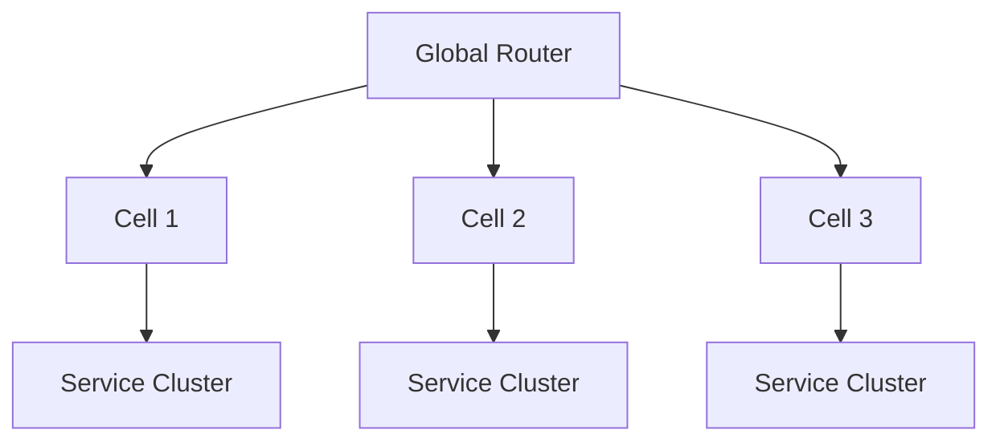

# 🧩 Cell-based Architecture（セル構造アーキテクチャ）

Cell-based Architecture は、大規模分散システムにおいて **システムをセル（Cell）と呼ばれる独立した小さなクラスター単位で構成する** トポロジである。Slack、Netflix、Uber など大規模運用組織で採用されている。

## ✅ このスタイルの概要

同一機能を複数の Cell に複製し、ユーザを Cell にルーティングすることでスケールや障害分離を実現する構造。

## ✅ 解決しようとした問題

- 単一リージョン／単一クラスター構成の限界
- マイクロサービスが巨大化し集中障害点となる問題
- 全体再デプロイ時のリスク増大
- 大規模トラフィックへのスケールの壁

## ✅ 基本思想・構造

- 各 Cell は独立したサービス群＋データストアを持つ
- Cell 間は基本的に疎結合（Cross-Cell 呼び出しを最小化）
- Cell の追加・削除でスケール

## ✅ 得意なアプリケーション

- 数百万〜数千万ユーザ規模
- 強力なフォールトアイソレーションが必要
- 柔軟にスケールしたい SaaS / Messaging 系

## ❌ 不向きなケース

- 小規模〜中規模システム
- 複製コストを支払う価値がない領域

## ✅ 関連スタイル

- Microservices
- Multi-region Architecture
- Sharding（データ分割）

## ✅ まとめ

Cell-based Architecture は超大規模システムを安定運用するための構成であり、障害分離とスケールを高次元で両立するトップロジーである。
