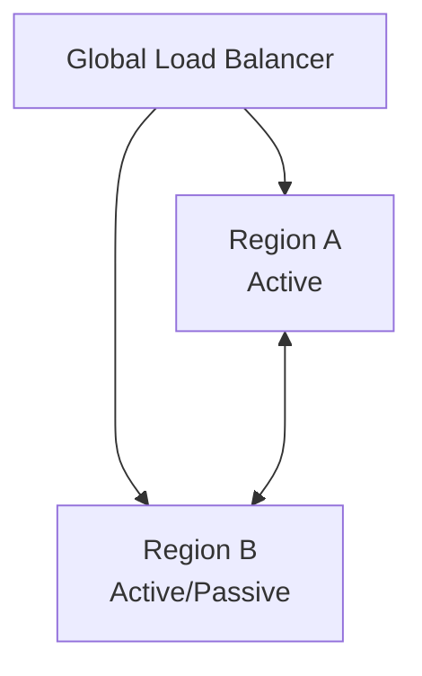

# 🧩 Multi-region Architecture（マルチリージョン構成）

Multi-region Architecture は、サービスを複数リージョンに展開し、**可用性・レイテンシ・災害対策を同時に満たす** トポロジーである。

## ✅ このスタイルの概要

アプリケーションとデータを複数リージョンに配置し、Active-active / Active-passive の構成で運用する。

## ✅ 解決しようとした問題

- 単一リージョン障害による全体停止
- グローバルユーザへの高レイテンシ
- 災害対策（DR）／フェイルオーバーの遅延
- データ整合性とスケールの両立

## ✅ 基本思想・構造

- Global Load Balancing によりユーザを最適リージョンへルーティング
- Strong / Eventual Consistency を選択
- RPO/RTO 要件に応じて構成を決定

## ✅ 代表的構成パターン

### ● Active-active

- 全リージョンが同時に稼働
- 高可用性・低レイテンシ
- データ整合性の設計が難しい

### ● Active-passive

- 片側が待機し障害時に切替
- シンプルで予測しやすい
- フェイルオーバーに時間がかかる

## ❌ 不向きなケース

- 強整合性を絶対に崩せない単一 DB 中心アプリ
- リージョン間通信コストを吸収できない規模

## ✅ 関連スタイル

- [Cell-based Architecture](./cell-based.md)
- [Event-driven Architecture（非同期レプリケーション）](../integration/event-driven.md)
- Global Caching / CDN

## ✅ まとめ

Multi-region Architecture はグローバルサービスに必須となる構成であり、可用性・災害耐性・レイテンシ改善を高いレベルで実現する。
