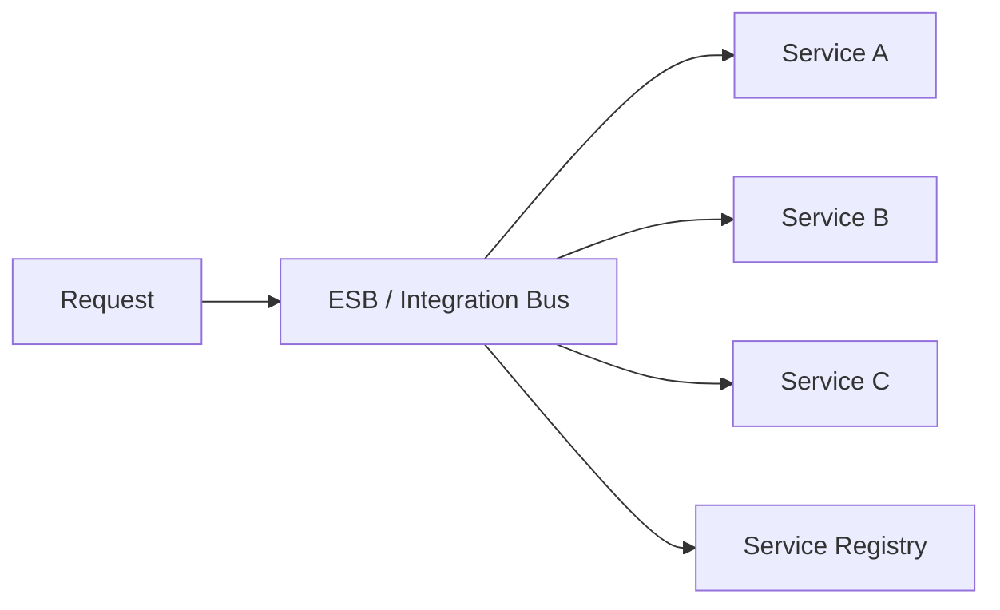

# 🧩 SOA（Service-Oriented Architecture）

## ✅ このスタイルの概要

**企業システムを「サービス」の集合として構築する、マイクロサービス以前のサービス分割アプローチ。**

## ✅ 解決しようとした問題

- 企業内のシステムがサイロ化し連携できない
- 統合基盤（ESB）なしでの連携が非常に困難
- 重厚なエンタープライズ連携を標準化したい

## ✅ 基本思想・ルール

- ESB（Enterprise Service Bus）による統合
- SOAP / WSDL / XML による厳格な契約
- サービスカタログ管理
- ガバナンス重視の設計

### 概念図（Conceptual Diagram）

## ✅ 得意なアプリケーション

- 大企業の基幹系統合
- 業務プロセスの長期安定運用
- 変更頻度が低く、ガバナンスが強い領域

## ❌ 不向きなケース

- 変化の速い Web プロダクト
- 開発速度と柔軟性が重要な領域
- 軽量 API（REST/gRPC）で十分な場合

## ✅ 歴史

- 2000 年代に企業 IT の中心として普及
- REST / Microservices により軽量化が進み、現在は限定領域で継続

## ✅ 関連スタイル

- Microservices：SOA の軽量版として発展
- API Gateway：SOA の「入口」をモダン化したものとして対応

## ✅ 代表的なフレームワーク

- **Oracle SOA Suite / IBM WebSphere ESB**  
  企業 IT で長く使われた SOA プラットフォーム。

- **WS-\*（SOAP / WSDL）対応ミドルウェア**  
  当時の SOA 標準を支えた通信基盤。

- **BizTalk Server**  
  エンタープライズ統合のための SOA 実装。

## ✅ このスタイルを支えるデザインパターン

- **Facade**  
  ESB がサービス全体の入り口として機能。

- **Mediator**  
  ESB が複数システム間の連携を調停。

- **Adapter**  
  レガシーシステムを SOAP/WSDL で包む際に必須。

- **Proxy**  
  メッセージのバリデーション／セキュリティ適用。

## ✅ まとめ

SOA はエンタープライズ IT の文脈では依然重要で、  
**金融・基幹系など高ガバナンス領域に特化したアーキテクチャ** である。
