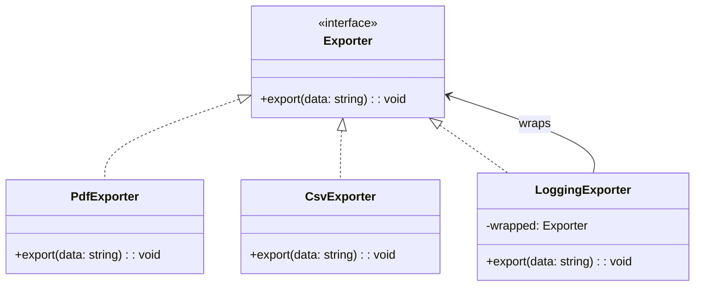

import Tabs from "@theme/Tabs";
import TabItem from "@theme/TabItem";
import CodeBlock from "@theme/CodeBlock";

import tsCode from "@site/src/codes/duplicate-logic/ts/rfc_decorator.ts";
import phpCode from "@site/src/codes/duplicate-logic/php/rfc_decorator.php";
import pyCode from "@site/src/codes/duplicate-logic/py/rfc_decorator.py";

# 🧩 Decorator パターン

## ✅ 設計意図

- 処理に**追加の振る舞いをラップして重ねる**構造
- 継承ではなく「合成」で振る舞いを追加できる

## ✅ 適用理由

- 元の `export` 処理を変えずにログ機能を追加
- 追加機能を**柔軟に組み合わせ可能**

## ✅ 向いているシーン

- ログ・バリデーション・権限チェックなど、**横断的な処理を再利用したい**

## ✅ コード例

<Tabs groupId="language">
  <TabItem value="ts" label="TypeScript">
    <CodeBlock language="ts">{tsCode}</CodeBlock>
  </TabItem>
  <TabItem value="php" label="PHP">
    <CodeBlock language="php">{phpCode}</CodeBlock>
  </TabItem>
  <TabItem value="python" label="Python">
    <CodeBlock language="python">{pyCode}</CodeBlock>
  </TabItem>
</Tabs>

## ✅ 解説

このコードは `Decorator` パターン を使用して、既存の機能（データ出力）に追加の機能（ログ出力）を動的に付加する設計を実現している。
`Decorator` パターンは、オブジェクトに動的に責務を追加する柔軟な方法を提供するデザインパターンであり、継承を使わずに機能を拡張できる。

### 1. Decorator パターンの概要

- **Component**: 基本機能を定義する共通インターフェース
  - このコードでは `Exporter` が該当
- **ConcreteComponent**: Component を実装し、基本機能を提供するクラス
  - このコードでは `PdfExporter` と `CsvExporter` が該当
- **Decorator**: `Component` を実装し、基本機能に追加の機能を付加するクラス
  - このコードでは `LoggingExporter` が該当
- **ConcreteDecorator**: `Decorator` を拡張して、具体的な追加機能を提供するクラス
  - このコードでは `LoggingExporter` がその役割を担う

### 2. 主なクラスとその役割

- `Exporter`
  - 基本機能を定義するインターフェース
  - `export(data: string): void` メソッドを定義
- `PdfExporter`, `CsvExporter`
  - `Exporter` を実装した具体的なコンポーネント
  - PDF または CSV 形式でデータを出力
- `LoggingExporter`
  - Decorator クラス
  - Exporter をラップし、データ出力の前後にログ出力を追加

### 3. UML クラス図

### 4. Decorator パターンの利点

- **動的な機能追加**: 継承を使わずに、既存のオブジェクトに動的に機能を追加可能
- **柔軟性**: 複数のデコレータを組み合わせて機能を拡張可能
- **オープン/クローズド原則**: 既存のクラスを変更せずに機能を拡張可能

この設計は、既存の機能に追加の責務を柔軟に付加する必要がある場面で非常に有効であり、コードの再利用性と拡張性を向上させる。
