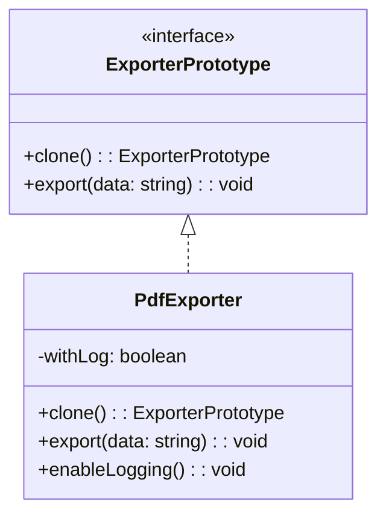

import Tabs from "@theme/Tabs";
import TabItem from "@theme/TabItem";
import CodeBlock from "@theme/CodeBlock";

import tsCode from "@site/src/codes/duplicate-logic/ts/rfc_prototype.ts";
import phpCode from "@site/src/codes/duplicate-logic/php/rfc_prototype.php";
import pyCode from "@site/src/codes/duplicate-logic/py/rfc_prototype.py";

# 🧩 Prototype パターン

## ✅ 設計意図

- **インスタンスの雛形（プロトタイプ）を複製**して使うことで、初期化済みの処理・構造を再利用
- ベースとなるオブジェクトを `clone()` でコピーし、差分だけを上書きして扱う

## ✅ 適用理由

- **「ちょっと違うだけ」な処理や構造**を、テンプレートベースで複製した方が保守性・再利用性が高い
- 大量の似た処理を `new` から毎回書いている場合に、共通化しやすい

## ✅ 向いているシーン

- 初期状態が共通で、差分だけ変更したいケース
- フォーム、設定オブジェクト、通知テンプレート、UI 構成などの複製

## ✅ コード例

<Tabs groupId="language">
  <TabItem value="ts" label="TypeScript">
    <CodeBlock language="ts">{tsCode}</CodeBlock>
  </TabItem>
  <TabItem value="php" label="PHP">
    <CodeBlock language="php">{phpCode}</CodeBlock>
  </TabItem>
  <TabItem value="python" label="Python">
    <CodeBlock language="python">{pyCode}</CodeBlock>
  </TabItem>
</Tabs>

## ✅ 解説

このコードは `Prototype` パターン を使用して、既存のオブジェクトを複製（クローン）し、
同じプロパティを持つ新しいインスタンスを生成する設計を実現している。
`Prototype` パターンは、オブジェクトの生成をクラスに依存せず、既存のインスタンスをコピーして新しいインスタンスを作成するデザインパターン。

### 1. Prototype パターンの概要

- **Prototype**: クローン機能を提供するインターフェース
  - このコードでは `ExporterPrototype` が該当
- **ConcretePrototype**: `Prototype` を実装し、具体的なクローン処理を提供するクラス
  - このコードでは `PdfExporter` が該当
- **Client**: `Prototype` を利用してオブジェクトを複製するコード
  - このコードでは `baseExporter.clone()` を呼び出してクローンを生成する部分が該当

### 2. 主なクラスとその役割

- `ExporterPrototype`
  - Prototype の共通インターフェース
  - `clone(): ExporterPrototype` メソッドを定義し、オブジェクトのクローンを生成
  - `export(data: string): void` メソッドを定義し、データを出力
- `PdfExporter`
  - ConcretePrototype クラス
  - `clone` メソッドで自身のコピーを生成
  - `export` メソッドで PDF 出力を実行
  - ログ出力を有効化するための `enableLogging` メソッドを提供

### 3. UML クラス図

### 4. Prototype パターンの利点

- **オブジェクト生成の柔軟性**: クラスに依存せず、既存のインスタンスを基に新しいインスタンスを生成可能。
- **複雑な初期化処理の回避**: クローンを使用することで、複雑な初期化処理を繰り返す必要がない。
- **拡張性**: 新しいクラスを追加する場合も、`clone` メソッドを実装するだけで対応可能。

この設計は、既存のオブジェクトを基に新しいインスタンスを生成する必要がある場面で非常に有効であり、コードの柔軟性と再利用性を向上させる。
