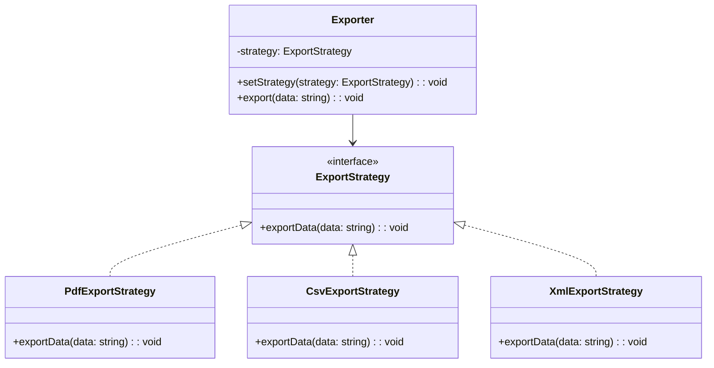

import Tabs from "@theme/Tabs";
import TabItem from "@theme/TabItem";
import CodeBlock from "@theme/CodeBlock";

import tsCode from "@site/src/codes/duplicate-logic/ts/rfc_strategy.ts";
import phpCode from "@site/src/codes/duplicate-logic/php/rfc_strategy.php";
import pyCode from "@site/src/codes/duplicate-logic/py/rfc_strategy.py";

# 🧩 Strategy パターン

## ✅ 設計意図

- **共通処理の中で差分となる「出力方法（戦略）」を外部化し、切り替え可能にする**
- 共通の `export()` 処理は 1 箇所に集約し、出力形式ごとの処理は戦略として分離することで、構造をシンプルに保つ

## ✅ 適用理由

- 「開始ログ」や「完了ログ」といった処理はすべての出力で共通している
- 一方、「どの形式で出力するか（PDF, CSV, XML）」という処理だけが異なる
- このような **共通フロー + 振る舞いの違い** は Strategy パターンで自然に解消できる

## ✅ 向いているシーン

- 出力・処理方式が複数あり、**動的に切り替える必要がある**
- 出力ロジックを共通のワークフロー（例：ログ、整形処理、テンプレート処理）でラップしたい
- 出力形式が増える予定があり、**拡張しやすい構造を求めている**
- テスト時などに **処理の一部を差し替えたい（Mock 処理を注入したい）**

## ✅ コード例

<Tabs groupId="language">
  <TabItem value="ts" label="TypeScript">
    <CodeBlock language="ts">{tsCode}</CodeBlock>
  </TabItem>
  <TabItem value="php" label="PHP">
    <CodeBlock language="php">{phpCode}</CodeBlock>
  </TabItem>
  <TabItem value="python" label="Python">
    <CodeBlock language="python">{pyCode}</CodeBlock>
  </TabItem>
</Tabs>

## ✅ 解説

このコードは `Strategy` パターン を使用して、データの出力形式（PDF, CSV, XML）を戦略（`ExportStrategy`）として分離し、動的に切り替えられる設計を実現している。`Strategy` パターンは、アルゴリズムや処理をクラスとして分離し、動的に切り替え可能にするデザインパターン。

### 1. Strategy パターンの概要

- **Strategy**: 共通のインターフェースを定義し、異なるアルゴリズムを統一的に扱う
  - このコードでは `ExportStrategy` が該当
- **ConcreteStrategy**: `Strategy` を実装し、具体的なアルゴリズムを提供する
  - このコードでは `PdfExportStrategy`, `CsvExportStrategy`, `XmlExportStrategy` が該当
- **Context**: `Strategy` を利用するクラスで、具体的なアルゴリズムを動的に切り替える
  - このコードでは `Exporter` が該当

### 2. 主なクラスとその役割

- `ExportStrategy`
  - データ出力の共通インターフェース
  - `exportData(data: string): void` メソッドを定義
- `PdfExportStrategy`, `CsvExportStrategy`, `XmlExportStrategy`
  - `ExportStrategy` を実装した具体的な戦略クラス
  - 各クラスで異なる形式（PDF, CSV, XML）でデータを出力
- `Exporter`
  - Context クラス
  - コンストラクタで `ExportStrategy` を受け取り、`export` メソッドで現在の戦略に応じた処理を実行
  - `setStrategy` メソッドで戦略を動的に切り替え可能

### 3. UML クラス図

### 4. Strategy パターンの利点

- **柔軟性**: 戦略を動的に切り替えることで、異なる処理を簡単に適用可能
- **単一責任の原則**: 各戦略が独立したクラスに分離されており、保守性が高い
- **拡張性**: 新しい戦略を追加する場合も、`ExportStrategy` を実装するだけで対応可能

この設計は、アルゴリズムや処理を柔軟に切り替える必要がある場面で非常に有効であり、コードの拡張性と保守性を向上させる。
