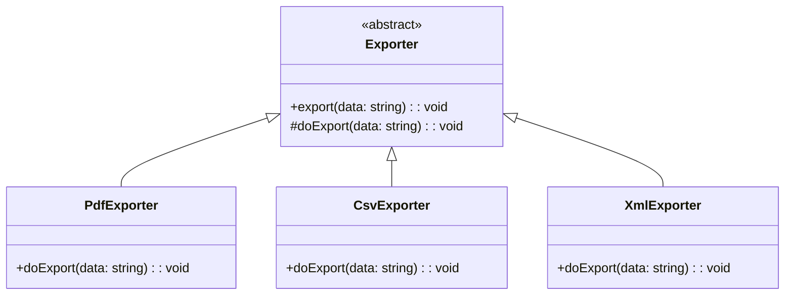

import Tabs from "@theme/Tabs";
import TabItem from "@theme/TabItem";
import CodeBlock from "@theme/CodeBlock";

import tsCode from "@site/src/codes/duplicate-logic/ts/rfc_template.ts";
import phpCode from "@site/src/codes/duplicate-logic/php/rfc_template.php";
import pyCode from "@site/src/codes/duplicate-logic/py/rfc_template.py";

# 🧩 Template Method パターン

## ✅ 設計意図

- 処理の「流れ（テンプレート）」を親クラスで定義し、**差分だけサブクラスで定義**
- 共通の処理は親クラスに集約される

## ✅ 適用理由

- 開始・終了ログなどの共通処理を一元化できる
- 「フックポイント（処理の差分）」を明示できる

## ✅ 向いているシーン

- 手順が決まっていて、一部だけ異なる処理を差し替えたい
- コードの重複を減らしたいとき

## ✅ コード例

<Tabs groupId="language">
  <TabItem value="ts" label="TypeScript">
    <CodeBlock language="ts">{tsCode}</CodeBlock>
  </TabItem>
  <TabItem value="php" label="PHP">
    <CodeBlock language="php">{phpCode}</CodeBlock>
  </TabItem>
  <TabItem value="python" label="Python">
    <CodeBlock language="python">{pyCode}</CodeBlock>
  </TabItem>
</Tabs>

## ✅ 解説

このコードは `Template Method` パターン を使用して、共通の処理フローを抽象クラスで定義し、具体的な処理部分をサブクラスに委譲する設計を実現している。
`Template Method` パターンは、アルゴリズムの骨組みをスーパークラスで定義し、詳細な処理をサブクラスで実装するデザインパターン。

### 1. Template Method パターンの概要

- **AbstractClass**: アルゴリズムの骨組みを定義し、具体的な処理をサブクラスに委譲する抽象クラス
  - このコードでは `Exporter` が該当
- **ConcreteClass**: `AbstractClass` を継承し、抽象メソッドを実装して具体的な処理を提供するクラス
  - このコードでは `PdfExporter`, `CsvExporter`, `XmlExporter` が該当

### 2. 主なクラスとその役割

- `Exporter`
  - 抽象クラス（`AbstractClass`）
  - `export` メソッドで共通の処理フローを定義
  - 「開始ログ」を出力
  - `doExport` メソッド（抽象メソッド）を呼び出して具体的な処理を実行
  - 「完了ログ」を出力
  - `doExport` メソッドをサブクラスに委譲
- `PdfExporter`, `CsvExporter`, `XmlExporter`
  - 具体クラス（`ConcreteClass`）
  - `doExport` メソッドを実装し、それぞれ異なる形式（PDF, CSV, XML）でデータを出力

### 3. UML クラス図

### 4. Template Method パターンの利点

- **コードの再利用**: 共通の処理フローをスーパークラスにまとめることで、コードの重複を削減
- **拡張性**: 新しい具体クラスを追加する場合も、抽象メソッドを実装するだけで対応可能
- **一貫性**: 共通の処理フローをスーパークラスで定義することで、処理の一貫性を確保

この設計は、共通の処理フローを持つが、一部の処理が異なる場合に非常に有効であり、コードの保守性と拡張性を向上させる。
