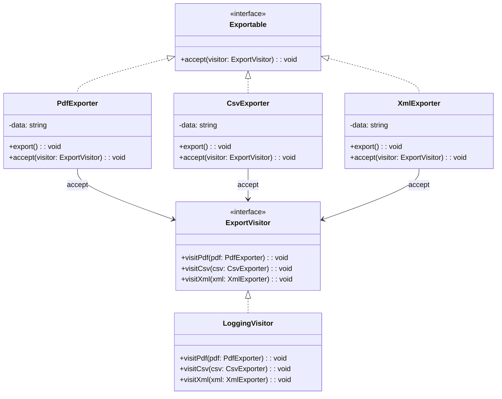

import Tabs from "@theme/Tabs";
import TabItem from "@theme/TabItem";
import CodeBlock from "@theme/CodeBlock";

import tsCode from "@site/src/codes/duplicate-logic/ts/rfc_visitor.ts";
import phpCode from "@site/src/codes/duplicate-logic/php/rfc_visitor.php";
import pyCode from "@site/src/codes/duplicate-logic/py/rfc_visitor.py";

# 🧩 Visitor パターン

## ✅ 設計意図

- 「処理を適用する側（訪問者）」と「データ構造」を分離
- **データ構造に変更を加えずに処理だけを追加できる**

## ✅ 適用理由

- 複数のデータ型や出力形式を持つ対象に対して、**異なる操作を外部から適用したい**
- 出力方式とデータ処理を切り離す

## ✅ 向いているシーン

- データ構造は安定していて、**処理ロジックだけ追加・変更される場合**

## ✅ コード例

<Tabs groupId="language">
  <TabItem value="ts" label="TypeScript">
    <CodeBlock language="ts">{tsCode}</CodeBlock>
  </TabItem>
  <TabItem value="php" label="PHP">
    <CodeBlock language="php">{phpCode}</CodeBlock>
  </TabItem>
  <TabItem value="python" label="Python">
    <CodeBlock language="python">{pyCode}</CodeBlock>
  </TabItem>
</Tabs>

## ✅ 解説

このコードは `Visitor` パターン を使用して、異なる要素（`PdfExporter`, `CsvExporter`, `XmlExporter`）に対して
共通の操作（ログ付き出力）を追加する設計を実現している。
`Visitor` パターンは、オブジェクト構造を変更せずに、新しい操作を追加するデザインパターンであり、要素ごとに異なる処理を実行する場合に有効。

### 1. Visitor パターンの概要

- **Element**: `Visitor` を受け入れるインターフェースを定義
  - このコードでは `Exportable` が該当
- **ConcreteElement**: `Element` を実装し、`Visitor` を受け入れる具体的な要素
  - このコードでは `PdfExporter`, `CsvExporter`, `XmlExporter` が該当
- **Visitor**: 要素ごとの操作を定義するインターフェース
  - このコードでは `ExportVisitor` が該当
- **ConcreteVisitor**: `Visitor` を実装し、要素ごとの具体的な操作を提供
  - このコードでは `LoggingVisitor` が該当

### 2. 主なクラスとその役割

- `Exportable`
  - 要素の共通インターフェース
  - `accept(visitor: ExportVisitor): void` メソッドを定義し、`Visitor` を受け入れる
- `PdfExporter`, `CsvExporter`, `XmlExporter`
  - `Exportable` を実装した具体的な要素
  - 各クラスでデータを特定の形式（PDF, CSV, XML）で出力
  - `accept` メソッドで `Visitor` を受け入れ、対応するメソッド（`visitPdf`, `visitCsv`, `visitXml`）を呼び出す
- `ExportVisitor`
  - `Visitor` の共通インターフェース
  - 各要素に対応するメソッド（`visitPdf`, `visitCsv`, `visitXml`）を定義
- `LoggingVisitor`
  - `Visitor` の具体的な実装
  - 各要素に対してログ付きの出力処理を実行

### 3. UML クラス図

### 4. Visitor パターンの利点

- **新しい操作の追加が容易**: 要素のクラスを変更せずに、新しい操作（`Visitor`）を追加可能
- **要素ごとの処理を分離**: 要素ごとの処理を `Visitor` にまとめることで、コードの保守性が向上
- **オープン/クローズド原則**: 要素の構造を変更せずに、新しい操作を追加可能

この設計は、異なる要素に対して共通の操作を実行する必要がある場面で非常に有効であり、コードの拡張性と保守性を向上させる。
