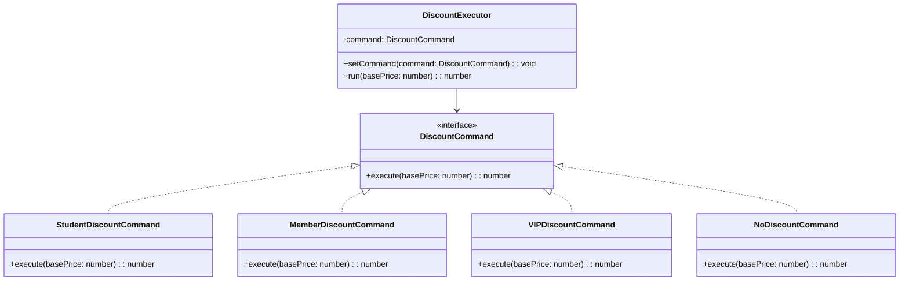

import Tabs from "@theme/Tabs";
import TabItem from "@theme/TabItem";
import CodeBlock from "@theme/CodeBlock";

import tsCode from "@site/src/codes/excessive-branching/ts/rfc_command.ts";
import phpCode from "@site/src/codes/excessive-branching/php/rfc_command.php";
import pyCode from "@site/src/codes/excessive-branching/py/rfc_command.py";

# 🧩 Command パターン

## ✅ 設計意図

- 処理そのものを「命令オブジェクト」として切り出す
- 処理を記録・再実行・スケジューリングするのが目的

## ✅ 適用理由

- 実行する処理を外から渡す → `execute()`
- **Undo/Redo やバッチ処理**にも応用しやすい

## ✅ 向いているシーン

- ユーザー操作やバッチ処理のように、**「処理の履歴」が重要**
- 処理の実行を「遅延」や「蓄積」したいとき

## ✅ コード例

<Tabs groupId="language">
  <TabItem value="ts" label="TypeScript">
    <CodeBlock language="ts">{tsCode}</CodeBlock>
  </TabItem>
  <TabItem value="php" label="PHP">
    <CodeBlock language="php">{phpCode}</CodeBlock>
  </TabItem>
  <TabItem value="python" label="Python">
    <CodeBlock language="python">{pyCode}</CodeBlock>
  </TabItem>
</Tabs>

## ✅ 解説

このコードは `Command` パターン を使用して、割引計算のロジックをコマンドとしてカプセル化し、動的に切り替えられる設計を実現している。
`Command` パターンは、操作をオブジェクトとして表現し、操作の実行を遅延させたり、キューに保存したり、取り消し可能にするデザインパターン。

### 1. Command パターンの概要

- **Command**: 操作を表現するインターフェース
  - このコードでは `DiscountCommand` が該当
- **ConcreteCommand**: `Command` を実装し、具体的な操作を定義するクラス
  - このコードでは `StudentDiscountCommand`, `MemberDiscountCommand`, `VIPDiscountCommand`, `NoDiscountCommand` が該当
- **Invoker**: `Command` を実行する役割を持つクラス
  - このコードでは `DiscountExecutor` が該当
- **Client**: `Command` を生成し、`Invoker` に渡す役割を持つ
  - このコードでは `switch` 文で `DiscountCommand` を生成し、`DiscountExecutor` に渡している部分が該当

### 2. 主なクラスとその役割

- `DiscountCommand`
  - 割引計算の共通インターフェース
  - `execute(basePrice: number): number` メソッドを定義
- `StudentDiscountCommand`, `MemberDiscountCommand`, `VIPDiscountCommand`, `NoDiscountCommand`
  - `DiscountCommand` を実装した具体的なコマンドクラス
  - 各クラスで異なる割引率を適用
- `DiscountExecutor`
  - `Invoker` クラス
  - `setCommand` メソッドでコマンドを設定し、`run` メソッドでコマンドを実行
- `Client`
  - `switch` 文でユーザータイプに応じたコマンドを生成し、`DiscountExecutor` に渡す

### 3. UML クラス図

### 4. Command パターンの利点

- **操作のカプセル化**: 操作をオブジェクトとして表現することで、操作の実行を遅延させたり、キューに保存したりできる。
- **柔軟性**: 新しい操作を追加する場合も、`DiscountCommand` を実装するだけで対応可能。
- **Invoker の汎用性**: `DiscountExecutor` はどのコマンドでも実行可能で、汎用性が高い。

この設計は、操作をオブジェクトとして扱うことで、柔軟性と拡張性を向上させる。特に、操作の切り替えや履歴管理が必要な場面で有効に機能する。
