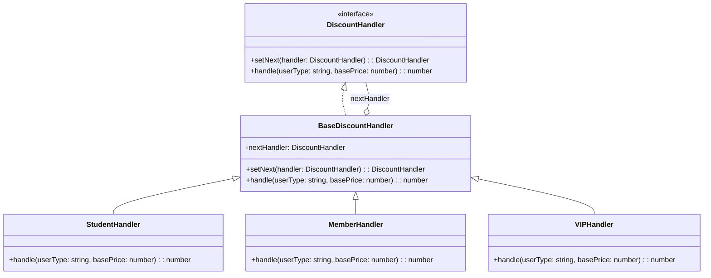

import Tabs from "@theme/Tabs";
import TabItem from "@theme/TabItem";
import CodeBlock from "@theme/CodeBlock";

import tsCode from "@site/src/codes/excessive-branching/ts/rfc_cor.ts";
import phpCode from "@site/src/codes/excessive-branching/php/rfc_cor.php";
import pyCode from "@site/src/codes/excessive-branching/py/rfc_cor.py";

# 🧩 Chain of Resp. パターン

## ✅ 設計意図

- 複数の処理クラスを連鎖させ、**条件に応じて誰が処理するかを委譲**
- 各処理クラスは「処理する or 次に渡す」

## ✅ 適用理由

- 分岐処理を**直列の処理チェーンに変換**
- 処理の流れを順に確認したいときに最適

## ✅ 向いているシーン

- 各処理が独立していて、**どこかで処理が止まる**
- 複数条件の中で「該当する 1 つ」に任せたい

## ✅ コード例

<Tabs groupId="language">
  <TabItem value="ts" label="TypeScript">
    <CodeBlock language="ts">{tsCode}</CodeBlock>
  </TabItem>
  <TabItem value="php" label="PHP">
    <CodeBlock language="php">{phpCode}</CodeBlock>
  </TabItem>
  <TabItem value="python" label="Python">
    <CodeBlock language="python">{pyCode}</CodeBlock>
  </TabItem>
</Tabs>

## ✅ 解説

このコードは `Chain of Responsibility (CoR)` パターン を使用して、割引計算のロジックを一連のハンドラに分割し、
リクエストを順に処理する設計を実現している。`CoR` パターンは、複数のオブジェクトが連鎖的にリクエストを処理し、
適切なオブジェクトが処理を担当するデザインパターン。

### 1. Chain of Responsibility パターンの概要

- **Handler**: リクエストを処理するためのインターフェースを定義
  - このコードでは `DiscountHandler` が該当
- **ConcreteHandler**: `Handler` を実装し、特定のリクエストを処理するクラス
  - このコードでは `StudentHandler`, `MemberHandler`, `VIPHandler` が該当
- **Client**: ハンドラチェーンを構築し、リクエストを最初のハンドラに渡す
  - このコードでは `student.setNext(member).setNext(vip)` の部分が該当

### 2. 主なクラスとその役割

- `DiscountHandler`
  - ハンドラの共通インターフェース
  - `setNext(handler: DiscountHandler): DiscountHandler` メソッドで次のハンドラを設定
  - `handle(userType: string, basePrice: number): number` メソッドでリクエストを処理
- `BaseDiscountHandler`
  - `DiscountHandler` を実装した抽象クラス
  - 共通の `setNext` メソッドと、次のハンドラに処理を委譲する `handle` メソッドを提供
- `StudentHandler`, `MemberHandler`, `VIPHandler`
  - `BaseDiscountHandler` を継承した具体的なハンドラクラス
  - 各クラスで特定のユーザータイプ（`student`, `member`, `vip`）に応じた割引ロジックを実装
- クライアントコード
  - ハンドラチェーンを構築し、最初のハンドラにリクエストを渡す

### 3. UML クラス図

### 4. Chain of Responsibility パターンの利点

- **柔軟な処理フロー**: ハンドラの順序を動的に変更可能
- **単一責任の原則**: 各ハンドラが特定の処理にのみ責任を持つ
- **拡張性**: 新しいハンドラを追加する場合も、既存のコードに影響を与えずに対応可能

この設計は、リクエストを柔軟に処理し、条件分岐を排除する。特に、処理の流れを動的に変更したい場合や、
複数の条件に基づく処理が必要な場面で有効に機能する。
