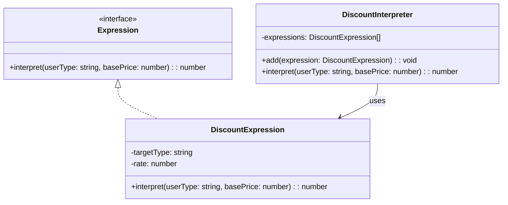

import Tabs from "@theme/Tabs";
import TabItem from "@theme/TabItem";
import CodeBlock from "@theme/CodeBlock";

import tsCode from "@site/src/codes/excessive-branching/ts/rfc_interpreter.ts";
import phpCode from "@site/src/codes/excessive-branching/php/rfc_interpreter.php";
import pyCode from "@site/src/codes/excessive-branching/py/rfc_interpreter.py";

# 🧩 Interpreter パターン

## ✅ 設計意図

- ドメイン固有言語（DSL）のように、**条件ロジックやルールを文法として表現**し、**解釈・評価できる構造を定義**する

## ✅ 適用理由

- 複雑で頻繁に変更される条件分岐を、**構文ツリーとして定義し、評価器（interpreter）に任せる**
- if 文/switch 文がネストして**保守困難になっているロジック**を、**柔軟に分離・追加できる形**にする

## ✅ 向いているシーン

- ビジネスルールエンジン、フィルタ条件、検索条件式など
- ルールが非エンジニアや設定ファイルで記述され、**実行時に評価される場合**

## ✅ コード例

<Tabs groupId="language">
  <TabItem value="ts" label="TypeScript">
    <CodeBlock language="ts">{tsCode}</CodeBlock>
  </TabItem>
  <TabItem value="php" label="PHP">
    <CodeBlock language="php">{phpCode}</CodeBlock>
  </TabItem>
  <TabItem value="python" label="Python">
    <CodeBlock language="python">{pyCode}</CodeBlock>
  </TabItem>
</Tabs>

## ✅ 解説

このコードは `Interpreter` パターン を使用して、割引計算のルールを文法として表現し、柔軟に評価できる設計を実現している。
`Interpreter` パターンは、特定の文法を定義し、その文法に従った式を評価するデザインパターンであり、特に複雑なルールや条件を扱う場合に有効。

### 1. `Interpreter` パターンの概要

- **Expression**: 文法の共通インターフェースを定義
  - このコードでは `Expression` が該当
- **TerminalExpression**: 文法の末端要素を表現し、具体的な条件や計算を実装
  - このコードでは `DiscountExpression` が該当
- **NonTerminalExpression**: 文法の非終端要素を表現し、複数の式を組み合わせて評価
  - このコードでは `DiscountInterpreter` が該当
- **Client**: 文法を構築し、評価を実行
  - このコードでは `DiscountInterpreter` に式を追加し、`interpret` メソッドを呼び出す部分が該当

### 2. 主なクラスとその役割

- `Expression`
  - 文法の共通インターフェース
  - `interpret(userType: string, basePrice: number): number` メソッドを定義
- `DiscountExpression`
  - `TerminalExpression`（ターミナル式）
  - 特定のユーザータイプ（`targetType`）に対して割引率（`rate`）を適用するロジックを実装
- `DiscountInterpreter`
  - `NonTerminalExpression`（非終端式）
  - 複数の `DiscountExpression` を保持し、順に評価
  - 最初に一致する式が見つかった場合、その結果を返す
- クライアントコード
  - `DiscountInterpreter` に複数の `DiscountExpression` を追加し、`interpret` メソッドで評価を実行

### 3. UML クラス図

### 4. Interpreter パターンの利点

- **柔軟なルール定義**: 文法をオブジェクトとして表現することで、複雑なルールを簡潔に定義可能。
- **拡張性**: 新しいルールを追加する場合も、`DiscountExpression` を作成して `DiscountInterpreter` に追加するだけで対応可能。
- **再利用性**: 各式（`DiscountExpression`）が独立しているため、他の文脈でも再利用可能。

この設計は、複雑な条件やルールを扱う際に非常に有効であり、特に動的にルールを変更したい場合や、条件が増える可能性がある場面で有効に機能する。
