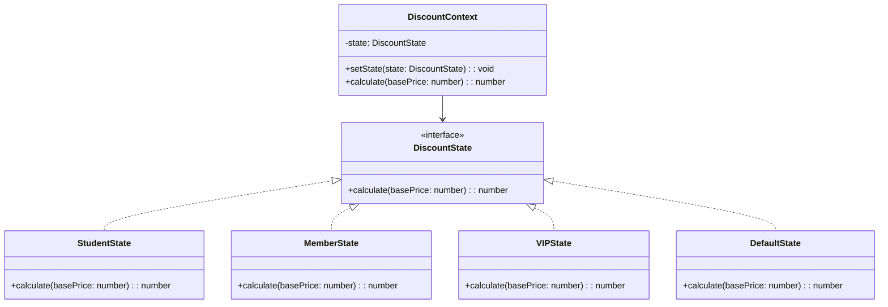

import Tabs from "@theme/Tabs";
import TabItem from "@theme/TabItem";
import CodeBlock from "@theme/CodeBlock";

import tsCode from "@site/src/codes/excessive-branching/ts/rfc_state.ts";
import phpCode from "@site/src/codes/excessive-branching/php/rfc_state.php";
import pyCode from "@site/src/codes/excessive-branching/py/rfc_state.py";

# 🧩 State パターン

## ✅ 設計意図

- オブジェクトの「状態」に応じて振る舞いが変化する設計
- 状態ごとの責務をクラスに委譲

## ✅ 適用理由

- 「ユーザーの種別」が**状態のように扱える**場合に効果的
- 状態が変わるロジックも含めて**状態オブジェクト側に持たせられる**

## ✅ 向いているシーン

- ユーザーのランク・ログイン状態など「**現在の状態が主役**」となる設計
- 状態遷移をコントロールしたい場面

## ✅ コード例

<Tabs groupId="language">
  <TabItem value="ts" label="TypeScript">
    <CodeBlock language="ts">{tsCode}</CodeBlock>
  </TabItem>
  <TabItem value="php" label="PHP">
    <CodeBlock language="php">{phpCode}</CodeBlock>
  </TabItem>
  <TabItem value="python" label="Python">
    <CodeBlock language="python">{pyCode}</CodeBlock>
  </TabItem>
</Tabs>

## ✅ 解説

このコードは `State` パターン を使用して、割引計算のロジックを状態ごとに分離し、動的に切り替えられる設計を実現している。
`State` パターンは、オブジェクトの内部状態に応じて振る舞いを変更するデザインパターンであり、条件分岐を排除してコードの可読性と保守性を向上させる。

### 1. State パターンの概要

- **State**: 状態ごとの振る舞いを定義するインターフェース
  - このコードでは `DiscountState` が該当
- **ConcreteState**: State を実装し、具体的な状態ごとの振る舞いを提供する
  - このコードでは `StudentState`, `MemberState`, `VIPState`, `DefaultState` が該当
- **Context**: 現在の状態を保持し、状態に応じた振る舞いを委譲する。
  - このコードでは `DiscountContext` が該当。

### 2. 主なクラスとその役割

- `DiscountState`
  - 割引計算の共通インターフェース
  - `calculate(basePrice: number): number` メソッドを定義
- `StudentState`, `MemberState`, `VIPState`, `DefaultState`
  - `DiscountState` を実装した具体的な状態クラス
  - 各クラスで異なる割引率を適用
- `DiscountContext`
  - 現在の状態を保持するコンテキストクラス
  - `setState` メソッドで状態を切り替え、`calculate` メソッドで現在の状態に応じた割引計算を実行

### 3. UML クラス図

### 5. State パターンの利点

- **条件分岐の排除**: 状態ごとの処理をクラスに分離することで、条件分岐を排除
- **拡張性**: 新しい状態を追加する場合も、`DiscountState` を実装するだけで対応可能
- **動的な状態切り替え**: 実行時に状態を簡単に切り替え可能

この設計は、状態に応じた振る舞いを明確に分離し、状態遷移を安全に管理する。特に、条件分岐が多くなる場面で有効に機能する。
