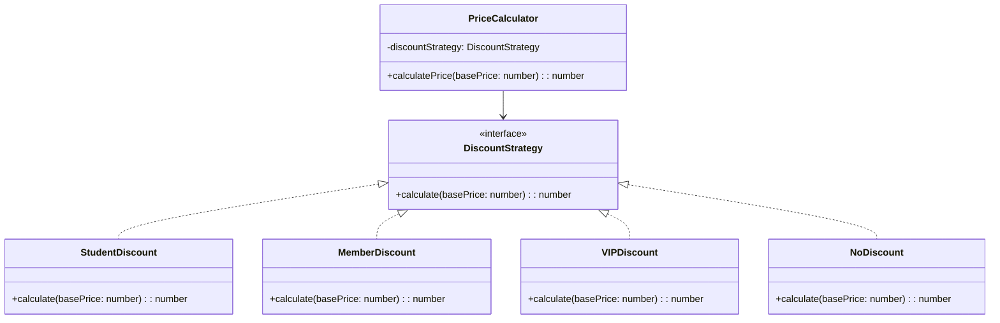

import Tabs from "@theme/Tabs";
import TabItem from "@theme/TabItem";
import CodeBlock from "@theme/CodeBlock";

import tsCode from "@site/src/codes/excessive-branching/ts/rfc_strategy.ts";
import phpCode from "@site/src/codes/excessive-branching/php/rfc_strategy.php";
import pyCode from "@site/src/codes/excessive-branching/py/rfc_strategy.py";

# 🧩 Strategy パターン

## ✅ 設計意図

- 条件ごとに異なる処理を「戦略（Strategy）」として分離
- どの戦略を使うかは外部から渡すことで切り替え可能

## ✅ 適用理由

- 分岐ロジックを**オブジェクト単位に分けてテスト・追加が容易**
- アルゴリズムの差し替えが求められるシステムに最適

## ✅ 向いているシーン

- アルゴリズムや処理ロジックを**動的に切り替えたい**
- 「これは A パターン」「これは B パターン」と明確な分類ができる場合

## ✅ コード例

<Tabs groupId="language">
  <TabItem value="ts" label="TypeScript">
    <CodeBlock language="ts">{tsCode}</CodeBlock>
  </TabItem>
  <TabItem value="php" label="PHP">
    <CodeBlock language="php">{phpCode}</CodeBlock>
  </TabItem>
  <TabItem value="python" label="Python">
    <CodeBlock language="python">{pyCode}</CodeBlock>
  </TabItem>
</Tabs>

## ✅ 解説

このコードは `Strategy` パターン を使用して、異なる割引ロジックを柔軟に切り替えられる設計を実現している。
`Strategy` パターンは、アルゴリズムや処理をクラスとして分離し、動的に切り替え可能にするデザインパターン。

### 1. Strategy パターンの概要

- **Strategy**: 共通のインターフェースを定義し、異なるアルゴリズムを統一的に扱う
  - このコードでは `DiscountStrategy` が該当
- **ConcreteStrategy**: Strategy を実装し、具体的なアルゴリズムを提供する
  - このコードでは `StudentDiscount`, `MemberDiscount`, `VIPDiscount`, `NoDiscount` が該当
- **Context**: `Strategy` を利用するクラスで、具体的なアルゴリズムを動的に切り替える
  - このコードでは `PriceCalculator` が該当

### 2. 主なクラスとその役割

- `DiscountStrategy`
  - 割引計算の共通インターフェース
  - `calculate(basePrice: number): number` メソッドを定義
- `StudentDiscount`, `MemberDiscount`, `VIPDiscount`, `NoDiscount`
  - `DiscountStrategy` を実装した具体的な割引ロジック
  - 各クラスで異なる割引率を適用
- `PriceCalculator`
  - `Context` クラス
  - コンストラクタで `DiscountStrategy` を受け取り、`calculatePrice` メソッドで割引後の価格を計算

### 3. UML クラス図

### 4. Strategy パターンの利点

- **柔軟性**: 新しい割引ロジックを追加する場合も、`DiscountStrategy` を実装するだけで対応可能
- **単一責任の原則**: 各割引ロジックが独立したクラスに分離されており、保守性が高い
- **動的な切り替え**: 実行時に異なる割引ロジックを簡単に切り替え可能

この設計は、アルゴリズムの切り替えが必要な場面で非常に有効であり、コードの拡張性と保守性を向上させる。
