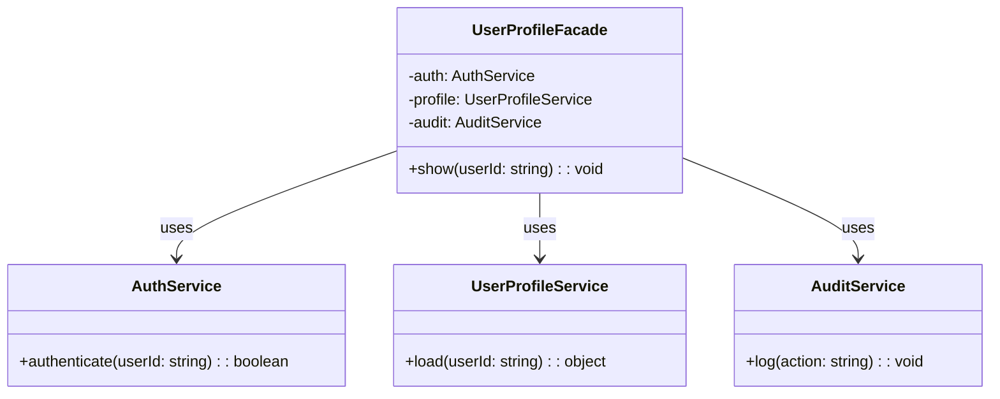

import Tabs from "@theme/Tabs";
import TabItem from "@theme/TabItem";
import CodeBlock from "@theme/CodeBlock";

import tsCode from "@site/src/codes/exposed-complexity/ts/rfc_facade.ts";
import phpCode from "@site/src/codes/exposed-complexity/php/rfc_facade.php";
import pyCode from "@site/src/codes/exposed-complexity/py/rfc_facade.py";

# 🧩 Facade パターン

## ✅ 設計意図

- 複雑な処理を 1 つの**分かりやすい窓口（Facade）**にまとめる
- 利用者は**目的ベースの簡潔な API**を使えるようにする

## ✅ 適用理由

- 呼び出し元の責務を減らし、**再利用しやすい統一的なインターフェース**に整理
- 背後の実装が変わっても呼び出し側に影響を与えにくい

## ✅ 向いているシーン

- 複数のサービス・処理を組み合わせた「よく使う処理パターン」がある場合
- フレームワークやモジュールの統合窓口

## ✅ コード例

<Tabs groupId="language">
  <TabItem value="ts" label="TypeScript">
    <CodeBlock language="ts">{tsCode}</CodeBlock>
  </TabItem>
  <TabItem value="php" label="PHP">
    <CodeBlock language="php">{phpCode}</CodeBlock>
  </TabItem>
  <TabItem value="python" label="Python">
    <CodeBlock language="python">{pyCode}</CodeBlock>
  </TabItem>
</Tabs>

## ✅ 解説

このコードは `Facade` パターン を使用して、複数のサブシステム（`AuthService`, `UserProfileService`, `AuditService`）を
統一的に利用できるようにする設計を実現している。
`Facade` パターンは、複雑なサブシステムを簡単に利用できるようにするための統一インターフェースを提供するデザインパターン。

### 1. Facade パターンの概要

- **Subsystem Classes**: 複雑な処理を提供するクラス
  - このコードでは `AuthService`, `UserProfileService`, `AuditService` が該当
- **Facade**: サブシステムを統一的に利用するための簡潔なインターフェースを提供するクラス
  - このコードでは `UserProfileFacade` が該当
- **Client**: `Facade` を利用してサブシステムを操作するクラス
  - このコードでは `facade.show("user-123")` を呼び出す部分が該当

### 2. 主なクラスとその役割

- `AuthService`
  - サブシステムの一部
  - ユーザー認証を行うクラス
- `UserProfileService`
  - サブシステムの一部
  - ユーザープロフィールを取得するクラス
- `AuditService`
  - サブシステムの一部
  - 操作の監査ログを記録するクラス
- `UserProfileFacade`
  - `Facade` クラス
  - サブシステムを統合し、`show` メソッドでユーザー認証、プロフィール取得、監査ログ記録を一括して実行
- クライアントコード
  - `UserProfileFacade` を利用して、ユーザーのプロフィールを表示

### 3. UML クラス図

### 4. Facade パターンの利点

- **簡潔なインターフェース**: クライアントは複雑なサブシステムを意識せずに操作可能
- **疎結合**: クライアントとサブシステム間の結合度を低減
- **保守性向上**: サブシステムの変更が `Facade` 内に閉じ込められるため、クライアントコードへの影響を最小化

この設計は、複雑な内部処理を隠蔽し、クライアントに対して簡潔なインターフェースを提供する必要がある場面で非常に有効であり、
コードの可読性と保守性を向上させる。
