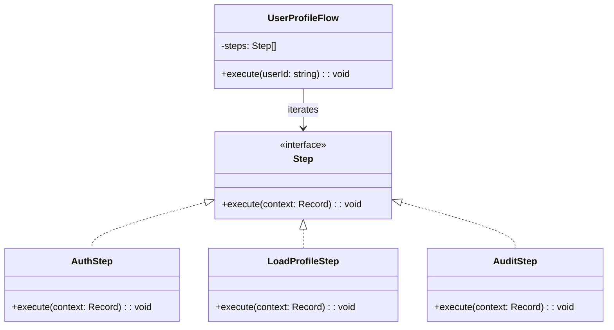

import Tabs from "@theme/Tabs";
import TabItem from "@theme/TabItem";
import CodeBlock from "@theme/CodeBlock";

import tsCode from "@site/src/codes/exposed-complexity/ts/rfc_iterator.ts";
import phpCode from "@site/src/codes/exposed-complexity/php/rfc_iterator.php";
import pyCode from "@site/src/codes/exposed-complexity/py/rfc_iterator.py";

# 🧩 Iterator パターン

## ✅ 設計意図

- 複雑な処理に含まれる **繰り返し処理（ループ）部分を分離** し、汎用的なインターフェースでアクセス
- 処理の **「流れ」ではなく「走査ロジック」** を抽象化し、再利用性と可読性を向上

## ✅ 適用理由

- Facade や Proxy でまとめられている処理の中に、**コレクション操作や繰り返しが含まれている場合**
- 同じようなループ処理が各所にコピペされている → 一元化できる

## ✅ 向いているシーン

- ユーザー一覧、ログのページ送り、レポート生成、ファイル構造など、**反復的な処理を含む複雑処理**

## ✅ コード例

<Tabs groupId="language">
  <TabItem value="ts" label="TypeScript">
    <CodeBlock language="ts">{tsCode}</CodeBlock>
  </TabItem>
  <TabItem value="php" label="PHP">
    <CodeBlock language="php">{phpCode}</CodeBlock>
  </TabItem>
  <TabItem value="python" label="Python">
    <CodeBlock language="python">{pyCode}</CodeBlock>
  </TabItem>
</Tabs>

## ✅ 解説

このコードは `Iterator` パターン を使用して、`UserProfileFlow` 内で一連の処理（Step）を順番に実行する設計を実現している。
`Iterator` パターンは、コレクション内の要素を順番にアクセスする方法を提供するデザインパターン。
このコードでは、`Step` のリストを順に処理することで、ユーザー認証、プロフィール取得、監査ログ記録を実現している。

### 1. Iterator パターンの概要

- **Aggregate**: コレクションを保持し、要素にアクセスするためのインターフェースを提供
  - このコードでは `UserProfileFlow` が該当
- **Iterator**: コレクション内の要素を順番にアクセスするためのインターフェース
  - このコードでは `for...of` ループがその役割を果たしている
- **ConcreteElement**: コレクション内の個々の要素
  - このコードでは `Step` を実装した `AuthStep`, `LoadProfileStep`, `AuditStep` が該当

### 2. 主なクラスとその役割

- `Step`
  - 各処理ステップの共通インターフェース
  - `execute(context: Record<string, any>): void` メソッドを定義
- `AuthStep`, `LoadProfileStep`, `AuditStep`
  - `Step` を実装した具体的なステップクラス
  - 各クラスで異なる処理を実行
    - `AuthStep`: ユーザー認証を実行
    - `LoadProfileStep`: 認証済みのユーザーのプロフィールを取得
    - `AuditStep`: 監査ログを記録
- `UserProfileFlow`
  - コレクション（`Aggregate`）を保持するクラス
  - `steps` 配列に `Step` を格納し、`execute` メソッドで順番に処理を実行

### 3. UML クラス図

### 4. Iterator パターンの利点

- **順序の明確化**: コレクション内の要素を順番に処理するロジックを簡潔に記述可能
- **拡張性**: 新しいステップを追加する場合も、`Step` を実装して `steps` 配列に追加するだけで対応可能
- **柔軟性**: 各ステップが独立しているため、処理の変更や再利用が容易

この設計は、一連の処理を順番に実行する必要がある場面で非常に有効であり、コードの拡張性と保守性を向上させる。
