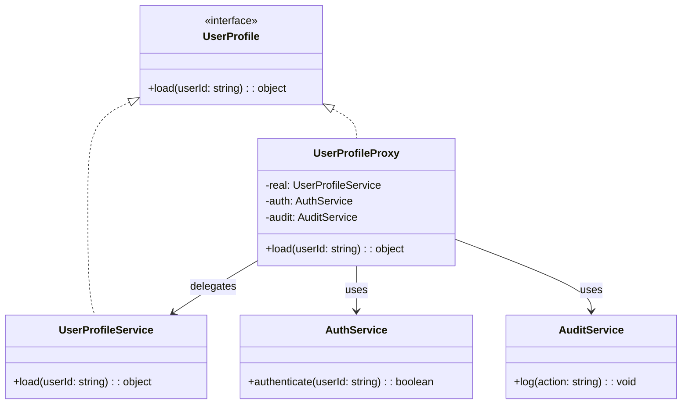

import Tabs from "@theme/Tabs";
import TabItem from "@theme/TabItem";
import CodeBlock from "@theme/CodeBlock";

import tsCode from "@site/src/codes/exposed-complexity/ts/rfc_proxy.ts";
import phpCode from "@site/src/codes/exposed-complexity/php/rfc_proxy.php";
import pyCode from "@site/src/codes/exposed-complexity/py/rfc_proxy.py";

# 🧩 Proxy パターン

## ✅ 設計意図

- 元のオブジェクトと同じインターフェースを持つ **代理（Proxy）** を介してアクセスを制御
- 認証・キャッシュ・遅延初期化・ログ記録などを**中間層で追加**

## ✅ 適用理由

- 実体へのアクセスに**前処理や制限**を加えたい
- 呼び出し方法を変えずに**追加処理を挟みたい**

## ✅ 向いているシーン

- 実処理に対して**キャッシュ、認証、トレースなどの制御**を行いたい場合
- 外部リソースへのアクセス制御や監視など

## ✅ コード例

<Tabs groupId="language">
  <TabItem value="ts" label="TypeScript">
    <CodeBlock language="ts">{tsCode}</CodeBlock>
  </TabItem>
  <TabItem value="php" label="PHP">
    <CodeBlock language="php">{phpCode}</CodeBlock>
  </TabItem>
  <TabItem value="python" label="Python">
    <CodeBlock language="python">{pyCode}</CodeBlock>
  </TabItem>
</Tabs>

## ✅ 解説

このコードは `Proxy` パターン を使用して、`UserProfileService` へのアクセスを `UserProfileProxy` が仲介し、
認証や監査といった追加の処理を実現している。
`Proxy` パターンは、オブジェクトへのアクセスを制御するための代理を提供するデザインパターンであり、
アクセス制御やログ記録、キャッシュなどに利用される。

### 1. Proxy パターンの概要

- **Subject**: クライアントが利用する共通インターフェース
  - このコードでは `UserProfile` が該当
- **RealSubject**: 実際の処理を行うクラス
  - このコードでは `UserProfileService` が該当
- **Proxy**: `RealSubject` へのアクセスを制御するクラス
  - このコードでは `UserProfileProxy` が該当
- **Client**: `Subject` を通じて `RealSubject` または `Proxy` を利用するクラス
  - このコードでは `proxy.load("user-123")` を呼び出す部分が該当

### 2. 主なクラスとその役割

- `UserProfile`
  - 共通インターフェース（`Subject`）
  - `load(userId: string): object` メソッドを定義
- `UserProfileService`
  - 実際の処理を行うクラス（`RealSubject`）
  - `load` メソッドでユーザープロフィールを取得
- `UserProfileProxy`
  - `Proxy` クラス
  - `UserProfileService` をラップし、認証と監査の処理を追加
  - `load` メソッドで認証を行い、成功した場合に `UserProfileService` の処理を呼び出し、監査ログを記録
- `AuthService`
  - 認証処理を行うクラス
- `AuditService`
  - 操作の監査ログを記録するクラス

### 3. UML クラス図

### 4. Proxy パターンの利点

- **アクセス制御**: クライアントが直接 `UserProfileService` にアクセスするのを防ぎ、認証や監査を追加可能
- **追加機能の付加**: 実際の処理の前後にログ出力や認証処理などを追加可能
- **疎結合**: クライアントは `UserProfile` インターフェースに依存するため、実装の変更が容易

この設計は、オブジェクトへのアクセスを制御したり、処理の前後に追加の機能を付加する必要がある場面で非常に有効であり、
コードの柔軟性と保守性を向上させる。
