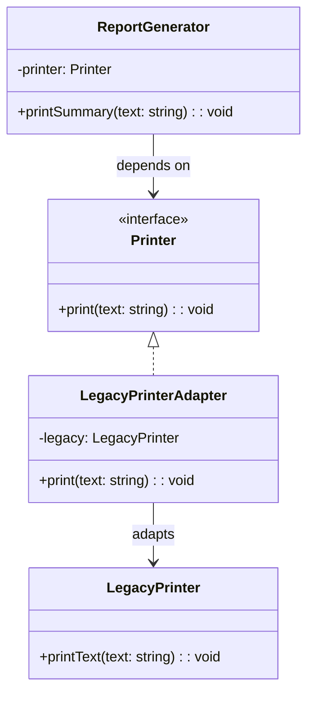

import Tabs from "@theme/Tabs";
import TabItem from "@theme/TabItem";
import CodeBlock from "@theme/CodeBlock";

import tsCode from "@site/src/codes/forced-compatibility/ts/rfc_adapter.ts";
import phpCode from "@site/src/codes/forced-compatibility/php/rfc_adapter.php";
import pyCode from "@site/src/codes/forced-compatibility/py/rfc_adapter.py";

# 🧩 Adapter パターン

## ✅ 設計意図

- 「期待されているインターフェース」と「実際の実装」が異なる場合に、**橋渡し役を作る**
- 呼び出し元と実装の間に**変換レイヤー（Adapter）**を挟むことで、疎結合にする

## ✅ 適用理由

- 旧 API の仕様に依存せず、**呼び出し元は統一されたインターフェースを使える**
- 将来的に他の実装（モック、別の API）へ差し替えが容易になる

## ✅ 向いているシーン

- 外部サービスの仕様が異なる
- 自前のコードベースに統一インターフェースを維持したい
- テスト容易性や交換可能性が求められる場面

## ✅ コード例

<Tabs groupId="language">
  <TabItem value="ts" label="TypeScript">
    <CodeBlock language="ts">{tsCode}</CodeBlock>
  </TabItem>
  <TabItem value="php" label="PHP">
    <CodeBlock language="php">{phpCode}</CodeBlock>
  </TabItem>
  <TabItem value="python" label="Python">
    <CodeBlock language="python">{pyCode}</CodeBlock>
  </TabItem>
</Tabs>

## ✅ 解説

このコードは `Adapter` パターン を使用して、互換性のないインターフェース（`LegacyPrinter` と `Printer`）をつなぎ、
新しいコード（`ReportGenerator`）が旧仕様のクラスを利用できるようにする設計を実現している。
`Adapter` パターンは、既存のクラスを変更せずに、新しいインターフェースに適合させるデザインパターン。

### 1. Adapter パターンの概要

- **Target**: クライアントが期待するインターフェース
  - このコードでは `Printer` が該当
- **Adaptee**: 既存のクラスで、新しいインターフェースに適合させる対象
  - このコードでは `LegacyPrinter` が該当
- **Adapter**: `Adaptee` をラップし、`Target` インターフェースを実装するクラス。
  - このコードでは `LegacyPrinterAdapter` が該当
- **Client**: `Target` インターフェースを使用するクラス
  - このコードでは `ReportGenerator` が該当

### 2. 主なクラスとその役割

- `LegacyPrinter`
  - 旧仕様のクラス（`Adaptee`）
  - `printText` メソッドでテキストを出力
- `Printer`
  - 新しいインターフェース（`Target`）
  - `print` メソッドを定義
- `LegacyPrinterAdapter`
  - Adapter クラス
  - `Printer` を実装し、`LegacyPrinter` をラップ
  - 必要な変換（例: テキストを大文字に変換）を吸収
- `ReportGenerator`
  - クライアントクラス
  - `Printer` インターフェースに依存し、`printSummary` メソッドでテキストを出力

### 3. UML クラス図

### 4. Adapter パターンの利点

- **互換性の提供**: 既存のクラスを変更せずに、新しいインターフェースに適合可能
- **再利用性**: 旧仕様のクラス（`LegacyPrinter`）を新しいコードで再利用可能
- **疎結合**: クライアント（`ReportGenerator`）は新しいインターフェース（`Printer`）に依存するため、旧仕様のクラスに直接依存しない

この設計は、既存のコードを変更せずに新しいシステムに統合する必要がある場面で非常に有効であり、コードの柔軟性と保守性を向上させる。
