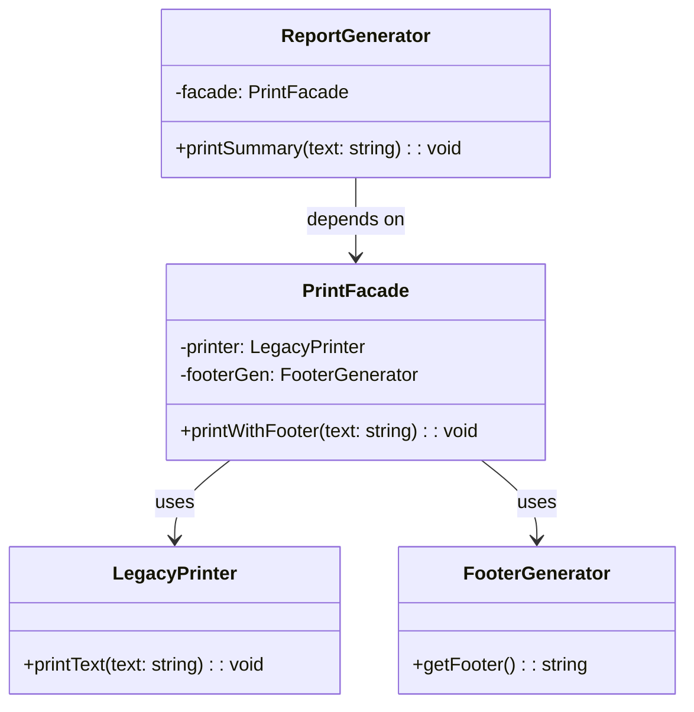

import Tabs from "@theme/Tabs";
import TabItem from "@theme/TabItem";
import CodeBlock from "@theme/CodeBlock";

import tsCode from "@site/src/codes/forced-compatibility/ts/rfc_facade.ts";
import phpCode from "@site/src/codes/forced-compatibility/php/rfc_facade.php";
import pyCode from "@site/src/codes/forced-compatibility/py/rfc_facade.py";

# 🧩 Facade パターン

## ✅ 設計意図

- **複雑な内部構造や複数の処理を 1 つの簡潔なインターフェースにまとめる**
- クライアントコードから詳細な手順や依存を隠蔽し、**操作を簡単にする**
- **使いやすく、安全な窓口（Facade）を用意して、呼び出し元のコードを疎結合に保つ**

## ✅ 適用理由

- 古い API や複数の下位モジュールへの **直接アクセスが必要な処理を 1 つにまとめたい**
- 呼び出し側のコードに **冗長な制御ロジック（初期化・整形・副処理など）が散らばってしまっている**
- **変更に強く、保守しやすい構造**にリファクタリングしたい
- UI やサービス層などから「内部の詳細を知らなくても使えるようにしたい」

## ✅ 向いているシーン

- **複雑な下位処理（API 呼び出し・設定・ログ・通知など）を 1 つのメソッドで完了させたい**
- 古い API や複数の外部サービスを **統一インターフェースで使いたい**
- テストやモック化のために **一括で抽象化したい**
- **利用者（呼び出し側）を極力シンプルに保ちたい**とき
- 一連の処理に失敗しにくい順序・制御が必要なとき（例：複数サービスの連携）

## ✅ コード例

<Tabs groupId="language">
  <TabItem value="ts" label="TypeScript">
    <CodeBlock language="ts">{tsCode}</CodeBlock>
  </TabItem>
  <TabItem value="php" label="PHP">
    <CodeBlock language="php">{phpCode}</CodeBlock>
  </TabItem>
  <TabItem value="python" label="Python">
    <CodeBlock language="python">{pyCode}</CodeBlock>
  </TabItem>
</Tabs>

## ✅ 解説

このコードは `Facade` パターン を使用して、複雑な内部処理（`LegacyPrinter` や `FooterGenerator`）を隠蔽し、
簡潔なインターフェース（`PrintFacade`）を提供する設計を実現している。
`Facade` パターンは、複雑なサブシステムを簡単に利用できるようにするための統一インターフェースを提供するデザインパターン。

### 1. Facade パターンの概要

- **Subsystem Classes**: 複雑な内部処理を提供するクラス
  - このコードでは `LegacyPrinter` と `FooterGenerator` が該当
- **Facade**: サブシステムを統一的に利用するための簡潔なインターフェースを提供するクラス
  - このコードでは `PrintFacade` が該当
- **Client**: `Facade` を利用してサブシステムを操作するクラス
  - このコードでは `ReportGenerator` が該当

### 2. 主なクラスとその役割

- `LegacyPrinter`
  - サブシステムの一部
  - テキストを出力する旧仕様のクラス
- `FooterGenerator`
  - サブシステムの一部
  - フッター文字列を生成するクラス
- `PrintFacade`
  - `Facade` クラス
  - `LegacyPrinter` と `FooterGenerator` を統合し、簡潔なインターフェース（`printWithFooter`）を提供
- `ReportGenerator`
  - クライアントクラス
  - `PrintFacade` を利用して、レポートを出力

### 3. UML クラス図

### 4. Facade パターンの利点

- **簡潔なインターフェース**: クライアントは複雑なサブシステムを意識せずに操作可能
- **疎結合**: クライアントとサブシステム間の結合度を低減
- **保守性向上**: サブシステムの変更が `Facade` 内に閉じ込められるため、クライアントコードへの影響を最小化

この設計は、複雑な内部処理を隠蔽し、クライアントに対して簡潔なインターフェースを提供する必要がある場面で非常に有効であり、
コードの可読性と保守性を向上させる。
