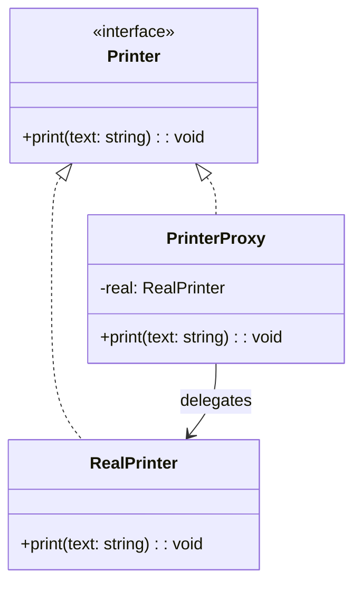

import Tabs from "@theme/Tabs";
import TabItem from "@theme/TabItem";
import CodeBlock from "@theme/CodeBlock";

import tsCode from "@site/src/codes/forced-compatibility/ts/rfc_proxy.ts";
import phpCode from "@site/src/codes/forced-compatibility/php/rfc_proxy.php";
import pyCode from "@site/src/codes/forced-compatibility/py/rfc_proxy.py";

# 🧩 Proxy パターン

## ✅ 設計意図

- **本物のオブジェクト（Real Subject）へのアクセスを間接化**し、その前段に**制御・検査・遅延処理**などの役割を持たせる
- 呼び出し元は Proxy 経由でアクセスするため、**本体を意識せずに操作できる構造**を作る
- **アクセス制限・キャッシュ・ログ・ネットワーク経由の操作などを透明に挟み込む**

## ✅ 適用理由

- 重い処理（例：リモートサービス、画像ロード、大量データ）に対して、**必要になるまで本体を生成したくない（遅延評価）**
- **アクセス制御や前処理（認証、ログ、チェック）を共通化**したい
- 実際の処理を変更せず、**代理層を挟んで拡張したい**
- **本体に影響を与えずに制御ロジックを追加**したい（OCP に沿った変更）

## ✅ 向いているシーン

- **大きなオブジェクトを後で初期化したい（遅延ロード）**
- **実際の処理にアクセス制限や前後処理を追加したい**
- **通信の境界（例：RPC, REST API）を抽象化して隠したい**
- **キャッシュやログ、モニタリングを間に挟みたい**
- テストやモックの場面で **本体の代替を提供したい**

## ✅ コード例

<Tabs groupId="language">
  <TabItem value="ts" label="TypeScript">
    <CodeBlock language="ts">{tsCode}</CodeBlock>
  </TabItem>
  <TabItem value="php" label="PHP">
    <CodeBlock language="php">{phpCode}</CodeBlock>
  </TabItem>
  <TabItem value="python" label="Python">
    <CodeBlock language="python">{pyCode}</CodeBlock>
  </TabItem>
</Tabs>

## ✅ 解説

このコードは `Proxy` パターン を使用して、`RealPrinter` へのアクセスを `PrinterProxy` が仲介する設計を実現している。
`Proxy` パターンは、オブジェクトへのアクセスを制御するための代理を提供するデザインパターンであり、
アクセス制御、ログ記録、遅延初期化などに利用される。

### 1. Proxy パターンの概要

- **Subject**: クライアントが利用する共通インターフェース
  - このコードでは `Printer` が該当
- **RealSubject**: 実際の処理を行うクラス
  - このコードでは `RealPrinter` が該当
- **Proxy**: `RealSubject` へのアクセスを制御するクラス
  - このコードでは `PrinterProxy` が該当
- **Client**: `Subject` を通じて `RealSubject` または `Proxy` を利用するクラス
  - このコードでは `printer.print("月次レポート")` を呼び出す部分が該当

### 2. 主なクラスとその役割

- `Printer`
  - 共通インターフェース（`Subject`）
  - `print(text: string): void` メソッドを定義
- `RealPrinter`
  - 実際の処理を行うクラス（`RealSubject`）
  - `print` メソッドでテキストを印刷
- `PrinterProxy`
  - Proxy クラス
  - `RealPrinter` をラップし、アクセスを制御
  - 印刷処理の前後にログを出力
- クライアントコード
  - `PrinterProxy` を通じて `RealPrinter` を利用

### 3. UML クラス図

### 4. Proxy パターンの利点

- **アクセス制御**: クライアントが直接 `RealPrinter` にアクセスするのを防ぎ、アクセス制御を実現
- **追加機能の付加**: 実際の処理の前後にログ出力やキャッシュ処理などを追加可能
- **遅延初期化**: 必要になるまで `RealPrinter` を生成しないようにすることも可能

この設計は、オブジェクトへのアクセスを制御したり、処理の前後に追加の機能を付加する必要がある場面で非常に有効であり、
コードの柔軟性と保守性を向上させる。
