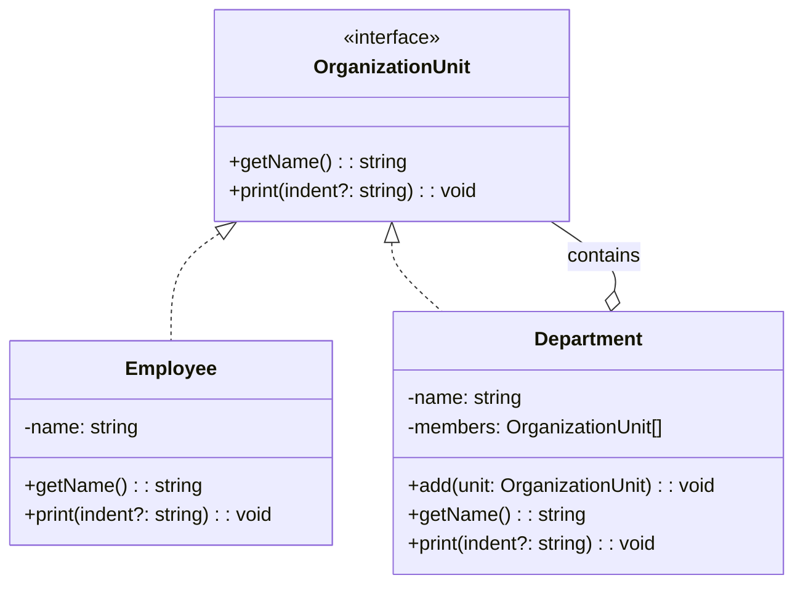

import Tabs from "@theme/Tabs";
import TabItem from "@theme/TabItem";
import CodeBlock from "@theme/CodeBlock";

import tsCode from "@site/src/codes/god-object/ts/rfc_composite.ts";
import phpCode from "@site/src/codes/god-object/php/rfc_composite.php";
import pyCode from "@site/src/codes/god-object/py/rfc_composite.py";

# 🧩 Composite パターン

## ✅ 設計意図

- オブジェクトを**木構造（ツリー構造）**で表現し、「個」と「集合」を**同一視して扱えるようにする**
- 大規模な `God Object` が、**部分構造を持っている場合に有効**

## ✅ 適用理由

- `God Object` の中で、UI 構成、ドキュメント構成、組織構成など**再帰的な構造を持っている**場合
- 各構成要素を再利用しやすく、追加や削除もシンプルにできる

## ✅ 向いているシーン

- フォルダ構成、メニュー構造、GUI パーツなど**階層的な構造**を扱うクラス
- 子要素を再帰的に持つデータ構造の整理

## ✅ コード例

<Tabs groupId="language">
  <TabItem value="ts" label="TypeScript">
    <CodeBlock language="ts">{tsCode}</CodeBlock>
  </TabItem>
  <TabItem value="php" label="PHP">
    <CodeBlock language="php">{phpCode}</CodeBlock>
  </TabItem>
  <TabItem value="python" label="Python">
    <CodeBlock language="python">{pyCode}</CodeBlock>
  </TabItem>
</Tabs>

## ✅ 解説

このコードは `Composite` パターン を使用して、組織構造のような階層的なデータを統一的に扱う設計を実現している。`Composite` パターンは、「個」と「集合」を同一視して操作できるようにするデザインパターンであり、ツリー構造を扱う際に非常に有効。

- `Composite` パターンの概要
  - **Component**: 共通インターフェースを定義し、「個」と「集合」を同一視して扱うための基盤を提供する
  - このコードでは `OrganizationUnit` が該当
- **Leaf**: ツリー構造の末端要素を表現するクラス
  - このコードでは `Employee` が該当
- **Composite**: 子要素を持つ集合を表現するクラス
  - このコードでは `Department` が該当

### 2. 主なクラスとその役割

- `OrganizationUnit`
  - 共通インターフェース
  - `getName` と `print` メソッドを定義し、`Employee` と `Department` の共通操作を提供
- `Employee`
  - `Leaf`（末端要素）を表現
  - 名前を持つ個々の従業員を表し、`print` メソッドで自身の名前を出力。
- `Department`
  - `Composite`（集合）を表現。
  - 部署名とその下に属するメンバー（`OrganizationUnit`）を管理。
  - `add` メソッドで子要素を追加し、`print` メソッドで自身と子要素を再帰的に出力。

### 3. UML クラス図

### 4. Composite パターンの利点

- **統一的な操作**: `OrganizationUnit` インターフェースを通じて、`Employee` と `Department` を同一視して操作可能
- **再帰的な構造**: 部署の中にさらに部署を持つような階層構造を簡潔に表現できる
- **拡張性**: 新しい種類の要素を追加する場合も、`OrganizationUnit` を実装するだけで対応可能

この設計は、階層的なデータ構造を扱う際に非常に有効であり、組織図やファイルシステムなどの実装に適している
