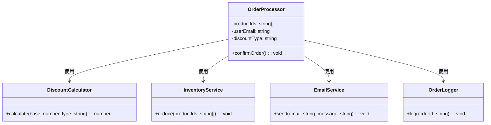

import Tabs from "@theme/Tabs";
import TabItem from "@theme/TabItem";
import CodeBlock from "@theme/CodeBlock";

import tsCode from "@site/src/codes/god-object/ts/rfc_facade.ts";
import phpCode from "@site/src/codes/god-object/php/rfc_facade.php";
import pyCode from "@site/src/codes/god-object/py/rfc_facade.py";

# 🧩 Facade パターン

## ✅ 設計意図

- 複雑な内部処理を隠蔽し、外部には**シンプルなインターフェース**を提供
- ユーザーに対して「使いやすい窓口」となる

## ✅ 適用理由

- ユースケース（注文処理）を外から 1 つのインターフェースで呼び出せる
- 各機能の**責務は分離されたまま統合**

## ✅ 向いているシーン

- ビジネスロジックを**モジュール化した上でまとめたい**
- 「〇〇処理一式」を 1 関数でまとめたい

## ✅ コード例

<Tabs groupId="language">
  <TabItem value="ts" label="TypeScript">
    <CodeBlock language="ts">{tsCode}</CodeBlock>
  </TabItem>
  <TabItem value="php" label="PHP">
    <CodeBlock language="php">{phpCode}</CodeBlock>
  </TabItem>
  <TabItem value="python" label="Python">
    <CodeBlock language="python">{pyCode}</CodeBlock>
  </TabItem>
</Tabs>

## ✅ 解説

このコードは `Facade` パターン を使用して、注文処理の複雑な内部ロジックを隠蔽し、外部からはシンプルなインターフェース (`OrderProcessor`) を提供している。
`Facade` パターンは、複雑なサブシステムを簡単に利用できるようにするための「窓口」を提供するデザインパターン。

### 1. Facade パターンの概要

- このコードでは、`OrderProcessor` クラスが `Facade` として機能し、以下の複数の責務を持つクラスを統合している：
  - `DiscountCalculator`: 割引計算を担当
  - `InventoryService`: 在庫管理を担当
  - `EmailService`: メール送信を担当
  - `OrderLogger`: 注文ログの記録を担当

### 2. 主なクラスとその役割

- `DiscountCalculator`
  - 割引計算を行うユーティリティクラス
  - 割引タイプ（`student`, `member`, `default`）に応じて価格を計算する
- `InventoryService`
  - 在庫を減らす処理を担当するクラス
- `EmailService`
  - 指定されたメールアドレスにメッセージを送信するクラス
- `OrderLogger`
  - 注文ログを記録するクラス
- `OrderProcessor`
  - `Facade` クラス
  - 上記の複数のクラスを統合し、注文処理を簡潔に実行するインターフェースを提供する
  - `confirmOrder` メソッドで以下の処理を行う：
    - 基本価格を計算
    - 割引後の合計金額を計算
    - 在庫を減らす
    - メールを送信
    - 注文ログを記録

### 3. UML クラス図

### 4. Facade パターンの利点

- **簡潔なインターフェース**: 外部からは `OrderProcessor` を使うだけで注文処理が完結する
- **責務の分離**: 各クラスが単一の責務を持つため、コードの保守性が向上する
- **再利用性**: サブシステム（`DiscountCalculator` など）は独立しているため、他のシステムでも再利用可能

この設計は、複雑な処理を隠蔽しつつ、各クラスの責務を明確に分離している。
