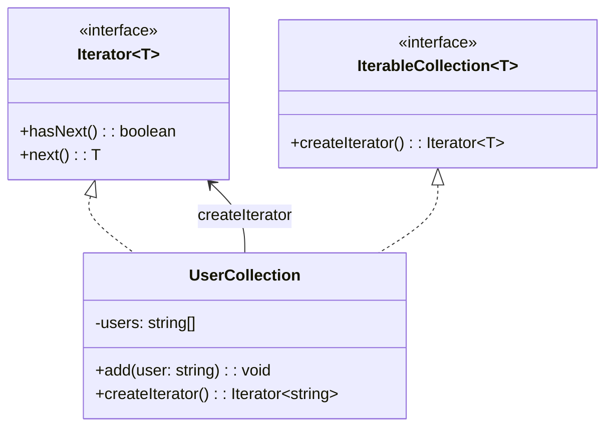

import Tabs from "@theme/Tabs";
import TabItem from "@theme/TabItem";
import CodeBlock from "@theme/CodeBlock";

import tsCode from "@site/src/codes/god-object/ts/rfc_iterator.ts";
import phpCode from "@site/src/codes/god-object/php/rfc_iterator.php";
import pyCode from "@site/src/codes/god-object/py/rfc_iterator.py";

# 🧩 Iterator パターン

## ✅ 設計意図

- 集合体の要素を**順番にアクセスする方法を提供**し、内部構造を隠蔽
- `God Object` の中でデータ構造が肥大化しており、**ループ処理がベタ書き**されている場合に有効

## ✅ 適用理由

- 内部データ（リスト、ツリーなど）に対する走査を**一貫した方法で提供**
- 外部から簡潔かつ安全に要素を扱えるようになる

## ✅ 向いているシーン

- カスタムデータ構造をループ処理する必要がある場面
- `for` や `while` 文が重複・分散しており、**走査ロジックが一貫していない**場合

## ✅ コード例

<Tabs groupId="language">
  <TabItem value="ts" label="TypeScript">
    <CodeBlock language="ts">{tsCode}</CodeBlock>
  </TabItem>
  <TabItem value="php" label="PHP">
    <CodeBlock language="php">{phpCode}</CodeBlock>
  </TabItem>
  <TabItem value="python" label="Python">
    <CodeBlock language="python">{pyCode}</CodeBlock>
  </TabItem>
</Tabs>

## ✅ 解説

このコードは Iterator パターン を使用して、コレクション（`UserCollection`）内の要素を順番にアクセスする方法を提供している。
`Iterator` パターンは、コレクションの内部構造を隠蔽しつつ、要素を順次操作できるようにするデザインパターン。

### 1. Iterator パターンの概要

- **Iterator**: コレクション内の要素を順次操作するためのインターフェースを定義
  - このコードでは `Iterator<T>` が該当
- **IterableCollection**: イテレーターを生成するためのインターフェースを定義
  - このコードでは `IterableCollection<T>` が該当
- **ConcreteCollection**: コレクションを具体的に実装し、イテレーターを生成する
  - このコードでは `UserCollection` が該当

### 2. 主なクラスとその役割

- `Iterator<T>`
  - イテレーターのインターフェース
  - `hasNext` メソッドで次の要素が存在するかを確認し、`next` メソッドで次の要素を取得する
- `IterableCollection<T>`
  - イテレーターを生成するためのインターフェース
  - `createIterator` メソッドを定義
- `UserCollection`
  - コレクションを具体的に実装したクラス
  - 内部にユーザー名（`string`）の配列を保持し、`add` メソッドで要素を追加
  - `createIterator` メソッドでイテレーターを生成

### 3. UML クラス図

### 4. Iterator パターンの利点

- **内部構造の隠蔽**: コレクションの内部構造を隠しつつ、要素にアクセス可能
- **統一的な操作**: コレクションの種類に依存せず、同じインターフェースで操作できる
- **拡張性**: 新しいコレクションを追加する場合も、`Iterator` と `IterableCollection` を実装するだけで対応可能

この設計は、コレクションの要素を順次操作する際に内部構造を意識せずに扱えるようにする。特に複雑なデータ構造を扱う場合に有効。
