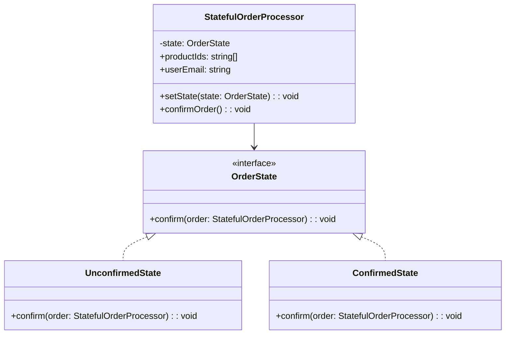

import Tabs from "@theme/Tabs";
import TabItem from "@theme/TabItem";
import CodeBlock from "@theme/CodeBlock";

import tsCode from "@site/src/codes/god-object/ts/rfc_state.ts";
import phpCode from "@site/src/codes/god-object/php/rfc_state.php";
import pyCode from "@site/src/codes/god-object/py/rfc_state.py";

# 🧩 State パターン

## ✅ 設計意図

- 「注文の状態（未確定 / 確定）」や「処理モード」によって**振る舞いを切り替えたい**
- 状態ごとにクラスを分けて、処理ロジックを**状態オブジェクト側に任せる**

## ✅ 適用理由

- `OrderManager`が「状態に応じて異なる振る舞いをする」機能を持っていた
- 状態遷移の明示性・安全性を上げる

## ✅ 向いているシーン

- ステップごとの処理（ウィザード式など）
- 処理の状態ごとに分岐がある

## ✅ コード例

<Tabs groupId="language">
  <TabItem value="ts" label="TypeScript">
    <CodeBlock language="ts">{tsCode}</CodeBlock>
  </TabItem>
  <TabItem value="php" label="PHP">
    <CodeBlock language="php">{phpCode}</CodeBlock>
  </TabItem>
  <TabItem value="python" label="Python">
    <CodeBlock language="python">{pyCode}</CodeBlock>
  </TabItem>
</Tabs>

## ✅ 解説

このコードは `State` パターン を使用して、注文処理の状態（未確定・確定済み）に応じた振る舞いを切り替える設計を実現している
`State` パターンは、オブジェクトの内部状態に応じて振る舞いを変更するデザインパターンであり、
状態ごとの処理をクラスとして分離し、状態遷移を明示的に管理する

### 1. State パターンの概要

- このコードでは、`OrderState` インターフェースを基に、以下の状態クラスを実装している：
  - `UnconfirmedState`: 注文が未確定の状態
  - `ConfirmedState`: 注文が確定済みの状態

### 2. 主なクラスとその役割

- `OrderState` インターフェース
  - 状態ごとの振る舞いを定義するインターフェース
  - `confirm(order: StatefulOrderProcessor): void` メソッドを実装する必要がある
- `UnconfirmedState`
  - 注文が未確定の状態を表すクラス
  - `confirm` メソッドで以下の処理を行う：
    - 在庫を減らす
    - ユーザーにメールを送信
    - 注文ログを記録
    - 状態を `ConfirmedState` に遷移
- `ConfirmedState`
  - 注文が確定済みの状態を表すクラス
  - `confirm` メソッドでは「すでに確定済みです」というメッセージを出力する
- `StatefulOrderProcessor`
  - 状態を管理するコンテキストクラス
  - 現在の状態を保持し、`confirmOrder` メソッドを呼び出すことで現在の状態に応じた処理を実行する
  - 状態遷移は setState メソッドで行う

### 3. UML クラス図

### 4. State パターンの利点

- **状態ごとの振る舞いを分離**: 各状態の処理が独立しているため、コードが読みやすく保守性が高い
- **状態遷移が明示的**: 状態の変更が `setState` メソッドで管理されるため、状態遷移が分かりやすい
- **拡張性**: 新しい状態を追加する場合も、`OrderState` を実装するだけで対応可能

この設計は、状態に応じた振る舞いを明確に分離し、状態遷移を安全に管理する。
