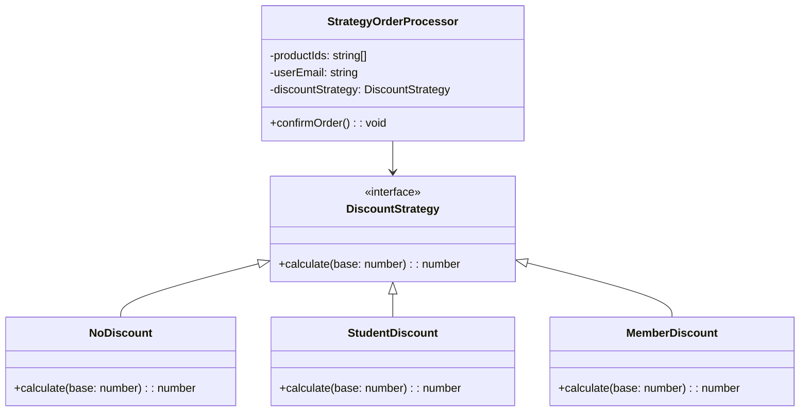

import Tabs from "@theme/Tabs";
import TabItem from "@theme/TabItem";
import CodeBlock from "@theme/CodeBlock";

import tsCode from "@site/src/codes/god-object/ts/rfc_strategy.ts";
import phpCode from "@site/src/codes/god-object/php/rfc_strategy.php";
import pyCode from "@site/src/codes/god-object/py/rfc_strategy.py";

# 🧩 Strategy パターン

## ✅ 設計意図

- 責務の中で「振る舞いが分岐する処理（今回なら割引計算）」を**Strategy として切り出す**
- 外部から割引のルール（戦略）を注入して、**柔軟に切り替えられるようにする**

## ✅ 適用理由

- 割引ロジックが今後増える可能性がある
- 割引ルールをクラスとして独立させてテスト・再利用しやすくする

## ✅ 向いているシーン

- 処理の選択・切り替えが頻繁に発生する
- 条件による処理分岐が肥大化しやすい

## ✅ コード例

<Tabs groupId="language">
  <TabItem value="ts" label="TypeScript">
    <CodeBlock language="ts">{tsCode}</CodeBlock>
  </TabItem>
  <TabItem value="php" label="PHP">
    <CodeBlock language="php">{phpCode}</CodeBlock>
  </TabItem>
  <TabItem value="python" label="Python">
    <CodeBlock language="python">{pyCode}</CodeBlock>
  </TabItem>
</Tabs>

---

## ✅ 解説

このコードは、`Strategy` パターンを用いて、異なる割引戦略を柔軟に適用できる注文処理システムを実装している。
`Strategy` パターンは、アルゴリズムや処理をクラスとして分離し、それを動的に切り替えられるようにするデザインパターン。

### 1. Strategy パターンの概要

- このコードでは、割引計算のロジックを `DiscountStrategy` インターフェースとその実装クラス (`NoDiscount`, `StudentDiscount`, `MemberDiscount`) に分離している。
- `StrategyOrderProcessor` クラスは、割引戦略を注入（依存性注入）することで、異なる割引ロジックを柔軟に適用できる。

### 2. 主なクラスとその役割

- `DiscountStrategy` インターフェース
  - 割引計算の共通インターフェースを定義
  - `calculate(base: number): number` メソッドを実装する必要がある
- `NoDiscount`, `StudentDiscount`, `MemberDiscount`
  - `DiscountStrategy` を実装した具体的な割引戦略クラス
  - それぞれ異なる割引ロジックを提供する
- `StrategyOrderProcessor`
  - 注文処理を行うクラス
  - 割引戦略 (`DiscountStrategy`) をコンストラクタで受け取り、confirmOrder メソッドで注文を確定する
  - 注文確定時に以下の処理を行う：
    - 基本価格を計算（`productIds.length \* 1000`）
    - 割引後の合計金額を計算
    - 在庫を減らす（`InventoryService.reduce`）
    - ユーザーにメールを送信（`EmailService.send`）
    - ログを記録（`OrderLogger.log`）
- 利用例
  - `StrategyOrderProcessor` に `StudentDiscount` を注入して、学生割引を適用した注文を処理している

### 3. UML クラス図

### 4. 更なる改善案

- テスト可能性の向上: `InventoryService`, `EmailService`, `OrderLogger` をモック可能な依存性として注入することで、ユニットテストが容易になる
- エラーハンドリング: 在庫不足やメール送信失敗時のエラーハンドリングを追加すると、より堅牢な設計になる
