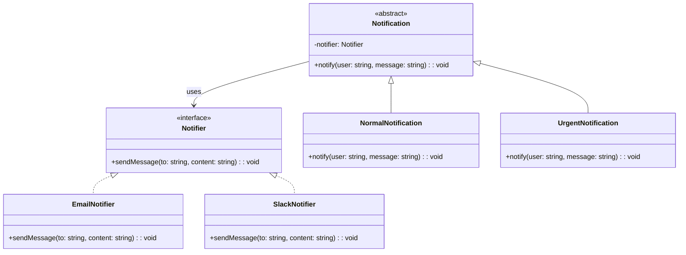

import Tabs from "@theme/Tabs";
import TabItem from "@theme/TabItem";
import CodeBlock from "@theme/CodeBlock";

import tsCode from "@site/src/codes/hardcoded-variability/ts/rfc_bridge.ts";
import phpCode from "@site/src/codes/hardcoded-variability/php/rfc_bridge.php";
import pyCode from "@site/src/codes/hardcoded-variability/py/rfc_bridge.py";

# 🧩 Bridge パターン

## ✅ 設計意図

- 抽象と実装を分離し、それぞれを**独立に拡張可能**にする
- 「通知内容」と「通知方法」のように、**独立した変化軸を持つ構成**を設計できる

## ✅ 適用理由

- 通知方法（メール、Slack）と通知内容（警告、お知らせ）を**別の軸で切り替えたい**
- 拡張パターンが**組み合わせによって爆発**しそうなときに有効

## ✅ 向いているシーン

- 複数の軸で拡張・組み合わせが必要な場合（表示方式 × 出力先、など）

## ✅ コード例

<Tabs groupId="language">
  <TabItem value="ts" label="TypeScript">
    <CodeBlock language="ts">{tsCode}</CodeBlock>
  </TabItem>
  <TabItem value="php" label="PHP">
    <CodeBlock language="php">{phpCode}</CodeBlock>
  </TabItem>
  <TabItem value="python" label="Python">
    <CodeBlock language="python">{pyCode}</CodeBlock>
  </TabItem>
</Tabs>

## ✅ 解説

このコードは `Bridge` パターン を使用して、通知手段（`Notifier`）と通知処理（`Notification`）を分離し、
それぞれを独立して拡張可能にする設計を実現している。
`Bridge` パターンは、抽象部分と実装部分を分離し、それぞれを独立して変更できるようにするデザインパターン。

### 1. Bridge パターンの概要

- **Abstraction**: 抽象部分を定義するクラス
  - このコードでは `Notification` が該当
- **RefinedAbstraction**: `Abstraction` を拡張したクラス
  - このコードでは `NormalNotification` と `UrgentNotification` が該当
- **Implementor**: 実装部分を定義するインターフェース
  - このコードでは `Notifier` が該当
- **ConcreteImplementor**: `Implementor` を実装した具体的なクラス
  - このコードでは `EmailNotifier` と `SlackNotifier` が該当

### 2. 主なクラスとその役割

- `Notifier`
  - 実装部分の共通インターフェース
  - `sendMessage(to: string, content: string): void` メソッドを定義
- `EmailNotifier`, `SlackNotifier`
  - `Notifier` を実装した具体的なクラス
  - メールまたは Slack を使用してメッセージを送信
- `Notification`
  - 抽象部分の基底クラス
  - `Notifier` を保持し、通知処理を定義
- `NormalNotification`, `UrgentNotification`
  - `Notification` を拡張した具体的なクラス
  - 通常通知や緊急通知の処理を実装

### 3. UML クラス図

### 4. Bridge パターンの利点

- **抽象と実装の分離**: 抽象部分（`Notification`）と実装部分（`Notifier`）を分離することで、それぞれを独立して変更可能
- **柔軟性**: 新しい通知手段や通知処理を追加する場合も、既存のコードに影響を与えずに拡張可能
- **コードの再利用性**: 抽象部分と実装部分を組み合わせることで、コードの再利用性が向上

この設計は、異なる実装を持つ機能を柔軟に組み合わせる必要がある場面で非常に有効であり、コードの拡張性と保守性を向上させる。
